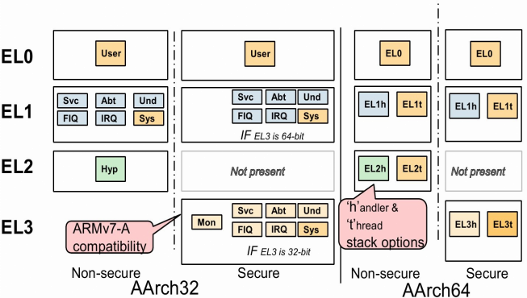

# ARM 架构和指令集 #

	https://developer.android.com/ndk/guides/arch.html

	armeabi: 第5代、第6代的ARM处理器，早期的手机用的比较多
	armeabi-v7a: 第7代及以上的 ARM 处理器。2011年15月以后的生产的大部分Android设备都使用它
	arm64-v8a: 第8代、64位ARM处理器
	
- 指令
		
		1）由于ARM的流水线机制，当前PC值为当前地址加8个字节
		如：
		80e9d3d8:   e59f202c	ldr r2, [pc, #44]   ; 80e9d40c <rel_dyn_test+0x34>
		所以上面的PC= 80e9d3d8+0x8= 0x80e9d3e0
		
		2）7种异常是用ldr将处理函数入口地址加载到pc中
		
		.globl _start  
		_start: b   reset  
			ldr pc, _undefined_instruction  
			ldr pc, _software_interrupt  
			ldr pc, _prefetch_abort  
			ldr pc, _data_abort  
			ldr pc, _not_used  
			ldr pc, _irq  
			ldr pc, _fiq

		3）用.balignl来指定接下来的代码要16字节对齐，空缺的用0xdeadbeef，方便更加高效的访问内存
			.balignl 16,0xdeadbeef
		

# ARM汇编 #

	https://wenku.baidu.com/view/bdf43555227916888486d77f

# ARM32/ARM64寄存器

	参考： https://en.wikipedia.org/wiki/Calling_convention
	https://blog.csdn.net/sandeldeng/article/details/52954781
	https://www.cnblogs.com/smartjourneys/p/6845180.html?utm_source=itdadao&utm_medium=referral

- 模式

  	

	EL1, EL2 and EL3 are separated into t (thread) and h (handle) mode:
	the thread mode means the SP is always SP0, while the handle mode means the SP is determined by the EL level.
	貌似一般用handle mode

- 寄存器

	参考： http://bdxnote.blog.163.com/blog/static/844423520155913829432

  

	1）ARM32

	37个32位寄存器，其中31个为通用寄存器，6个为状态寄存器。
	但是这些寄存器不能被同时访问，具体哪些寄存器是可以访问的，取决ARM处理器的工作状态及具体的运行模式。
	但在任何时候，通用寄存器R14~R0、程序计数器PC、一个状态寄存器都是可访问的。

	31个通用寄存器：
	R0 ~ R14,R15  (16)  //所有模式下公用的
	R13_svc、R14_svc
	R13_abt、R14_abt
	R13_und、R14_und
	R13_irq、R14_irq (+8)
	R8_fiq ~ R14_fiq (+7)
	
	6个状态寄存器
	SVC/ABT/UND/IRQ/FIQ模式下的SPSR, SYS&usr模式下的CPSR

	寄存器用途：
	r14 is the link register. (The BL instruction, used in a subroutine call, stores the return address in this register).
	r13 is the stack pointer. (The Push/Pop instructions in "Thumb" operating mode use this register only).
	r12 is the Intra-Procedure-call scratch register（函数调用过程中的暂存寄存器）.

	r0~r3: 用于参数传递，r0也用于存储函数调用后的返回值
	r4~r11:用于存储本地变量

	ELR_hyp：Hyp mode下特有的异常链接寄存器，保存异常进入Hyp mode时的异常地址
	SP_x： 通常称R13为堆栈指针，除了Sys模式外，其他各种模式下都有对应的SP_x寄存器：x ={ und/svc/abt/irq/fiq/hyp/mon}
	LR_x： 称R14为链接寄存器，除了Sys模式外，其他各种模式下都有对应的LR_x寄存器：x ={ und/svc/abt/svc/irq/fiq/mon},
			用于保存程序返回链接信息地址，AArch32环境下，也用于保存异常返回地址，也就说LR和ELR是公用一个，AArch64下是独立的.
	CPSR： 记录当前PE的运行状态数据,CPSR.M[4:0]记录运行模式，AArch64下CPSR使用PSTATE代替
	SPSR_x： 是CPSR的备份，除了User和Sys模式外，其他各种模式下都有对应的SPSR_x寄存器：x ={ und/svc/abt/irq/fiq/hpy/mon}，
			注意：这些模式只适用于32bit运行环境

  

	2) ARM64
	有两种主要的执行状态： AArch64，AArch32

	AArch64特征:
	1、提供31个64位通用寄存器:X0~X30;其中,X30也可用作过程连接寄存器PLR(Produce Link Register);
	2、提供64位的程序计数器PC(Program Counter)、栈指针寄存器SP(Stack Pointer)和异常链接寄存器ELR(Exception Link Register);
	3、提供32个128位的SIMD Vector和标量浮点寄存器SFP(Scalar Floating Point):V0~V31,也可用作64位寄存器;
	所有向量寄存器都是128位;双精度标量浮点使用Vx[63:0],单精度标量浮点使用Vx[31:0];
	4、定义了4个执行级别寄存器(Executing Level):EL0、EL1、EL2、EL3;
	5、支持64位的虚拟寻址(Virtual Addressing);
	6、定义一组PSTATE,用以保存PE(Processing Element)状态;

	AArch32特征:
	1、提供31个32位通用寄存器:X0~X30;其中R3用作栈指针SP,R14用作链接寄存器LR,R15用作程序计数器PC,
	且R14需同时供异常链接寄存器ELR与过程连接寄存器PLR之用;
	2、提供1个异常链接寄存器ELR,用以作为从HpyerVisior-Mode的异常返回之用;
	3、提供32个64位的高级SIMD Vector和标量浮点寄存器(Scalar Floating Point);
	4、提供A32与T32两种指令集;
	5、支持32位虚拟寻址(Virtual Addressing);
	6、只使用CPSR保存PE(Processing Element)状态;
	7、提供1个32位异常特征寄存器ESR(Exception Syndrome Register),这个寄存器有自己特有的编码格式,
	且按照不同的执行级别EL(Executing Level)划分,每个执行级别都有一个ESR,名字分别记作:ESR_EL0、ESR_EL1、ESR_EL2、ESR_EL3;

	寄存器用途：
	x30 is the link register (used to return from subroutines)
	x29 is the frame register
	x19 to x29 are callee-saved
	x16 to x18 are the Intra-Procedure-call scratch register（函数调用过程中的暂存寄存器）.
	x9 to x15: used to hold local variables (caller saved) . 调用者保存本地变量
	x8: used to hold indirect return value address
	x0 to x7: used to hold argument values passed to a subroutine, and also hold results returned from a subroutine.
		用于参数传递和保存函数调用的返回结果

	X0-X30： 通用寄存器，如果有需要可以当做32bit使用：W0-W30
	ELR_ELx：异常链接寄存器，保存异常进入ELx的异常地址（x={1,2,3}）
	SP_ELx：每个异常级别都有一个专用的SP寄存器，若PSTATE.M[0] ==1，则每个ELx选择SP_ELx（x={0,1,2,3}），否则选择同一个SP_EL0
	SPSR_ELx：保存进入ELx的PSTATE状态信息（x={1,2,3}）
	PSTATE： 不是一个寄存器，是保存当前PE状态的一组寄存器统称(每个PE对应一组PSTATE)，属于ARMv8新增内容
 
# ARM32/ARM64函数调用规则 #
	
	参考： https://blog.csdn.net/listener51/article/details/78443047

	1) ARM32函数调用约定
	http://infocenter.arm.com/help/topic/com.arm.doc.ihi0042f/IHI0042F_aapcs.pdf
	
	2) ARM64函数调用约定
	http://infocenter.arm.com/help/topic/com.arm.doc.ihi0055b/IHI0055B_aapcs64.pdf
	
	3) ARM32_THUMB函数调用约定
	http://infocenter.arm.com/help/topic/com.arm.doc.espc0002/ATPCS.pdf
	
	4) X86函数调用约定
	https://en.wikipedia.org/wiki/Calling_convention#x86

# ARM32/ARM64参数传递 #

	ARM32: 前4个参数是通过 r0~r3寄存器传递的；如果参数超过四个，就要借助于栈

	ARM64: 前8个参数是通过x0-x7或w0-w7。 如果参数超过8个，就要借助于栈
		1）int型(32bit)由w开头的寄存器操作，结果在w0返回
		2）long型(64bit)由x开头的寄存器操作，结果在x0返回

# ARMV8中PSTATE和ESR寄存器的用途 #
	
	参考
	实例： https://blog.csdn.net/forever_2015/article/details/77434580
	ARM官方文档： DDI0487A_d_armv8_arm.pdf
	
	kernel log中以下值：
	1)pstate:600001c5  //PSTATE的值，从中可以知道异常发生时的状态，如EL的级别以及使用的SP指针
	2)Oops:96000046[#1] PREEMPT SMP //ESR_ELx（异常综合寄存器）寄存器的值，从中可以知道是什么原因导致进入该异常模式
	ARM文档中的关键字： ESR_ELx, Exception Syndrome Register (ELx)

# 异常 #

	参考: http://www.cnblogs.com/smartjourneys/p/6845078.html

- 同步异常

		1）异常的产生是和cpu core执行的指令或者试图执行相关
		2）硬件提供给handler的返回地址就是产生异常的那一条指令所在的地址
		3）synchronous exception又可以细分成两个类别：
		a)一种我们称之为synchronous abort，例如未定义的指令、data abort、prefetch instruction abort、SP未对齐异常，debug exception等等;
		b)还有一种是正常指令执行造成的，包括SVC/HVC/SMC指令，这些指令的使命就是产生异常。

		A64指令必须是word(32bits)对齐，试图从一个PC未对齐的位置取指会引发PC对齐错误;
		A64指令固定为32bit，且为小端存储;
		对device memory的访问, 必须对齐;
		

- 异步异常

		asynchronous exception基本上可以类似大家平常说的中断，它是毫无预警的，丝毫不考虑cpu core感受的外部事件,
		这些事件打断了cpu core对当前软件的执行，因此称之interrupt。
		需要注意的是：外部并不是表示外设，这里的外部是针对cpu core而言，有些中断是来自SOC的其他HW block，
		例如GIC，这时候，对于processor或者cpu（指soc）而言，这些事件是内部的

		asynchronous exception有下面的特点：
		1）异常和CPU执行的指令无关。
		2）返回地址是硬件保存下来并提供给handler，以便进行异常返回现场的处理。
		这个返回地址并非产生异常时的指令, 根据这个定义IRQ、FIQ和SError interrupt属于asynchronous exception。

# Memory类型和属性 #

	参考： http://www.cnblogs.com/smartjourneys/p/6844145.html

	memory分为normal memory和device memory，两种类型的Memory有各自的属性

- Normal Memory: 用于大块内存的读写、只读操作

		1）Shareable  Normal Memory： 可以被所有的PE(cpu)访问, 包括：Inner Shareable, and Outer Shareable

		2）Non-shareable Normal Memory： 只能被唯一的PE访问

		3）Cacheability属性:
		（1）Write-Through Cacheable：同时写入cache与内存
		（2）Write-Back Cacheable:直接更新cache,闲时再更新到内存
		（3）Non-cacheable：无cache，不需要更新cache,直接更新内存

- Device Memory: 禁止随机读写操作，如大部分的IO寄存器

		1) Gathering 或者non Gathering (G or nG)
		这个特性表示对多个memory的访问是否可以合并，如果是nG，表示处理器必须严格按照代码中内存访问来进行，不能把两次访问合并成一次。
		例如：代码中有2次对同样的一个地址的读访问，那么处理器必须严格进行两次read transaction
	
		2）Re-ordering (R or nR)
		这个特性用来表示是否允许处理器对内存访问指令进行重排。nR表示必须严格执行program order。
	
		3）Early Write Acknowledgement (E or nE)
		PE访问memory是有问有答的（更专业的术语叫做transaction），对于write而言，PE需要write ack操作以便确定完成一个write transaction。
		为了加快写的速度，系统的中间环节可能会设定一些write buffer。nE表示写操作的ack必须来自最终的目的地而不是中间的write buffer。

- memory访问的限制

		1）如果访问的是两个连续字节p、q,则p、q需要有相同的存储类型和共享属性；要有共同的cacheablbility
		2）如果访问的是device memory,则要求必须是对齐的

# Cache #

	参考: http://www.cnblogs.com/smartjourneys/p/6841090.html

	Cache是一种高速的存储块。包含很多的存储项，每个存储项包含主存的地址（称为tag）和数据信息。
	利用时间局部性和空间局部性提高了内存的访问速度

	Cache line: 将cache分成一些固定大小的存储空间, 这些存储空间叫做Cache Line
	Cache hit:  cache命中，访问的数据存在于cache中
	Cache miss: cache失效，访问的数据不在cache中

	Set: 由多个连续的cache line组成一个组（set）
	Way: 每个set中冲突的备选表项的数目
	Clean: 为确保更新到cache中的内容flush到内存
	Invalidate: 确保内存中的修改能够重新加载到cache
	Clean and invalidate： clean指令后跟一个invalidate指令，针对的是同一访问地址

# 大小端 #

	指 低地址是存储高位字节还是低位字节。
	大端： 低地址存储高位字节
	小端： 低地址存储低位字节

# TrustZone #

	参考：https://blog.csdn.net/guyongqiangx/article/details/78020257

	处理器架构上，TrustZone将每个物理核虚拟为两个核，一个非安全核（Non-secure Core, NS Core），运行非安全世界的代码；
	和另一个安全核（Secure Core），运行安全世界的代码。

	两个虚拟的核以基于时间片的方式运行，根据需要实时占用物理核，并通过Monitor Mode在安全世界和非安全世界之间切换，
	类似同一CPU下的多应用程序环境，不同的是多应用程序环境下操作系统实现的是进程间切换，
	而Trustzone下的Monitor Mode实现了同一CPU上两个操作系统间的切换。 