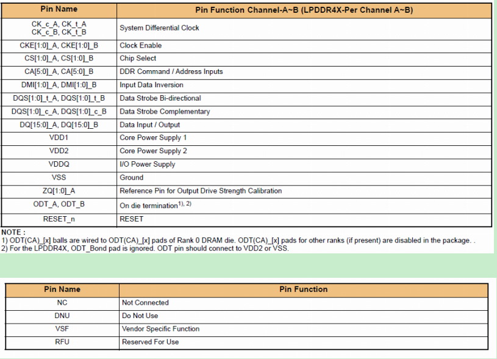
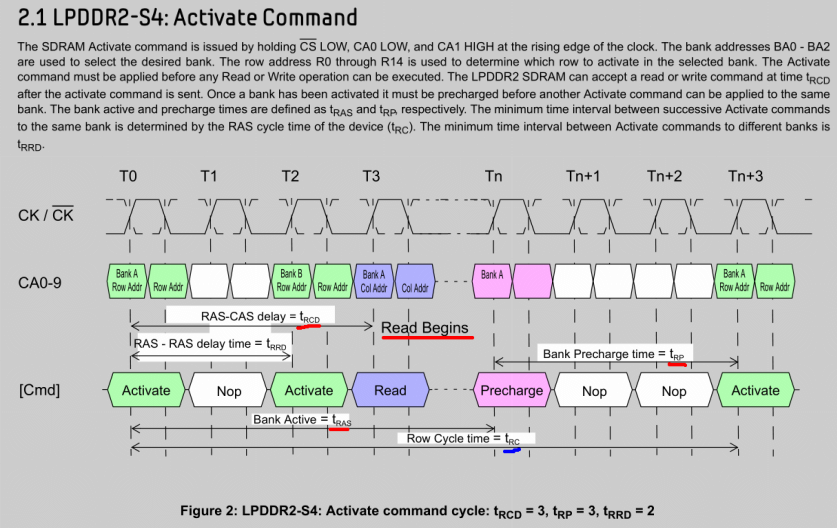

#  示波器 #

	如果TIME/DIV设置不合适，则可能造成波形混迭。混迭意味着屏幕上显示的波形频率低于信号实际频率。这时候，可以通过缓慢改变扫速
	TIME/DIV到较快的时基挡提高波形频率，如果波形频率参数急剧改变或者晃动的波形在某个较快的时基挡稳定下来，说明之前发生了波形混迭。
	根据奈奎斯特定理，采样速率至少高于信号高频分量的两倍才不会发生混迭，如一个500MHz的信号，至少需要1GS/s的采样速率。
	
	奈奎斯特定理即为采样定理，指当采样频率fsmax 大于信号中最高频率fmax的两倍时，即fsmax≥2fmax时，
	采样之后的数字信号可完整地保留原始信息。

# 逻辑分析仪 #

	逻辑分析仪是利用时钟从测试设备上采集数字信号并进行显示的仪器，其最主要的作用是用于时序的判定。
	与示波器不同，逻辑分析仪并不具备许多电压等级，通常只显示两个电压（逻辑1和0）。
	在设定了参考电压之后，逻辑分析仪通过比较器来判定待测试信号，高于参考电压者为1，低于参考电压者为0。

# DDR #

- 接口

		DQ： 数据线，传输的是数据信号。
		DQS： 是内存和内存控制器之间信号同步用的。
		由DQ信号发出端发出DQS，信号接收端根据DQS的上、下沿来触发数据的接收。

 

- 参数(单位都是时钟周期)

		tMRD: 完成2个模式寄存器写操作命令的最小时间间隔
		The mode register set command cycle time. 
		tMRD is required to complete the write operation to the mode register 
		and is the minimum time required between two MRS commands
	
		tRAS(Row Active strobe): ACTIVE命令到PRECHARGE命令之间的最小时间
		也可以理解为：从发出行地址以及列地址/读写命令，到读出数据之间的间隔
		
		tCAS： 列地址选通周期，指从发出列地址/读写命令，到读出数据之间的间隔
	
		tRCD(RAS to CAS Delay): 指从行激活，到列地址/读写命令之间的间隔
		ACTIVE to internal READ/WRITE. 每一次对DDR3读写操作前必须确保是处于Active状态的
	
		CL(CAS Latency，列地址脉冲选通潜伏期)：与 tRCD 一样
	
		tRP(bank precharge time): PERCHARG命令的处理周期. 在做下一次行激活前，必须对行进行预充电的时间.
		在此周期内不能对正在进行precharge的bank作任何操作。
	
		tRC(row cycle time): 同一bank内2次ACTIVE命令间的最小延迟
		就是说，我们不能过于频繁的激活同一bank的同一行或不同行。
		
		tRRD: 不同bank的ACTIVE命令间的最小延迟
		The minimum time interval between successive ACTIVE command to different banks
	
		tRFC(refresh cycle time): REFRESH 命令的周期，发起refresh命令后这么长时间不可再次激活
		REFRESH to ACTIVE or REFRESH command period
	
		tWR(write recovery time): 最后一次写突发到向同一bank发起PRECHARGE命令的最小时间
	
		tWTR: 写切换到读的延迟
		Delay from start of internal write transaction to internal READ command
	
		tAC(Access Time from CLK): 时钟触发后的访问时间
	
		BL(Burst Lengths): 突发长度

  
	
	