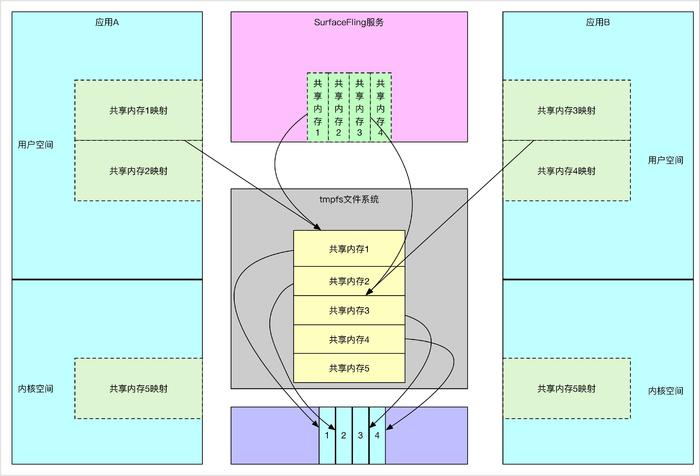
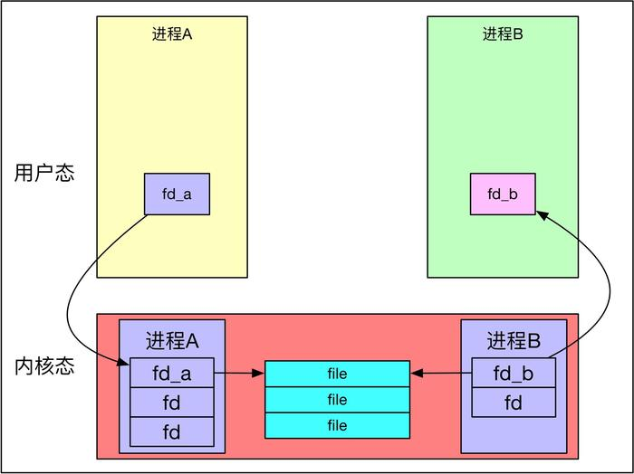

# android ashmem #

	参考
	
	https://www.jianshu.com/p/d9bc9c668ba6
	https://blog.csdn.net/guoping16/article/details/6584058
	
	Android的匿名共享内存（Anonymous Shared Memory-Ashmem）
	
- Linux共享内存

		两个关键函数:
		int shmget(key_t key, size_t size, int shmflg) //该函数用来创建共享内存
		void *shmat(int shm_id, const void *shm_addr, int shmflg) //要想访问共享内存，必须将其映射到当前进程的地址空间

		其中key_t是共享内存的唯一标识，可以说，Linux的共享内存其实是有名共享内存，而名字就是key
		
		Linux的共享内存的用法
	  
	
	
- Android ashmem原理

		Android ashmem跟linux原生的共享内存通信不太一样，比如它在自己的驱动中添加了互斥锁，另外通过fd的传递来实现共享内存的传递。
		MemoryFile是Android为匿名共享内存而封装的一个对象，是进程间大数据传递的一个手段。
		
		原生Linux共享内存是通过传递已知的key来处理的，但是Android中不存在这种机制，Android是通过Binder传递文件描述符来处理：
		Android的Binder对于fd的传递也做了适配，原理其实就是在内核层为要传递的目标进程转换fd；
		Binder驱动通过当前进程的fd找到对应的文件，然后为目标进程新建fd，并传递给目标进程，核心就是把进程A中的fd转化成进程B中的fd，
		看一下Android中binder的实现：

		void binder_transaction()
		{ 
			... 
			case BINDER_TYPE_FD: 
			{ 
				int target_fd; 
				struct file *file; 
				
				//关键点1 可以根据fd在当前进程获取到file ，多个进程打开同一文件，在内核中对应的file是一样
				file = fget(fp->handle); 
				
				//关键点2,为目标进程获取空闲fd
				target_fd = task_get_unused_fd_flags(target_proc, O_CLOEXEC); 
				
				//关键点3将目标进程的空闲fd与file绑定
				task_fd_install(target_proc, target_fd, file); 
				
				fp->handle = target_fd; 
			} 
			break; 
			... 
		}
	  
		

- 优缺点

		匿名共享内存不会占用Dalvik Heap与Native Heap，不会导致OOM，这是优点，同时也是缺点，因为如果肆意使用，会导致系统资源不足，性能下降，
		
		另外共享存占用空间的计算，只会计算到第一个创建它的进程中，其他进程不将ashmem计算在内。
		
- 查看android进程的ashmem
		
		cat /proc/<pid>/maps | grep /dev/ashmem
		=>
		7f7f8a1000-7f7f8c1000 rw-p 00000000 00:01 49025	 /dev/ashmem/dalvik-LinearAlloc_1504_1544 (deleted)
		
- ashmem实例

		参考

		https://blog.csdn.net/new_abc/article/details/8167973
		https://blog.csdn.net/liudongming_1985/article/details/69947113
		
		ashmem主要 用于两个进程 的内存共享.
		使用步骤：
		1、server端调用ashmem_create_region创建一个共享内存，调用mmap进行内存映射，并把这个fd通过binder返回给client端
		2、client使用从server端拿到的句柄fd，调用mmap进行内存映射，这样client和server端 就映射到了同一块内存区域，从而实现共享 