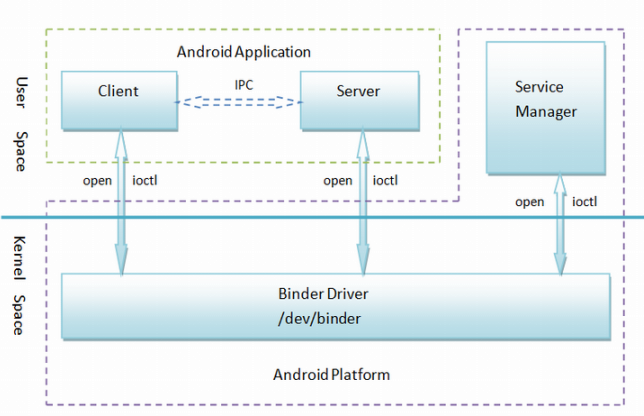

# android binder #

	参考
	
	https://blog.csdn.net/pashanhu6402/article/details/79022881
	https://blog.csdn.net/happylishang/article/details/51784834
	https://blog.csdn.net/u011006622/article/details/78961320
	
	Binder基于Client-Server通信模式，传输过程只需一次拷贝，为发送方添加UID/PID身份，既支持实名Binder也支持匿名Binder，安全性高。
	
	在Android系统的Binder机制由4个系统组件组成: Client、Server、Service Manager和Binder驱动
	其中Client、Server和Service Manager运行在用户空间，Binder驱动程序运行内核空间。
	核心组件是Binder驱动程序；
	Service Manager是一个守护进程（同时它也充当着特殊Server角色），用来管理Server，并向Client提供查询Server接口的能力；
	Client和Server在Binder驱动和Service Manager的基础上，进行Client-Server之间的通信。
	
	关系如下图所示：
  
	
	
- binder适用场景

		适合小数据量的通信，不适合数据量较大的通信
		
- Binder与其它IPC的不同

		Binder使用了面向对象的思想，来描述作为访问接入点的Binder及其在Client中的入口：
		
		1）Binder是一个位于Server中的实体对象，该对象提供了一套方法用以实现对服务的请求，就象类的成员函数。
		
		2）遍布于client中的入口可以看成指向这个binder对象的‘指针’（指针是C++的术语，而更通常的说法是引用），一旦获得了这个‘指针’就可以调用该对象的方法访问server。
		在Client看来，通过Binder‘指针’调用其提供的方法，与通过指针调用其它任何本地对象的方法并无区别，尽管前者的实体位于远端Server中，而后者实体位于本地内存中。
		
		3）从通信的角度看，Client中的Binder也可以看作是Server Binder的‘代理’，在本地代表远端Server为Client提供服务。

- 1 Service Manager成为Binder守护进程的过程

		1) 打开/dev/binder文件：open("/dev/binder", O_RDWR)
		
		2) 建立128K内存映射：mmap(NULL, mapsize, PROT_READ, MAP_PRIVATE, bs->fd, 0)
		
		3) 通知Binder驱动程序它是守护进程：binder_become_context_manager(bs)
		
		4) 进入循环等待请求的到来：binder_loop(bs, svcmgr_handler)
		
		这个过程会在Binder驱动中建立了一个struct binder_proc结构、一个struct  binder_thread结构和一个struct binder_node结构，

- 2 Client获得server接口的过程

		Service Manager在Binder机制中既充当守护进程的角色，同时它也充当着Server角色，然而它又与一般的Server不一样。

		1)Client如果想要获得普通的Server的远程接口，那么必须通过Service Manager远程接口提供的getService接口来获得，
		这本身是一个使用Binder机制来进行进程间通信的过程。
		
		2)Client如果想要获得Service Manager(也是个server)远程接口，却不必通过进程间通信机制来获得，
		因为Service Manager远程接口是一个特殊的Binder引用，它的引用句柄一定是0。
		
		获取Service Manager远程接口的函数是defaultServiceManager()
		
		
- 3 Service Manager远程接口的创建过程

		Service Manager远程接口本质上是一个BpServiceManager，包含了一个句柄值为0的Binder引用。
		
		BpServiceManager继承了 BpInterface,  BpInterface又继承了IServiceManager。
		
		IServiceManager类继承了IInterface类，而IInterface类和BpRefBase类又分别继承了RefBase类。
		在BpRefBase类中，有一个成员变量mRemote，它的类型是IBinder*，实现类为BpBinder，它表示一个Binder引用，Binder引用的句柄值保存在BpBinder类的mHandle成员变量中。
		BpBinder类通过IPCThreadState类来与Binder驱动程序并互，而IPCThreadState又通过它的成员变量mProcess来打开/dev/binder设备文件，mProcess成员变量的类型为ProcessState。
		ProcessState类打开设备/dev/binder之后，将该打开的文件描述符保存在它的mDriverFD成员变量中，用来与binder驱动交互。
		
- 4 Server和Client拿到Service Manager远程接口之后怎么用？

		1）对Server来说，调用IServiceManager::addService接口来和Binder驱动程序交互，即调用BpServiceManager::addService 。
		
		BpServiceManager::addService会调用通过其基类BpRefBase的成员函数remote()获得原先创建的BpBinder实例，接着调用BpBinder::transact成员函数。
		在BpBinder::transact函数中，又会调用IPCThreadState::transact成员函数，这里就是最终与Binder驱动程序交互的地方。
		回忆一下前面，IPCThreadState有一个PorcessState类型的成中变量mProcess，而mProcess有一个成员变量mDriverFD，它是打开的设备文件/dev/binder的文件描述符，
		因此，IPCThreadState就相当于间接拥有了设备文件/dev/binder的打开文件描述符，于是，便可以与Binder驱动程序交互了。
		
		2）对Client来说，调用IServiceManager::getService这个接口来和Binder驱动程序交互。
		
- Binder 内存映射

		Binder驱动实现了mmap系统调用：binder_mmap()，其内部会创建一块binder内存，用于client-server间收发数据。
		
		每个进程都有属于自己的一块binder内存，
		binder_proc->buffer是这块内存在内核空间的首地址，在进程的用户空间的首地址为：ProcessState::mVMStart, 它们的差值存储在binder_proc->user_buffer_offset中，
		这样在已知内核地址情况下，在用户空间只需要加上这个user_buffer_offset偏移值，即可以得到在用户空间访问的地址，从而达到访问同一物理内存地址的目的。
		
		参与binder通讯的进程，无论是client还是服务器端，他们都会通过调用ProcessState::self()函数（单例模式）来建立自己的初步映射。
		为什么说是初步影射呢，因为binder_mmap为我们分配了指定长度的虚拟地址，但却只是建立一个物理页的影射，其他的虚拟地址都还暂未建立虚拟到物理的影射。
		
		ProcessState::ProcessState()  
			: mDriverFD(open_driver())//打开/dev/binder设备驱动  
			, mVMStart(MAP_FAILED)  
			, mManagesContexts(false)  
			, mBinderContextCheckFunc(NULL)  
			, mBinderContextUserData(NULL)  
			, mThreadPoolStarted(false)  
			, mThreadPoolSeq(1)  
		{  
			if (mDriverFD >= 0) {  
				// XXX Ideally, there should be a specific define for whether we  
				// have mmap (or whether we could possibly have the kernel module  
				// availabla).  
		#if !defined(HAVE_WIN32_IPC)  
				// mmap the binder, providing a chunk of virtual address space to receive transactions.  
				mVMStart = mmap(0, BINDER_VM_SIZE, PROT_READ, MAP_PRIVATE | MAP_NORESERVE, mDriverFD, 0);  //建立影射，直接调用到驱动的binder_mmap函数  
				if (mVMStart == MAP_FAILED) {  
					// *sigh*  
					ALOGE("Using /dev/binder failed: unable to mmap transaction memory.\n");  
					close(mDriverFD);  
					mDriverFD = -1;  
				}  
		#else  
				mDriverFD = -1;  
		#endif  
			}  
		  
			LOG_ALWAYS_FATAL_IF(mDriverFD < 0, "Binder driver could not be opened.  Terminating.");  
		}
		
		以上ProcessState类的构造函数实现了：
		为进程的用户和内核空间各分配一段虚拟地址，并且，biner_mmap()刚开始只是分配了一个物理页，
		并将这个物理页映射到进程的内核虚拟地址空间V1（修改内核空间的页表映射）和进程的用户虚拟地址空间V2（修改用户空间的页表映射）。
		从而实现进程的内核和用户空间共享同一块物理内存的目的。
		当binder驱动在内核空间将一段数据拷贝到这个物理页后，不需要做copy_to_user()，进程的用户空间即可以看到内核空间的修改。

		文件：Binder.c (\kernel\drivers\staging\android)
		
		1）static int binder_open(struct inode *nodp, struct file *filp)
		创建用户进程对应的binder_proc（用来保存打开binder设备文件的进程的上下文信息）,
		并放在filp->private_data和全局的hash表binder_procs中，方便使用和管理。
		
		2）static int binder_mmap(struct file *filp, struct vm_area_struct *vma)
		根据用户进程虚拟地址块来建立对应的内核虚拟地址块，并分配一个物理page，做好该物理page在内核页表和用户进程页表的映射关系。
		这是binder通信机制的精髓：同一个物理页面，一方映射到进程虚拟地址空间，一方面映射到内核虚拟地址空间，
		这样，进程和内核之间就可以减少一次内存拷贝了，提到了进程间通信效率。
		
		static int binder_mmap(struct file *filp, struct vm_area_struct *vma)
		{
			struct vm_struct *area;  //内核虚拟地址变量
			struct binder_proc *proc = filp->private_data;  //从file里获取当前的binder_proc
			struct binder_buffer *buffer;   //binder_proc的内核buffer
			
			area = get_vm_area(vma->vm_end - vma->vm_start, VM_IOREMAP); //根据用户虚拟地址块的大小，来获取一个内核虚拟地址块
			
			proc->buffer = area->addr;  //binder_proc的内核buffer起始地址就是内核虚拟地址的起始地址
			proc->user_buffer_offset = vma->vm_start - (uintptr_t)proc->buffer; //获得内核虚拟地址与用户虚拟地址的差值，以方便两者间的快速转换
				
			proc->pages = kzalloc(sizeof(proc->pages[0]) * ((vma->vm_end - vma->vm_start) / PAGE_SIZE), GFP_KERNEL); //为内核虚拟地址块分配n个page*指针
			proc->buffer_size = vma->vm_end - vma->vm_start; //proc的内核buffer大小就是内核虚拟地址块的大小

			vma->vm_ops = &binder_vm_ops;  //用于态操作？
			vma->vm_private_data = proc;  //将proc指针保存到用户态的vma中

			//分配一个page的物理页，并建立好该物理页与内核虚拟地址的映射关系以及与用户虚拟地址的映射关系，也就是说会同时改变内核页表和用户进程的页表。
			参数1代表分配。这个物理页对应内核虚拟地址是proc->buffer ~ proc->buffer + PAGE_SIZE
			
			binder_update_page_range(proc, 1, proc->buffer, proc->buffer + PAGE_SIZE, vma))
			
			buffer = proc->buffer;
			INIT_LIST_HEAD(&proc->buffers);
			list_add(&buffer->entry, &proc->buffers); //将proc的buffer插入到proc->buffers list中
			buffer->free = 1;
			binder_insert_free_buffer(proc, buffer);  //将proc的buffer插入到proc->free_buffers.rb_node的rbtree中
			proc->free_async_space = proc->buffer_size / 2;
			barrier();
			proc->files = get_files_struct(current);  
			proc->vma = vma;
			proc->vma_vm_mm = vma->vm_mm;

		}

- Binder 收发数据过程

		client向server发起请求：

		1）Client进程C1中的线程T1通过S的Binder的引用向进程S发送请求；
		2）S为了处理这个请求需要启动线程T2，此时线程T1处于接收返回数据的等待状态；
		3）T2处理完请求将处理结果返回给T1，T1被唤醒得到处理结果；
		
		对于Server进程S，可能会有许多Client同时发起请求，怎样使用线程池实现并发处理呢？
		
		一开始就创建一堆线程有点浪费资源。于是Binder协议引入了专门命令或消息帮助用户管理线程池，包括：
		INDER_SET_MAX_THREADS
		BC_REGISTER_LOOP
		BC_ENTER_LOOP
		BC_EXIT_LOOP
		BR_SPAWN_LOOPER
		1）首先要应用程序通过INDER_SET_MAX_THREADS告诉驱动最多可以创建几个线程；
		2）每个线程在创建、进入主循环、退出主循环时都要分别使用BC_REGISTER_LOOP，BC_ENTER_LOOP，BC_EXIT_LOOP告知驱动，以便驱动收集和记录当前线程池的状态；
		3）每当驱动接收完数据包返回读Binder的线程时，都要检查一下是不是已经没有闲置线程了；
		如果是，而且线程总数不会超出线程池最大线程数，就会在当前读出的数据包后面再追加一条BR_SPAWN_LOOPER消息，告诉用户线程即将不够用了，请再启动一些线程。
		
		
		数据包接收队列与线程等待队列管理：
		
		1）每个进程有一个全局的接收队列，也叫to-do队列，存放不是发往特定线程的数据包；
		相应地有一个全局等待队列，所有等待从全局接收队列里收数据的线程在该队列里排队。
		
		2）每个线程有自己私有的to-do队列，存放发送给该线程的数据包；
		相应的每个线程都有各自私有等待队列，专门用于本线程等待接收自己to-do队列里的数据。其实线程私有等待队列中最多只有一个线程，即它自己。
		
		由于发送时没有特别标记，驱动怎么判断哪些数据包该送入全局to-do队列，哪些数据包该送入特定线程的to-do队列呢？
		这里有两条规则。
		
		规则1：Client发给Server的请求数据包都提交到Server进程的全局to-do队列。
		不过有个特例，就是上节谈到的Binder对工作线程启动的优化。
		经过优化，来自T1的请求不是提交给P2的全局to-do队列，而是送入了T2的私有to-do队列。
		
		规则2：对同步请求的返回数据包（由BC_REPLY发送的包）都发送到 发起请求的线程的私有to-do队列中。
		如上面的例子，如果进程P1的线程T1发给进程P2的线程T2的是同步请求，那么T2返回的数据包将送进T1的私有to-do队列而不会提交到P1的全局to-do队列。
		
		数据包进入接收队列的潜规则也就决定了线程进入等待队列的潜规则，
		即一个线程只要不接收返回数据包则应该在全局等待队列中等待新任务，否则就应该在其私有等待队列中等待Server的返回数据。