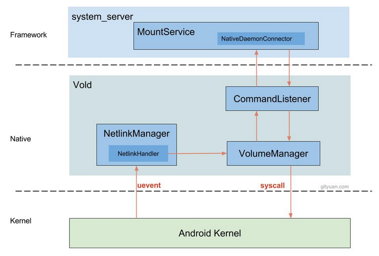
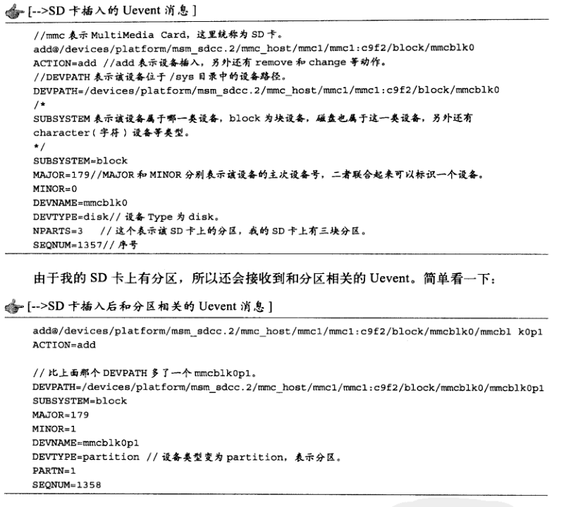

# android上的VOLD守护进程 #

	参考
	https://blog.csdn.net/new_abc/article/details/7396733  android usb挂载分析----vold启动
	https://blog.csdn.net/qq_31530015/article/details/53324819  Android7.0 Vold 进程工作机制分析之整体流程
	https://blog.csdn.net/qq_31530015/article/details/53325101  Android7.0 Vold 进程工作机制分析之由Kernel发起挂载请求
	https://blog.csdn.net/qq_31530015/article/details/53325116  Android7.0 Vold 进程工作机制分析之由MountService发起挂载请求

 

	VOLD在init.rc中启动后, 作为native server运行着
	code： system/vold/

	VOLD启动了： VolumeManager，NetlinkManager， CommandListener
	main.cpp:
		vm = VolumeManager::Instance();
		nm = NetlinkManager::Instance();
		cl = new CommandListener();
		
		vm->setBroadcaster((SocketListener *) cl);
		nm->setBroadcaster((SocketListener *) cl);
		
		vm->start();
		nm->start();
		cl->startListener();

- 1) NetlinkManager(NM)

		kernel的uevent通过内核的Netlink(特殊的socket方式）往用户空间上报插入等事件(因为card/usb storage device的KObject状态发生变化了)，
		NetlinkManager监听到这个事件，进而usb/card device被VolumeManager管理

		

- 2) VolumeManager(VM)

		管理多个device，如SD cards, usb storage devices, 而每个device有一个对应的handler

		调用process_config(), 它的主要功能是解析/etc/vold.fstab，这个文件的作用和Linux系统中的fstab文件很类似，就是设置一些存储设备的挂载点.

	 
	  
	  
	 

- 3) CommandListener

		监听来自Mountservice的命令（实现的方式是socket, 其中CL是server端，mountservice是client）；
		以及将VM和NM的消息转发给mountservice

	  
	 

- java中的MountService

		文件： MountService.java

		Framework的MountService.java是一个系统服务, 负责与Vold进程通信, 运行在SystemServer进程.
		当收到Vold的挂载消息后,会通过广播的方式通知上层应用; 当然也会通过CommandListener与下层传递

		有些应用程序需要检测外部存储卡的插人/拔出事件，这些事件是由MountService通过Intent广播发出的.
		例如SD卡插人后，MountService就会发送ACTION_MEDlA_MOUNTED消息

		MountService通过NativeDaemonCcmnector和Vold的CL模块建立通信连接

- 过程分析

		1) 插入sd card -> Kernel(/sys/block/mmcblk0/uevent) 
		-> NetLinkManager(socket通信) -> NetlinkHandler(.onEvent())
		-> VolumeManager(.handleBlockEvent()) -> DirectVolume(.handleBlockEvent()/.handleDiskAdded())
		-> Mountservice.java(.doMountVolume()/.onEvent()/.notifyVolumeStateChange()) 
		<-> CommandListener(.runCommand("mount"))

	  
		
	 

		2) 由MountService发起挂载请求:
		上层setting -> Mountservice.java -> CommandListener -> VolumeManager -> Volume-> USB storage device或者SD device
	

- Netlink

		Netlink是Linux系统中用户空间进程和Kernel进行通信的一种机制，通过这种机制，
		位于用户空间的进程可以接收来自Kerne的一些消息（例如Void中用到的USB或SD的插 拔消息），
		同时应用层也可通过Netlink向Kernel发送一些控制命令（怎么做？）。

		目前，Linux系统并没有为NetUnk单独设计一套系统调用，而是复用了 Socket的操作接口，
		只是在创建Socket时会有一些特殊的地方

- uevent

		Uevent和Linux的Udev设备文件系统及设备模型有关系，它实际上就是一串字符串， 字符串的内容可告知发生了什么事情。
		下面通过一个实例来直观感受uevent.

		在SD卡插人手机后，系统会检测到这个设备的插人，然后内核会通过Netlink发送一个消息给Void, 
		Vold将根据接收到的消息进行处理，例如挂载这个SD卡，内核发送的这个消息，就是Invent, 
		其中U代表User space (应用层空间).

		下面看SD卡插入时Vold截获到的Uevent消息:

	 

		内核通过Uevent告知外部存储系统发生了哪些事倩，那么Uevent在什么情况下会由Kernel发出呢？ 

		(1) 由设备发生变化而触发
		当设备发生变化时，这会引起Kernel发送Uevent消息，例如设备的插入和拔出等.
		如果Vold在设备发生变化之前已经建立了 Netlink IPC通信，那么Vold可以接收到这些Uevent消息。

		(2) 由应用层触发
		设备一般在/sys对应的目录下有一个叫uevent的文件，往该文件中写入指定的数据，也会触发Kernel发送和该设备相关的Uevent消息，
		例如，Vold启动时，会往这些uevent文件中写数据，通过这种方式促使内核发送Uevent消息，这样Vold就能得到这些设备的当前信息了。
		vold的main.cpp中，
		coldboot{"/sys/block") //通过往/sys/block目录下对应的uevent文件写“add\n”来触发内核发送Uevent消息