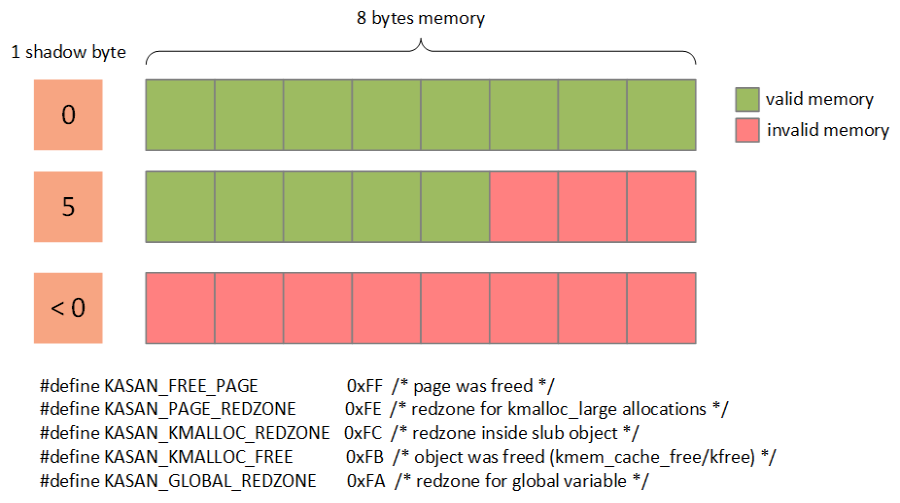
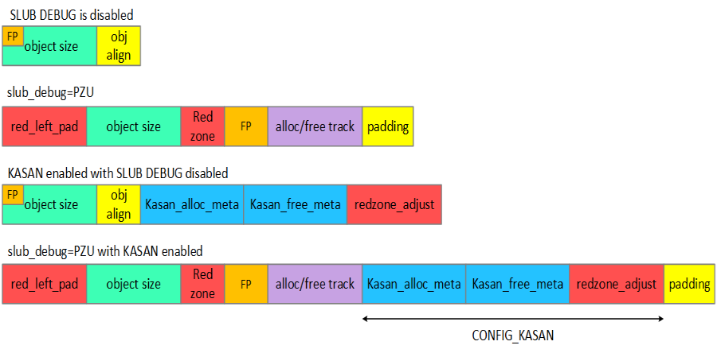

# 参考资料 #

	1) https://source.android.com/devices/tech/debug/sanitizers#kernel-address-sanitizer

	KASAN is supported on x86_64 and arm64 architectures. 
	It has been part of the upstream kernel since 4.0, and has been backported to Android 3.18-based kernels.
	KASAN has been tested on Android kernels compiled with gcc based on 4.9.2.

	To compile a kernel with KASAN and kcov enabled, add the following build flags to your kernel build configuration:

	CONFIG_KASAN
	CONFIG_KASAN_INLINE
	CONFIG_TEST_KASAN
	CONFIG_KCOV
	CONFIG_SLUB
	CONFIG_SLUB_DEBUG
	CONFIG_CC_OPTIMIZE_FOR_SIZE

	And removing the following:

	CONFIG_SLUB_DEBUG_ON
	CONFIG_SLUB_DEBUG_PANIC_ON
	CONFIG_KASAN_OUTLINE
	CONFIG_KERNEL_LZ4

	After flashing the kernel, check the kernel boot logs to see if KASAN is enabled and running.
	The kernel will start up with memory map information for KASAN, such as:
	...
	[	0.000000] c0	  0 Virtual kernel memory layout:
	[	0.000000] c0	  0	 kasan   : 0xffffff8000000000 - 0xffffff9000000000   (	64 GB) //=> KASAN enabled
	[	0.000000] c0	  0	 vmalloc : 0xffffff9000010000 - 0xffffffbdbfff0000   (   182 GB)

	2) https://www.kernel.org/doc/html/latest/dev-tools/kasan.html

	Overview

	KernelAddressSANitizer (KASAN) is a dynamic memory error detector. 
	It provides a fast and comprehensive solution for finding use-after-free and out-of-bounds bugs.
	KASAN uses compile-time instrumentation for checking every memory access, therefore you will need a GCC version 4.9.2 or later.
	GCC 5.0 or later is required for detection of out-of-bounds accesses to stack or global variables.

	Currently KASAN is supported only for the x86_64 and arm64 architectures.

	To enable KASAN configure kernel with:
	CONFIG_KASAN = y

	and choose between CONFIG_KASAN_OUTLINE and CONFIG_KASAN_INLINE. Outline and inline are compiler instrumentation types.
	The former produces smaller binary the latter is 1.1 - 2 times faster. 
	Inline instrumentation requires a GCC version 5.0 or later.
	
	KASAN works with both SLUB and SLAB memory allocators. 
	For better bug detection and nicer reporting, enable CONFIG_STACKTRACE

	A typical out of bounds access report looks like this:
	==================================================================
	BUG: AddressSanitizer: out of bounds access in kmalloc_oob_right+0x65/0x75 [test_kasan] at addr ffff8800693bc5d3

	Memory state around the buggy address:
	 ffff8800693bc300: fc fc fc fc fc fc fc fc fc fc fc fc fc fc fc fc
	 ffff8800693bc380: fc fc 00 00 00 00 00 00 00 00 00 00 00 00 00 fc
	 ffff8800693bc400: fc fc fc fc fc fc fc fc fc fc fc fc fc fc fc fc
	 ffff8800693bc480: fc fc fc fc fc fc fc fc fc fc fc fc fc fc fc fc
	 ffff8800693bc500: fc fc fc fc fc fc fc fc fc fc fc 00 00 00 00 00
	>ffff8800693bc580: 00 00 00 00 00 00 00 00 00 00 03 fc fc fc fc fc  //=> 03 means that the accessed address is partially accessible.

	The header of the report discribe what kind of bug happened and what kind of access caused it.
	It’s followed by the description of the accessed slub object (see ‘SLUB Debug output’ section in Documentation/vm/slub.txt for details) 
	and the description of the accessed memory page.

	In the last section the report shows memory state around the accessed address. 
	Reading this part requires some understanding of how KASAN works.
	
	The state of each 8 aligned bytes of memory is encoded in one shadow byte. 
	Those 8 bytes can be accessible, partially accessible, freed or be a redzone.
	
	We use the following encoding for each shadow byte: 
	0 means that all 8 bytes of the corresponding memory region are accessible; 
	number N (1 <= N <= 7) means that the first N bytes are accessible, and other (8 - N) bytes are not; 
	any negative value indicates that the entire 8-byte word is inaccessible. 
	We use different negative values to distinguish between different kinds of inaccessible memory like redzones or freed memory (see mm/kasan/kasan.h).

	3) https://source.android.com/devices/tech/debug/kasan-kcov

	4) youtube视频: How to use KASAN to debug memory corruption

# N7.0 上使能 KASAN #

	1) kernel部分
	# CONFIG_KASAN_INLINE
	CONFIG_KASAN=y

	此外需要打开 slub config:
	CONFIG_SLUB_DEBUG_ON=y
	CONFIG_SLUB_DEBUG_PANIC_ON=y //不打开不会panic，当KASAN发生问题时

	考虑使用：slub_debug=PZU

	N7.0 要disable 以下config, 否则不能boot； M 不需要disable它们：
	# CONFIG_PAGE_POISONING
	# CONFIG_FREE_PAGES_RDONLY
	# CONFIG_DEBUG_PAGEALLOC

	可以考虑eanble：
	CONFIG_TEST_KASAN=m //模块化编译，之后 insmod 安装，但目前发现安装时有错误发生
	CONFIG_STACKTRACE=y

	2) 在LK中重新指定device tree和ramdisk的加载地址
	原则：根据boot image增加的大小修改iomap.h中的宏
	#define ABOOT_FORCE_RAMDISK_ADDR
	#define ABOOT_FORCE_TAGS_ADDR

	3）编译器方面：按照官方的说法，最好是GCC5.0以上，但目前测试GCC-4.9.2就可以
	
	
# log分析 #

	==================================================================
	BUG: AddressSanitizer: out of bounds access in kmalloc_oob_right+0x65/0x75 [test_kasan] at addr ffff8800693bc5d3  //=> 发生oob: 试图写ffff8800693bc5d3处
	Write of size 1 by task modprobe/1689  //==> 越界写1个字节
	=============================================================================
	BUG kmalloc-128 (Not tainted): kasan error
	-----------------------------------------------------------------------------
	Disabling lock debugging due to kernel taint
	INFO: Allocated in kmalloc_oob_right+0x3d/0x75 [test_kasan] age=0 cpu=0 pid=1689
	 __slab_alloc+0x4b4/0x4f0
	 kmem_cache_alloc_trace+0x10b/0x190
	 kmalloc_oob_right+0x3d/0x75 [test_kasan]
	 init_module+0x9/0x47 [test_kasan]
	 do_one_initcall+0x99/0x200
	 load_module+0x2cb3/0x3b20
	 SyS_finit_module+0x76/0x80
	 system_call_fastpath+0x12/0x17
	INFO: Slab 0xffffea0001a4ef00 objects=17 used=7 fp=0xffff8800693bd728 flags=0x100000000004080
	INFO: Object 0xffff8800693bc558 @offset=1368 fp=0xffff8800693bc720 //=> object的首地址是：0xffff8800693bc558

	Bytes b4 ffff8800693bc548: 00 00 00 00 00 00 00 00 5a 5a 5a 5a 5a 5a 5a 5a  ........ZZZZZZZZ
	Object ffff8800693bc558: 6b 6b 6b 6b 6b 6b 6b 6b 6b 6b 6b 6b 6b 6b 6b 6b  kkkkkkkkkkkkkkkk  //=> object的真实内容，字节对齐后的size是128个字节（另一个0XA5是结束标记）
	Object ffff8800693bc568: 6b 6b 6b 6b 6b 6b 6b 6b 6b 6b 6b 6b 6b 6b 6b 6b  kkkkkkkkkkkkkkkk
	Object ffff8800693bc578: 6b 6b 6b 6b 6b 6b 6b 6b 6b 6b 6b 6b 6b 6b 6b 6b  kkkkkkkkkkkkkkkk
	Object ffff8800693bc588: 6b 6b 6b 6b 6b 6b 6b 6b 6b 6b 6b 6b 6b 6b 6b 6b  kkkkkkkkkkkkkkkk
	Object ffff8800693bc598: 6b 6b 6b 6b 6b 6b 6b 6b 6b 6b 6b 6b 6b 6b 6b 6b  kkkkkkkkkkkkkkkk
	Object ffff8800693bc5a8: 6b 6b 6b 6b 6b 6b 6b 6b 6b 6b 6b 6b 6b 6b 6b 6b  kkkkkkkkkkkkkkkk
	Object ffff8800693bc5b8: 6b 6b 6b 6b 6b 6b 6b 6b 6b 6b 6b 6b 6b 6b 6b 6b  kkkkkkkkkkkkkkkk
	Object ffff8800693bc5c8: 6b 6b 6b 6b 6b 6b 6b 6b 6b 6b 6b 6b 6b 6b 6b a5  kkkkkkkkkkkkkkk.
	Redzone ffff8800693bc5d8: cc cc cc cc cc cc cc cc                          ........ //=> 该object是分配状态
	Padding ffff8800693bc718: 5a 5a 5a 5a 5a 5a 5a 5a                          ZZZZZZZZ
	CPU: 0 PID: 1689 Comm: modprobe Tainted: G    B          3.18.0-rc1-mm1+ #98
	 ffff8800693bc000 0000000000000000 ffff8800693bc558 ffff88006923bb78
	 ffffffff81cc68ae 00000000000000f3 ffff88006d407600 ffff88006923bba8
	 ffffffff811fd848 ffff88006d407600 ffffea0001a4ef00 ffff8800693bc558
	Call Trace:
	 [<ffffffff81cc68ae>] dump_stack+0x46/0x58
	 [<ffffffff811fd848>] print_trailer+0xf8/0x160
	 [<ffffffffa00026a7>] ? kmem_cache_oob+0xc3/0xc3 [test_kasan]
	 [<ffffffff811ff0f5>] object_err+0x35/0x40
	 [<ffffffffa0002065>] ? kmalloc_oob_right+0x65/0x75 [test_kasan] //=> 访问的callstack
	 [<ffffffff8120b9fa>] kasan_report_error+0x38a/0x3f0
	 [<ffffffff8120a79f>] ? kasan_poison_shadow+0x2f/0x40
	 [<ffffffff8120b344>] ? kasan_unpoison_shadow+0x14/0x40
	 [<ffffffff8120a79f>] ? kasan_poison_shadow+0x2f/0x40
	 [<ffffffffa00026a7>] ? kmem_cache_oob+0xc3/0xc3 [test_kasan]
	 [<ffffffff8120a995>] __asan_store1+0x75/0xb0
	 [<ffffffffa0002601>] ? kmem_cache_oob+0x1d/0xc3 [test_kasan]
	 [<ffffffffa0002065>] ? kmalloc_oob_right+0x65/0x75 [test_kasan]
	 [<ffffffffa0002065>] kmalloc_oob_right+0x65/0x75 [test_kasan]
	 [<ffffffffa00026b0>] init_module+0x9/0x47 [test_kasan]
	 [<ffffffff810002d9>] do_one_initcall+0x99/0x200
	 [<ffffffff811e4e5c>] ? __vunmap+0xec/0x160
	 [<ffffffff81114f63>] load_module+0x2cb3/0x3b20
	 [<ffffffff8110fd70>] ? m_show+0x240/0x240
	 [<ffffffff81115f06>] SyS_finit_module+0x76/0x80
	 [<ffffffff81cd3129>] system_call_fastpath+0x12/0x17
	Memory state around the buggy address:
	 ffff8800693bc300: fc fc fc fc fc fc fc fc fc fc fc fc fc fc fc fc
	 ffff8800693bc380: fc fc 00 00 00 00 00 00 00 00 00 00 00 00 00 fc
	 ffff8800693bc400: fc fc fc fc fc fc fc fc fc fc fc fc fc fc fc fc
	 ffff8800693bc480: fc fc fc fc fc fc fc fc fc fc fc fc fc fc fc fc
	 ffff8800693bc500: fc fc fc fc fc fc fc fc fc fc fc 00 00 00 00 00
	>ffff8800693bc580: 00 00 00 00 00 00 00 00 00 00 03 fc fc fc fc fc  //=> 值03 是 0xffff8800693bc5d0 对应的shadow memory
													 ^
	 ffff8800693bc600: fc fc fc fc fc fc fc fc fc fc fc fc fc fc fc fc
	 ffff8800693bc680: fc fc fc fc fc fc fc fc fc fc fc fc fc fc fc fc
	 ffff8800693bc700: fc fc fc fc fb fb fb fb fb fb fb fb fb fb fb fb
	 ffff8800693bc780: fb fb fb fb fb fb fb fb fb fb fb fb fb fb fb fb
	 ffff8800693bc800: fb fb fb fb fb fb fb fb fb fb fb fb fb fb fb fb
	==================================================================
	
	可以推出：
	1）从shadow memory的值03看，有连续的15个00，申请的内存是15*8+3=123个连续的字节的内存
	2）object的首地址是0xffff8800693bc558， 0xffff8800693bc558+123 = 0xffff8800693bc5d3（是目前要访问的地址）, 正好超过了1个字节
	3）object一共有127个0x6b，说明OOB发生前，没有任何对该内存的写操作
	

# KASAN 原理 #

	参考
	https://www.cnblogs.com/alantu2018/p/8457420.html
	
	KASAN（KernelAddressSANitizer）是一个动态检测内存错误的工具。
	KASAN可以检测全局变量、栈、堆分配的内存发生越界访问out-of-bounds和use-after-free问题。
	功能比SLUB DEBUG功能齐全并且支持实时检测。
	
	KASAN使用编译时检测每个内存访问，因此您需要GCC 4.9.2或更高版本。
	检测堆栈或全局变量的越界访问需要GCC 5.0或更高版本。
	
	目前KASAN仅支持x86_64和arm64架构（linux 4.4版本合入）。
	如果你是用ARM64架构，那么就需要保证linux版本在4.4以上。
	当然了，如果你使用的linux也有可能打过KASAN的补丁。例如，使用高通平台做手机的厂商使用linux 3.18同样支持KASAN。 
	
- 如何使能

		使用KASAN工具是比较简单的，只需要添加kernel一下配置项。
		CONFIG_SLUB_DEBUG=y
		CONFIG_KASAN=y
		为什么这里必须打开SLUB_DEBUG呢？是因为有段时间KASAN是依赖SLUBU_DEBUG的。
		不过最新的代码已经不需要依赖了，可以看下提交。但是建议打开该选项，因为log可以输出更多有用的信息

- KASAN是如何实现检测的

		KASAN的原理是利用1/8的内存标记可用内存的状态。这部分额外的内存被称作shadow memory（影子区）。
		使用特殊的magic num填充shadow memory，在每一次load/store（load/store检查指令由编译器插入）内存的时候检测对应的shadow memory确定操作是否valid。
		
		连续8 bytes内存（8 bytes align）使用1 byte shadow memory标记：
		1) 如果8 bytes内存都可以访问，则shadow memory的值为0；
		2) 如果连续N(1 =< N <= 7) bytes可以访问，则shadow memory的值为N；
		3) 如果8 bytes内存访问都不可以访问，则shadow memory的值为负数
	
	 

	- 检测 SLUB object
	
			当我们打开KASAN的时候，SLUB Allocator管理的object layout将会放生一定的变化。
			如下图所示:
		 

			