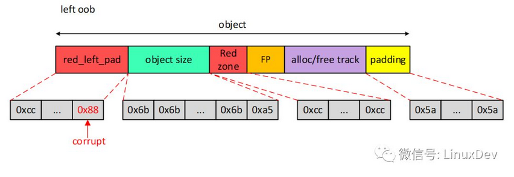

# SLUB Debug #

	参考
	https://blog.csdn.net/jus3ve/article/details/79285745
	
- 使能

		enable以下宏：
		
		CONFIG_SLUB=y
		CONFIG_SLUB_DEBUG=y
		CONFIG_SLUB_DEBUG_ON=y
	
- 如何使用

		SLUB内存检测功能在某些情况下不能立刻检测出来，必须主动触发，因此我们需要借助slabinfo命令触发SLUB allocator检测功能。
		和KASAN相比较而言，这也是SLUB DEBUG的一个劣势。毕竟KASAN可以做到在越界问题出现时就报出问题。
		
		slabinfo工具源码位于tools/vm目录。可以使用如下命令编译slabinfo工具（针对ARM64 architecture）：
		aarch64-linux-gnu-gcc -o slabinfo slabinfo.c

		当系统开机之后，就可以运行slaninfo –v 命令触发SLUB allocator检测所有的object，并将log信息输出到syslog。
		接下来的任务就是查看log信息是否包含SLUB allocator输出的bug log。

- slub object debug 原理

		相关的宏：
		
		#define SLUB_RED_INACTIVE	0xbb
		#define SLUB_RED_ACTIVE		0xcc

		/* ...and for poisoning */
		#define	POISON_INUSE	0x5a	/* for use-uninitialised poisoning */
		#define POISON_FREE		0x6b	/* for use-after-free poisoning */
		#define	POISON_END		0xa5	/* end-byte of poisoning */
		
		
		打开SLUB DEBUG选项时，slub object的结构中会增加一些DEBUG域：
		linux 3.18(64bit)上
	 
	
		linux 4.15上
	 

		说明：
		
		1）Red zone的作用：检查object的越界访问，分为左越界(linux 4.? 后才支持)和右越界。
		REDZONE里的值为BBBBBBBB表示object处于free状态（被free过，或者从来没有被分配过）；
		CCCCCCCC表示object是已经分配的了.
		
		2) padding的作用： 如果pad不是0X5A, 则发生了Object padding overwritten
		有可能是因为野指针，或错误使用指针导致的越界访问
		
		3）red_left_pad的作用： 检查左越界访问
		
		4）allocate或free track的大小对应struct track(slub.c), 大小是0x98(152), 函数：set_track()
		
		5）如果使能了KASAN, 那么在alloc/free track后还会增加kasan_alloc和kasan_free的信息。
		
- object layout
		
	- 1）仅分配了但还没有free过的OBJECT, 地址：0x FFFFFFC076208000
		
		 
		
			注意：free pointer的值只是指向下一个object, 当已经分配后，这个free pointer并不改变。
			所以我们不能认为free pointer指向的object一定是free的，只能通过指向的object中的REDZONE值来判断
			
			______________________address|________0________4________8________C_0123456789ABCDEF
			NSD:0000:FFFFFFC076207FC0 | 5A5A5A5A 5A5A5A5A 5A5A5A5A 5A5A5A5A ZZZZZZZZZZZZZZZZ
			NSD:0000:FFFFFFC076207FD0 | 5A5A5A5A 5A5A5A5A 5A5A5A5A 5A5A5A5A ZZZZZZZZZZZZZZZZ
			NSD:0000:FFFFFFC076207FE0 | 5A5A5A5A 5A5A5A5A 5A5A5A5A 5A5A5A5A ZZZZZZZZZZZZZZZZ
			NSD:0000:FFFFFFC076207FF0 | 5A5A5A5A 5A5A5A5A 5A5A5A5A 5A5A5A5A ZZZZZZZZZZZZZZZZ //<= object前的PAD
			NSD:0000:FFFFFFC076208000 | 6C616D6B 2D636F6C 00383231 6B6B6B6B kmalloc-128.kkkk //<= object的地址(内容开始)，6B表示object的内容是free过的
			NSD:0000:FFFFFFC076208010 | 6B6B6B6B 6B6B6B6B 6B6B6B6B 6B6B6B6B kkkkkkkkkkkkkkkk
			NSD:0000:FFFFFFC076208020 | 6B6B6B6B 6B6B6B6B 6B6B6B6B 6B6B6B6B kkkkkkkkkkkkkkkk
			NSD:0000:FFFFFFC076208030 | 6B6B6B6B 6B6B6B6B 6B6B6B6B 6B6B6B6B kkkkkkkkkkkkkkkk
			NSD:0000:FFFFFFC076208040 | 6B6B6B6B 6B6B6B6B 6B6B6B6B 6B6B6B6B kkkkkkkkkkkkkkkk
			NSD:0000:FFFFFFC076208050 | 6B6B6B6B 6B6B6B6B 6B6B6B6B 6B6B6B6B kkkkkkkkkkkkkkkk
			NSD:0000:FFFFFFC076208060 | 6B6B6B6B 6B6B6B6B 6B6B6B6B 6B6B6B6B kkkkkkkkkkkkkkkk
			NSD:0000:FFFFFFC076208070 | 6B6B6B6B 6B6B6B6B 6B6B6B6B A56B6B6B kkkkkkkkkkkkkkk. //<= A5表示free的内容的结束
			NSD:0000:FFFFFFC076208080 | CCCCCCCC CCCCCCCC 76208200 FFFFFFC0 .......... v.... //<= REDZONE(CCCCCCCCCCCCCCCC表示已经分配了)和free pointer(0xFFFFFFC076208200)。object的内容结束
			NSD:0000:FFFFFFC076208090 | 0037C644 FFFFFFC0 001B64F0 FFFFFFC0 D.7......d...... //<= 此处+0x98处是allocate track信息；+0x98*2处是free track信息
			NSD:0000:FFFFFFC0762080A0 | 001B6A9C FFFFFFC0 001B9798 FFFFFFC0 .j..............
			NSD:0000:FFFFFFC0762080B0 | 0037C5AC FFFFFFC0 0037C644 FFFFFFC0 ..7.....D.7.....
			NSD:0000:FFFFFFC0762080C0 | 0190FC68 FFFFFFC0 019120B0 FFFFFFC0 h........ ......
			NSD:0000:FFFFFFC0762080D0 | 018F9854 FFFFFFC0 100818B0 00000000 T...............
			NSD:0000:FFFFFFC0762080E0 | 00000000 00000000 00000000 00000000 ................
			NSD:0000:FFFFFFC0762080F0 | 00000000 00000000 00000000 00000000 ................
			NSD:0000:FFFFFFC076208100 | 00000000 00000000 00000000 00000000 ................
			NSD:0000:FFFFFFC076208110 | 00000000 00000000 00000000 00000000 ................
			NSD:0000:FFFFFFC076208120 | FFFF8AD0 00000000 00000000 00000000 ................ //0xFFFFFFC076208128开始处是free track信息
			NSD:0000:FFFFFFC076208130 | 00000000 00000000 00000000 00000000 ................
			NSD:0000:FFFFFFC076208140 | 00000000 00000000 00000000 00000000 ................
			NSD:0000:FFFFFFC076208150 | 00000000 00000000 00000000 00000000 ................
			NSD:0000:FFFFFFC076208160 | 00000000 00000000 00000000 00000000 ................
			NSD:0000:FFFFFFC076208170 | 00000000 00000000 00000000 00000000 ................
			NSD:0000:FFFFFFC076208180 | 00000000 00000000 00000000 00000000 ................
			NSD:0000:FFFFFFC076208190 | 00000000 00000000 00000000 00000000 ................
			NSD:0000:FFFFFFC0762081A0 | 00000000 00000000 00000000 00000000 ................
			NSD:0000:FFFFFFC0762081B0 | 00000000 00000000 00000000 00000000 ................
			NSD:0000:FFFFFFC0762081C0 | 5A5A5A5A 5A5A5A5A 5A5A5A5A 5A5A5A5A ZZZZZZZZZZZZZZZZ //<= object后的PAD
			NSD:0000:FFFFFFC0762081D0 | 5A5A5A5A 5A5A5A5A 5A5A5A5A 5A5A5A5A ZZZZZZZZZZZZZZZZ
			NSD:0000:FFFFFFC0762081E0 | 5A5A5A5A 5A5A5A5A 5A5A5A5A 5A5A5A5A ZZZZZZZZZZZZZZZZ
			NSD:0000:FFFFFFC0762081F0 | 5A5A5A5A 5A5A5A5A 5A5A5A5A 5A5A5A5A ZZZZZZZZZZZZZZZZ
			NSD:0000:FFFFFFC076208200 | 6C616D6B 2D636F6C 00323135 6B6B6B6B kmalloc-512.kkkk //从此处0xFFFFFFC076208200开始是下一个object
			NSD:0000:FFFFFFC076208210 | 6B6B6B6B 6B6B6B6B 6B6B6B6B 6B6B6B6B kkkkkkkkkkkkkkkk
			NSD:0000:FFFFFFC076208220 | 6B6B6B6B 6B6B6B6B 6B6B6B6B 6B6B6B6B kkkkkkkkkkkkkkkk
		

	- 2) 重来没有allocate过的OBJECT(即初始转态), 地址：0x FFFFFFC0D0525900
		
			______________________address|________0________4________8________C_0123456789ABCDEF
			NSD:0000:FFFFFFC0D0525880 | 5A5A5A5A 5A5A5A5A 5A5A5A5A 5A5A5A5A ZZZZZZZZZZZZZZZZ
			NSD:0000:FFFFFFC0D0525890 | 5A5A5A5A 5A5A5A5A 5A5A5A5A 5A5A5A5A ZZZZZZZZZZZZZZZZ
			NSD:0000:FFFFFFC0D05258A0 | 5A5A5A5A 5A5A5A5A 5A5A5A5A 5A5A5A5A ZZZZZZZZZZZZZZZZ
			NSD:0000:FFFFFFC0D05258B0 | 5A5A5A5A 5A5A5A5A 5A5A5A5A 5A5A5A5A ZZZZZZZZZZZZZZZZ
			NSD:0000:FFFFFFC0D05258C0 | 5A5A5A5A 5A5A5A5A 5A5A5A5A 5A5A5A5A ZZZZZZZZZZZZZZZZ
			NSD:0000:FFFFFFC0D05258D0 | 5A5A5A5A 5A5A5A5A 5A5A5A5A 5A5A5A5A ZZZZZZZZZZZZZZZZ
			NSD:0000:FFFFFFC0D05258E0 | 5A5A5A5A 5A5A5A5A 5A5A5A5A 5A5A5A5A ZZZZZZZZZZZZZZZZ
			NSD:0000:FFFFFFC0D05258F0 | 5A5A5A5A 5A5A5A5A 5A5A5A5A 5A5A5A5A ZZZZZZZZZZZZZZZZ
			NSD:0000:FFFFFFC0D0525900 |>6B6B6B6B 6B6B6B6B 6B6B6B6B 6B6B6B6B kkkkkkkkkkkkkkkk //没有allocate/free track，所以认为6B是object的初值
			NSD:0000:FFFFFFC0D0525910 | 6B6B6B6B 6B6B6B6B 6B6B6B6B 6B6B6B6B kkkkkkkkkkkkkkkk
			NSD:0000:FFFFFFC0D0525920 | 6B6B6B6B 6B6B6B6B 6B6B6B6B 6B6B6B6B kkkkkkkkkkkkkkkk
			NSD:0000:FFFFFFC0D0525930 | 6B6B6B6B 6B6B6B6B 6B6B6B6B 6B6B6B6B kkkkkkkkkkkkkkkk
			NSD:0000:FFFFFFC0D0525940 | 6B6B6B6B 6B6B6B6B 6B6B6B6B 6B6B6B6B kkkkkkkkkkkkkkkk
			NSD:0000:FFFFFFC0D0525950 | 6B6B6B6B 6B6B6B6B 6B6B6B6B 6B6B6B6B kkkkkkkkkkkkkkkk
			NSD:0000:FFFFFFC0D0525960 | 6B6B6B6B 6B6B6B6B 6B6B6B6B 6B6B6B6B kkkkkkkkkkkkkkkk
			NSD:0000:FFFFFFC0D0525970 | 6B6B6B6B 6B6B6B6B 6B6B6B6B 6B6B6B6B kkkkkkkkkkkkkkkk
			NSD:0000:FFFFFFC0D0525980 | 6B6B6B6B 6B6B6B6B 6B6B6B6B 6B6B6B6B kkkkkkkkkkkkkkkk
			NSD:0000:FFFFFFC0D0525990 | 6B6B6B6B 6B6B6B6B 6B6B6B6B 6B6B6B6B kkkkkkkkkkkkkkkk
			NSD:0000:FFFFFFC0D05259A0 | 6B6B6B6B 6B6B6B6B 6B6B6B6B 6B6B6B6B kkkkkkkkkkkkkkkk
			NSD:0000:FFFFFFC0D05259B0 | 6B6B6B6B 6B6B6B6B 6B6B6B6B A56B6B6B kkkkkkkkkkkkkkk.
			NSD:0000:FFFFFFC0D05259C0 | BBBBBBBB BBBBBBBB D0525B80 FFFFFFC0 .........[R..... //<= REDZONE和free pointer(下一个object)
			NSD:0000:FFFFFFC0D05259D0 | 00000000 00000000 00000000 00000000 ................ //没有allocate track信息，说明没有allocate
			NSD:0000:FFFFFFC0D05259E0 | 00000000 00000000 00000000 00000000 ................
			NSD:0000:FFFFFFC0D05259F0 | 00000000 00000000 00000000 00000000 ................
			NSD:0000:FFFFFFC0D0525A00 | 00000000 00000000 00000000 00000000 ................
			NSD:0000:FFFFFFC0D0525A10 | 00000000 00000000 00000000 00000000 ................
			NSD:0000:FFFFFFC0D0525A20 | 00000000 00000000 00000000 00000000 ................
			NSD:0000:FFFFFFC0D0525A30 | 00000000 00000000 00000000 00000000 ................
			NSD:0000:FFFFFFC0D0525A40 | 00000000 00000000 00000000 00000000 ................
			NSD:0000:FFFFFFC0D0525A50 | 00000000 00000000 00000000 00000000 ................
			NSD:0000:FFFFFFC0D0525A60 | 00000000 00000000 00000000 00000000 ................ //没有free track信息，说明没有被free过
			NSD:0000:FFFFFFC0D0525A70 | 00000000 00000000 00000000 00000000 ................
			NSD:0000:FFFFFFC0D0525A80 | 00000000 00000000 00000000 00000000 ................
			NSD:0000:FFFFFFC0D0525A90 | 00000000 00000000 00000000 00000000 ................
			NSD:0000:FFFFFFC0D0525AA0 | 00000000 00000000 00000000 00000000 ................
			NSD:0000:FFFFFFC0D0525AB0 | 00000000 00000000 00000000 00000000 ................
			NSD:0000:FFFFFFC0D0525AC0 | 00000000 00000000 00000000 00000000 ................
			NSD:0000:FFFFFFC0D0525AD0 | 00000000 00000000 00000000 00000000 ................
			NSD:0000:FFFFFFC0D0525AE0 | 00000000 00000000 00000000 00000000 ................
			NSD:0000:FFFFFFC0D0525AF0 | 00000000 00000000 00000000 00000000 ................
			NSD:0000:FFFFFFC0D0525B00 | 5A5A5A5A 5A5A5A5A 5A5A5A5A 5A5A5A5A ZZZZZZZZZZZZZZZZ
			NSD:0000:FFFFFFC0D0525B10 | 5A5A5A5A 5A5A5A5A 5A5A5A5A 5A5A5A5A ZZZZZZZZZZZZZZZZ
			NSD:0000:FFFFFFC0D0525B20 | 5A5A5A5A 5A5A5A5A 5A5A5A5A 5A5A5A5A ZZZZZZZZZZZZZZZZ
			NSD:0000:FFFFFFC0D0525B30 | 5A5A5A5A 5A5A5A5A 5A5A5A5A 5A5A5A5A ZZZZZZZZZZZZZZZZ
			NSD:0000:FFFFFFC0D0525B40 | 5A5A5A5A 5A5A5A5A 5A5A5A5A 5A5A5A5A ZZZZZZZZZZZZZZZZ
			NSD:0000:FFFFFFC0D0525B50 | 5A5A5A5A 5A5A5A5A 5A5A5A5A 5A5A5A5A ZZZZZZZZZZZZZZZZ
			NSD:0000:FFFFFFC0D0525B60 | 5A5A5A5A 5A5A5A5A 5A5A5A5A 5A5A5A5A ZZZZZZZZZZZZZZZZ
			NSD:0000:FFFFFFC0D0525B70 | 5A5A5A5A 5A5A5A5A 5A5A5A5A 5A5A5A5A ZZZZZZZZZZZZZZZZ
		
	- 3）分配过且当前是free状态的OBJECT, 地址：0x FFFFFFC02E3252B0
		
		 
	
			______________________address|________0________4________8________C_0123456789ABCDEF
			NSD:0000:FFFFFFC02E3252A0 | 00000000 00000000 5A5A5A5A 5A5A5A5A ........ZZZZZZZZ
			NSD:0000:FFFFFFC02E3252B0 |>6B6B6B6B 6B6B6B6B 6B6B6B6B 6B6B6B6B kkkkkkkkkkkkkkkk
			NSD:0000:FFFFFFC02E3252C0 | 6B6B6B6B 6B6B6B6B 6B6B6B6B 6B6B6B6B kkkkkkkkkkkkkkkk
			NSD:0000:FFFFFFC02E3252D0 | 6B6B6B6B A56B6B6B BBBBBBBB BBBBBBBB kkkkkkk......... //REDZONE表明object是allocate后被free的(因为有allocate/free track)
			NSD:0000:FFFFFFC02E3252E0 | 00000000 00000000 005B5B48 FFFFFFC0 ........H[[..... //allocate track信息
			NSD:0000:FFFFFFC02E3252F0 | 001B64F0 FFFFFFC0 001B6A9C FFFFFFC0 .d.......j......
			NSD:0000:FFFFFFC02E325300 | 001B6C9C FFFFFFC0 005B5B48 FFFFFFC0 .l......H[[.....
			NSD:0000:FFFFFFC02E325310 | 005B5C68 FFFFFFC0 005B1730 FFFFFFC0 h\[.....0.[.....
			NSD:0000:FFFFFFC02E325320 | 0059D51C FFFFFFC0 0059D634 FFFFFFC0 ..Y.....4.Y.....
			NSD:0000:FFFFFFC02E325330 | 0059F7D8 FFFFFFC0 0019FDB0 FFFFFFC0 ..Y.............
			NSD:0000:FFFFFFC02E325340 | 001A29E0 FFFFFFC0 0018B3E8 FFFFFFC0 .)..............
			NSD:0000:FFFFFFC02E325350 | 001A0E64 FFFFFFC0 000886F0 FFFFFFC0 d...............
			NSD:0000:FFFFFFC02E325360 | 0008558C FFFFFFC0 00000000 00000000 .U..............
			NSD:0000:FFFFFFC02E325370 | 00000004 00000B5C FFFF9E88 00000000 ....\...........
			NSD:0000:FFFFFFC02E325380 | 005B5E30 FFFFFFC0 001B7B7C FFFFFFC0 0^[.....|{...... //free track信息
			NSD:0000:FFFFFFC02E325390 | 001B7C70 FFFFFFC0 001B81FC FFFFFFC0 p|..............
			NSD:0000:FFFFFFC02E3253A0 | 005B5E30 FFFFFFC0 005B11C0 FFFFFFC0 0^[.......[.....
			NSD:0000:FFFFFFC02E3253B0 | 0059E134 FFFFFFC0 0059E178 FFFFFFC0 4.Y.....x.Y.....
			NSD:0000:FFFFFFC02E3253C0 | 005A11C0 FFFFFFC0 005A9108 FFFFFFC0 ..Z.......Z.....
			NSD:0000:FFFFFFC02E3253D0 | 005A91B4 FFFFFFC0 001D4228 FFFFFFC0 ..Z.....(B......
			NSD:0000:FFFFFFC02E3253E0 | 001D4368 FFFFFFC0 0008558C FFFFFFC0 hC.......U......
			NSD:0000:FFFFFFC02E3253F0 | 00000000 00000000 00000000 00000000 ................
			NSD:0000:FFFFFFC02E325400 | 00000000 00000000 00000007 00000B5C ............\...
			NSD:0000:FFFFFFC02E325410 | FFFFA222 00000000 5A5A5A5A 5A5A5A5A ".......ZZZZZZZZ

	

- 检测 out of bound(OOB)

	- 1) 右越界（即REDZONE被改写）
	
			Red zone区域本来应该0xcc的地方被修改成了0x88。这是一个Redzone overwritten问题。
			
			如下图:
		 
		
		
			检测机制：kfree()中会调用free_consistency_checks()去检测要释放的object中各个区域的值是否valid：
			(1) free pointer指针数据是否valid
			(2) object是否已经free，可以检测多次free的bug
			(3) Redzone区域是否全为0xcc，否则invalid
		
	- 2）左越界访问
		
			如下图:
		 
		
			检测机制：在free_consistency_checks()函数中通过检测red_left_pad区域发现left oob问题
		
	- 3）overwrite padding区域

- 检测 use-after-free(UAF)
		
		发生场景： free后，再写free的区域
		
		如下图:
	 
		
		检测机制： 运行命令 slabinfo –v, 因为SLUB DEBUG是被动的。
		slabinfo遍历所有已经释放的object，检查object区域是否全是0x6b（最后一个字节oxa5）即可，如果不是，就是use-after-free。