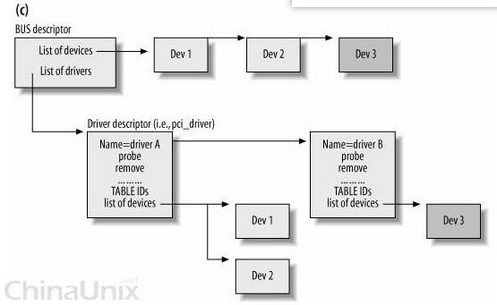

# 参考 #

	http://www.cnblogs.com/lifexy/category/1076894.html  linux底层驱动

# 驱动编译 #

- makefile和kconfig

		1)在linux内核里几乎每个目录里都有Kconfig，Kconfig文件由它的上一级目录的Kconfig里”source”调用。
		2)在linux内核里又是每个目录里都有Makefile文件，由它的上一级目录里的Makefile文件里调用
		参考：https://blog.csdn.net/ForFuture_/article/details/79406610
	
- 编译为动态模块(.ko)

		驱动模块生成一个和多个.ko的方式,
		参考： https://blog.csdn.net/ForFuture_/article/details/79406467
	
		如果配置项是编成模块：
		make uImage ARCH=arm CROSS_COMPILE=arm-linux-gnueabihf- //先编译image
		make modules ARCH=arm CROSS_COMPILE=arm-linux-gnueabihf- //再编译模块

		如果编译出的模块很多的话，可以通过以下命令写进文件系统：
		make modules_install INSTALL_MOD_PATH=ko文件的输出目录/ ARCH=arm CROSS_COMPILE=arm-linux-gnueabihf-
		//更换uImage，将模块拷贝到板文件系统，通过加载或卸载驱动，即可看到相应的内容输出

		andorid编译的方法也是类似：
		$(TARGET_PREBUILT_INT_KERNEL): $(KERNEL_OUT) $(KERNEL_HEADERS_INSTALL)
		166    $(hide) echo "Building kernel..."
		167    $(hide) rm -rf $(KERNEL_OUT)/arch/$(KERNEL_ARCH)/boot/dts
		168    $(MAKE) -C $(TARGET_KERNEL_SOURCE) O=$(BUILD_ROOT_LOC)$(KERNEL_OUT) ARCH=$(KERNEL_ARCH) CROSS_COMPILE=$(KERNEL_CROSS_COMPILE) $(KERNEL_CFLAGS)
		169    $(MAKE) -C $(TARGET_KERNEL_SOURCE) O=$(BUILD_ROOT_LOC)$(KERNEL_OUT) ARCH=$(KERNEL_ARCH) CROSS_COMPILE=$(KERNEL_CROSS_COMPILE) $(KERNEL_CFLAGS) modules
		170    $(MAKE) -C $(TARGET_KERNEL_SOURCE) O=$(BUILD_ROOT_LOC)$(KERNEL_OUT) INSTALL_MOD_PATH=$(BUILD_ROOT_LOC)../$(KERNEL_MODULES_INSTALL) INSTALL_MOD_STRIP=1 ARCH=$(KERNEL_ARCH) CROSS_COMPILE=$(KERNEL_CROSS_COMPILE) modules_install
		171    $(mv-modules)
		172    $(clean-module-folder)

		也可以在模块的makefile里指定编译为模块：
		obj-m += xxx.o

		KSRC := /目录路径/orangepi_sdk/source/linux-3.4.112/  
		export ARCH := arm
		export CROSS_COMPILE := arm-linux-gnueabihf-

		all :
			make -C $(KSRC) modules M=`pwd`

		.PHONY : clean
		clean :
			make -C $(KSRC) modules clean M=`pwd`
		
		说明：
			1）-C $(KDIR) 指明跳转到内核源码目录下读取那里的Makefile
				M=$(PWD)是让 该 Makefile 在构造 modules 目标之前返回到当前目录（模块源码目录）
			2）三种赋值等号的区别
			“：=”表示：它的右边如果为变量，那么该变量在这条语句之前就要定义好，而不能在使用这条语句之后定义的变量
			“=”  表示：当它右边如果变量时，这个变量可以在这条语句之前或者之后使用
			“？=”表示：当它左边的变量在这条语句之前没有定义过，则执行本条语句，如果已经定义了，则什么都不做。
		
			3）make -p 可以查看所有预定义的变量的当前值。比如 $(MAKE) 变量其实就是 make 命令
		

		非交叉编译的情况，参考：
		
			64位Ubuntu 14.04下加载内核模块hello world（非交叉编译的情况，即自定义的内核仍然运行在ubuntu上）
			https://blog.csdn.net/lucien_zhou/article/details/71274447
			
			准备ubuntu主机上的linux源码树：
			1）原因：编译模块的内核版本要与运行目标机（ubuntu主机或开发版）的内核版本一致，构建模块之前首先要编译内核
			2）方法：
			执行命令 sudo apt-cache search Linux-source ，系统会给出适合我们ubuntu主机的“内核源码版本 ”；
			然后使用命令 sudo apt-get install linux-source-3.13.0 下载安装该“内核源码 ”；
			进入 /usr/src/ 目录，解压源码，并sudo make menuconfig 生成一个 .config  文件，sudo make 命令进行内核编译，
			生成vmlinux; 使用 sudo make modules 命令编译模块,sudo make modules_install 命令安装模块,
			执行完后,会在 /lib/modules 目录下生成一个新的目录 /lib/modules/3.13.0/ 。
			至此，内核就编译完成了, 其中的 /lib/modules/3.13.0/build目录里是包括内核源码树，
			它被自定义的内核模块的Makefile指定为文件依赖路径。
		
		
- 驱动模块带参数（支持外部输入参数）

		实现方法步骤：
		1.包含头文件：
			#include <linux/moduleparam.h>
		2.在驱动源码里定义变量：
			如：static int num = 0;//当加载模块不指定num的值时则为0
		3.声明指定的变量为驱动模块参数：
			module_param(变量名, 类型, 权限);
			//类型有：byte, int, uint, short, ushort, long, ulong, bool, charp
			//权限：其它用户所占的权限里不能有写的权限（如：0644）
		4.写完程序后，在加载驱动模块时可指定模块参数的具体值：
			insmod xxx.ko 变量名1=值1  变量名2=值2

		用modinfo查看到模块参数的信息：
		modinfo xxx.ko
		参考：https://blog.csdn.net/ForFuture_/article/details/79394538

		cat /proc/modules   //查看当前系统的动态加载模块（相当于lsmod）
		如：xxx 1768 0 - Live 0xbf03c000
		（模块名 使用的内存大小 正在被调用次数 - 有效 模块所在的内存地址）
		ls /sys/module  //查看系统里现有的驱动模块（包括动静态驱动模块）

- init相关的关键字

		char __initdata buf[] = "hello world"; //表示此字符数组在驱动初始化后可以回收空间

		//__init为了把test_init的函数代码放入统一的初始化段里，当内核把驱动初始化完后，自动释放此函数的代码指令空间
		static int __init test_init(void)
		{
			printk("This is the test init function\n");//printk为内核默认的打印函数
			return 0;//返回0表示成功，返回负数退出加载模块，返回正数，会有警告但还是会加载
		}

		//__exit为了指定此函数只在驱动卸载时使用，用完后自动释放
		static void __exit test_exit(void)
		{
			printk("This is the test exit function\n");
		}

- 代码里用于调试输出的宏

		#ifdef DEBUG
		    #define TS_DEBUG(fmt,args...)   do { printk(fmt, ##args); } while (0)
		#else
		    #define TS_DEBUG(fmt,args...)   do { } while (0)
		#endif
		
		用法：
		
		TS_DEBUG("hello\n");
		TS_DEBUG("%d, %d\n", num , num2);

# device/driver的绑定(匹配) #
	
	参考
	http://blog.csdn.net/qwaszx523/article/details/65635071
	https://blog.csdn.net/wh8_2011/article/details/51711440  设备驱动模型之device-driver

	内核中driver和 device是分别注册的，但最终都依附于某一总线。
	他们的匹配过程是：
	在driver注册时调用函数driver_match_device()进行driver和device的匹配，
	在匹配之后执行driver的probe函数进行初始化等操作。

  

	在device_register()->device_add()中，先调用bus_add_device()添加device与bus间的联系，然后调用bus_probe_device();
	bus_probe_device()会试图为已挂在总线上的该设备寻找对应的驱动:
	它先检查bus->p->drivers_autoprobe，看是否允许自动探测, 允许了才会调用device_attach()进行实际的寻找工作。
	
	device_attach()：

	1) 如果在调用device_attach()前就已经有了dev->driver()，就调用device_bind_driver()进行绑定：
	=>将device加入它所属的driver的设备链表

	2) 否则，调用bus_for_each_drv(dev, __device_attach)进行依次匹配：
	
	static int __device_attach(struct device_driver *drv, void *data)  
	{  
	    struct device *dev = data;  
	  
	    if (!driver_match_device(drv, dev))  
	        return 0;  
	  
	    return driver_probe_device(drv, dev);  
	}
	=> 如果driver_match_device()匹配成功了，继续调用driver_probe_devices()完成绑定。
	driver_probe_devices()-> really_probe()完成的绑定工作和device_bind_driver()差不多，
	只是它还会调用bus->probe或者drv->probe中定义的probe函数。

- 内核添加dts后，device和device_driver的match匹配的变动

        参考
        https://blog.csdn.net/shenhuxi_yu/article/details/77921608

        所有的struct bus_type 实例，如：platform_bus_type、mipi_dsi_bus_type、
		hsi_bus_type、i2c_bus_type、spi_bus_type 等的match函数都会调用of_driver_match_device()
		进行driver和device的匹配：
        of_driver_match_device()->__of_match_node()，在这个函数里，
		通过把device_driver.of_match_table（of_device_id结构体的数组）和device.of_node（device_node结构体）进行匹配，
        匹配方式是分别比较两者的name、type、和compatible字符串, 找到最匹配的项，规则如下，见__of_device_is_compatible():

        * 1. specific compatible && type && name
        * 2. specific compatible && type
        * 3. specific compatible && name
        * 4. specific compatible
        * 5. general compatible && type && name
        * 6. general compatible && type
        * 7. general compatible && name
        * 8. general compatible
        * 9. type && name
        * 10. type
        * 11. name

        一般name、和type为空，只比较compatible字符串. 比较compatible时，是比较整个字符串，
		不管字符串里的逗号的，直接compare整个字符串

        compatible属性：用于将设备与driver匹配的关键字，通过of_match_table[]来匹配时会用到它

        of_match_table[]与id_table[]的区别：
        of_match_table: 用于添加了device tree的情况，优先匹配
        id_table： 当无device tree或者device tree不匹配时，用id_table来匹配

        device tree 中的of就是OpenFirmware的缩写

# kernel input #

	设置输入设备支持的事件类型和事件代码:
	set_bit(EV_KEY,button_dev->evbit);
	set_bit(KEY_1,button_dev->keybit); //按键1
	 
	也可以直接调用input_set_capability来完成：
	input_set_capability(input_dev,EV_KEY, KEY_1);
	
	
	设置范围参数：
	void input_set_abs_params(struct input_dev *dev, unsigned int axis,
	              int min, int max, int fuzz, int flat)
	              
	 input_set_abs_params(input_dev,ABS_MT_POSITION_X,0,SCREEN_MAX_X,4,0),
	 //表示：X轴范围是0到SCREEN_MAX_X，数据误差是-4到+4，中心平滑位置是0 .
	 
	 * struct input_absinfo - used by EVIOCGABS/EVIOCSABS ioctls
	@value: latest reported value for the axis.
	* @minimum: specifies minimum value for the axis.
	* @maximum: specifies maximum value for the axis.
	* @fuzz: specifies fuzz value that is used to filter noise from the event stream.
	* @flat: values that are within this value will be discarded by joydev interface and reported as 0 instead.
	@resolution: specifies resolution for the values reported for the axis.
	* * Note that input core does not clamp reported values to the [minimum, maximum] limits, such task is left to userspace.
	Resolution for main axes (ABS_X, ABS_Y, ABS_Z) is reported in units per millimeter (units/mm),
	resolution for rotational axes (ABS_RX, ABS_RY, ABS_RZ) is reported in units per radian.

# 设备 #
	
	主设备编号用来区分驱动程序，不同的驱动用不同的主设备编号。
	次设备编号用来区分使用同一驱动的多个设备。

	对设备的访问是通过/dev/下的设备节点进行的。

- 设备文件和编号
	
		设备文件的inode结构体的irdev是设备编号，其中高12位是主设备编号，低20位是次设备编号。
		也可以从以下位置获得：

		1）/proc/devices  //查看设备文件和主设备编号
		
			Character devices: //字符设备
			  1 mem
			256 msm_rng
			  5 /dev/tty
			  5 /dev/console
			  5 /dev/ptmx
			 10 misc
			 13 input
			 21 sg
			
			Block devices:  //块设备
			  1 ramdisk
			259 blkext
			  7 loop
			  8 sd
			 65 sd
	
		2）ll /dev //查看所有的设备文件，其中日期前的2列分别是主设备编号和次设备编号

- 创建设备文件
	
		mknod /dev/${device}0 c $major 0

		linux2.4中devfs的出现，使得驱动程序可以在/dev下创建设备文件，同时不必手动指定设备号。

- 查看所有输入设备

		$ cat /proc/bus/input/devices
		=>
		I: Bus=0018 Vendor=dead Product=beef Version=28bb
		N: Name="goodix-ts" //设备名
		P: Phys=input/ts
		S: Sysfs=/devices/virtual/input/input0 //节点
		U: Uniq=
		H: Handlers=mdss_fb kgsl event0  //event号
		B: PROP=2
		B: EV=b
		B: KEY=10 0 0 0 400 0 0 40000000 10004000000000 0
		B: ABS=265000000000000
		...

- 查看所有eventX对应的设备名

		$ getevent
		=>
		...
		add device 6: /dev/input/event1
		  name:	 "input_mt_wrapper"
		add device 7: /dev/input/event0
		  name:	 "goodix-ts"
		add device 8: /dev/input/event5
		  name:	 "gpio-keys"
		...

		/dev/input/event0: 0000 0000 00000000  //==>当有输入事件时会打印出来. 解析event的工具是hexdump
		/dev/input/event0: 0003 0035 000000ac
		/dev/input/event0: 0003 0036 0000058b

- 查看所有的bus下的设备和driver

		ls -l /sys/bus/i2c/devices  //I2C上的所有设备
		...
		
		ls -l /sys/bus/i2c/drivers  //注册到I2C总线上的所有驱动
		total 0
		drwxr-xr-x 2 root root 0 2018-04-21 19:13 Goodix-TS
		drwxr-xr-x 2 root root 0 2018-04-21 19:13 adv7533
		drwxr-xr-x 2 root root 0 2018-04-21 19:13 akm09911
		drwxr-xr-x 2 root root 0 2018-04-21 19:13 akm8963

# udev/devfs #

	2.6后udev取代了devfs

	区别：基于linux应该实现机制而不是策略的思想，udev将devfs的设备命名、权限控制、事件处理等操作放在用户空间来完成。
	具体的说是：在设备插入和移除时，内核通过netlink套接字发出uvent 给用户态的udev，udev根据获取到的信息进行规则的匹配，
	从而进行add,remove等操作。

	在嵌入式系统中可能会使用udev的轻量级版本mdev，它被busybox集成了。
	andorid中没有udev, 转而使用的是VOLD, 机制是类似的;
	其中netlinkManager.cpp就是基于netlink套接字来监听内核发出的信息。
	
# sysfs #

	sysfs将系统上的设备和总线组成一个分级的文件结构，目的就是展示设备驱动模型中各组件的层级关系。
	内核中设备驱动模型使用bus_type, device_driver, device 这3个结构体来描述总线，驱动和设备。
	见device.h
	

# 阻塞与非阻塞IO #

	open/read/write, ioctl/fcntl都可以指定是阻塞还是非阻塞类型的操作；
	之后在对应driver里的read/write/contol函数里用 file->f_flags&O_NONBLOCK标记来识别，以便进一步处理（比如用等待队列）。

- 阻塞/非阻塞与同步/异步的区别
		
		1)在进程通信层面，阻塞/非阻塞，同步/异步基本是同义词，但是需要注意区分讨论的对象是发送方还是接收方
		
		2)在 IO 系统调用层面（ IO system call ）层面,
		(1) 阻塞/非阻塞IO：线程要访问的数据是否就绪，线程是否需要等待；
		请求不能立即得到应答，需要等待，那就是阻塞；否则可以理解为非阻塞。
		
		非阻塞I/O和异步I/O都属于非阻塞系统调用,区别是：返回结果的方式和内容不同:
		一个非阻塞I/O系统调用 read()操作立即返回的是任何可以立即拿到的数据，可以是完整的结果，也可以是不完整的结果，还可以是一个空值。
		而异步I/O系统调用read()结果必须是完整的，但是这个操作完成的通知可以延迟到将来的一个时间点。

		(2) 同步/异步IO：访问数据的方式。
		同步需要主动读写数据，在读写数据的过程中还是会阻塞；
		异步只需要I/O操作完成的通知，并不主动读写数据，由操作系统内核完成数据的读写。
		
		
- 应用程序中的轮询
	
		非阻塞方的读写方式有：select()/poll()/epoll(), 他们最终调用到驱动的poll函数进行轮询，
		调用进程会阻塞在驱动的等待队列上, 直到有可读写的FD。
 
		缺点是：当多路复用的文件数量庞大时，性能较差，适用于FD较少的情况。
		epoll改善上述缺点：它不会随着FD的增加而降低效率。
	
- 设备驱动中的轮询
		
		驱动的 poll 原型：
		unsigned int (*poll) (struct file *filp, poll_table *wait)

		它会做2件事情：
		1) 对可能引起设备状态变化的等待队列，调用poll_wait()将对应的等待队列加入到poll_talbe中。
		注意：poll_wait()并不会阻塞poll进程，它只是把poll进程添加到wait参数指定的等待列表poll_table中，
		以便可以唤醒因select/poll而睡眠的进程。
		void poll_wait (struct file *, wait_queue_head_t *, poll_table *)

		2) 返回表示是否能对设备进行无阻塞读写的掩码。
	
	  
	
# 中断 #

	linux2.6.35后取消了嵌套中断。

	PIC中断控制器: 屏蔽、使能中断通过中断MASK寄存器来完成，获取中断状态可以通过中断PEND寄存器来完成。
	ARM常用中断控制器是GIC.

	ARM多核处理器的GIC中断的类型：
    1）SPI(shared peripheral interrupt): 外设的中断可以发给任何一个CPU
    2）PPI(Private peripheral interrupt)： 外设的中断只能发个指定的CPU
    3）SGI(software general interrupt): 软件产生的中断，可以发送给其他CPU
		(如IPI_xxx类的中断，可以通过写GIC的寄存器，从一个cpu发送到另一个CPU)

    ARM GIC图：TBD
	

	软中断以及基于软中断的tasklet如果在某段时间内大量出现，内核会把后续软中断放入ksoftd内核线程中执行，
	以缓解高负载情况下的系统响应。

	request_threaded_irq()/devm_request_threaded_irq()支持在irqflags中设置IRQF_ONESHOT标记，
	这样内核会自动在中断上下文中屏蔽对应的中断号，而在内核调度执行thread_fun后，才重新使能中断号。
	这样可以避免中断洪泛的情况（因为有的时候不能在中断上半部 清中断）

	实现中断后半部分的2种机制：tasklet和workquue.

	中断的文件系统节点:
	1) /proc/interrupts
	=> 打印：1、逻辑中断号，2、中断在各CPU发生的次数，3、中断所属设备类名称，4、硬件中断号，5、中断处理函数

				   CPU0	   CPU1	   CPU2	   CPU3	   CPU4	   CPU7
		 20:   48536633	8930356	6111218	5190098	2509399	1782915	   GIC  arch_timer
		 23:		  0		  0		  0		  0		  0		  0	   GIC  ARM64 Single-Bit Error PMU IRQ
		 35:		  0		  0		  0		  0		  0		  0	   GIC  apps_wdog_bark
		 39:   10550905	2973341	1574494	1218684	 857158	 550424	   GIC  arch_mem_timer
		...
		415:		  0		  0		  0		  0		  0		  0  qpnp-int  qpnp_sc_irq
		417:		  0		  0		  0		  0		  0		  0  qpnp-int  pm8004_tz
		419:		324		 25		 12		  9		  5		  0  msm_tlmm_irq  gf
		420:	 180260	 201688	 193054	 264520		  4		  3  msm_tlmm_irq  gt9xx
		550:		  0		  0		  0		  0		  0		  0  smp2p_gpio  adsp
		551:		  1		  0		  0		  0		  0		  0  smp2p_gpio  error_ready_interrupt
		552:		  1		  0		  0		  0		  0		  0  smp2p_gpio  adsp

	2）/proc/stat  
 

- 屏蔽IRQ

		local_irq_disable()针对是CPU, 不是外部的中断控制器，只是直接让CPU不响应中断请求。

		disable_irq()针对的是中断控制器（结构体 irq_chip），直接屏蔽掉某个中断。

		对于外设，只能根据具体的情况，通过写寄存器的方式，不给中断控制器发送中断信号。
		
	 

- 中断级联
	
	 

	 
	
- 中断的分发
	
		参考： https://blog.csdn.net/skyflying2012/article/details/46681675
		
		内核的中断号可以与硬件中断号不一致

		中断初始化：
		通用函数start_kernel -----> 处理器平台级函数init_IRQ -----> 板级中断初始化函数init_irq等
		对于arm处理器，init_IRQ调用对应设备描述符machine_desc的init_irq。
		
		对于arm处理器，执行流程如下：
		vector_irq ---> irq_handler ---> arch_irq_handler_default ---> asm_do_IRQ ---> handle_IRQ
		在 arch_irq_handler_default 中调用get_irqnr_and_base获取中断号，传给asm_do_IRQ作为参数。
		get_irqnr_and_base由板级支持包实现。

		板级支持包中会读取中断控制器中相关寄存器来获取当前产生的中断情况，进而返回中断号。
		如果我们想将35号中断的中断处理函数在注册时放在30号irq_desc中（方法是request_irq时中断号写30）。
		那么在中断分发时，获取中断号函数中我们也需要进行修改：查询到中断控制器寄存器状态是产生35号中断时，我们返回中断号为30

# 内存管理 #

- 驱动里用的栈是定长的（对于32位OS, 是8k）, 所以在使用大的缓冲区时需要动态申请（kmalloc/vmalloc）

- IO端口与IO内存

		IO端口：设备寄存器位于IO空间。申请方式：request_region()

		IO内存：设备寄存器位于内存空间。
		一般是指对芯片内部的I2C,SPI,USB等控制寄存器，通过ioremap()将它们的设备物理地址映射到内核虚拟地址上。
		申请方式：request_mem_region()->ioremap()

		查看IOMEM:
		cat /proc/iomem

			000601d4-000611d3 : vmpm
			00078000-000789f7 : qmp_phy_base
			00079000-0007917f : qusb_phy_base
			004a8000-004a9fff : tsens_physical
			004ab000-004ab003 : pshold-base
			01000000-012fffff : /soc/pinctrl@1000000
		
		注意：
		驱动必须确保没有进行缓冲，并且在存取寄存器时没有发生读或写的重编排:
		1) 底层的硬件已经配置(或者通过Linux初始化代码)成禁止任何硬件缓冲。
		对于IO内存，可以在ioremap映射时指定non cacheable属性。
		2) 防止处理器优化和编译器优化，解决方法是：在必须以一个特殊顺序对硬件(或者另一个处理器)可见的操作之间，安放一个内存屏障。

- volatile
	
		参考： https://baike.baidu.com/item/volatile/10606957?fr=aladdin
	
		volatile确保编译器的行为：
		1）指令不会因编译器的优化而省略
			如：
			XBYTE=0x57; //有被编译器优化掉的可能
			XBYTE=0x58;
			如果使用volatile int XBYTE，则编译器会逐一地进行编译并产生2行代码的指令。

		2）要求每次直接从原始内存（包括IO内存）处读值，而不使用之前保存在其他寄存器里的备份
			如：
			volatile int i=10;
			int a=i;
			...
			//其他代码，并未对i进行过操作
			...	
			int b=i; //<==
			
			编译器优化的做法：由于编译器发现两次从i读数据的代码之间没有对i进行过操作，它会自动把上次读的数据放在b中，而不是重新从i里面读。
			这样一来，如果i是一个寄存器变量或者表示一个端口数据时，就容易出错。 所以说volatile可以保证对特殊地址的稳定访问。

		使用场景：
		1）访问并行设备的硬件寄存器（如：状态寄存器）
		2）一个中断服务子程序中会访问到的变量
		3）在多线程中共享的变量

- 内存屏障(memory barrier)
	
		参考
		https://blog.csdn.net/cheng_fangang/article/details/41849067
		https://blog.csdn.net/world_hello_100/article/details/50131497
		
		使用内存屏障的原因是内存乱序访问： 程序在实际运行时内存的访问顺序 与 程序代码编写的访问顺序不一定一致。
		内存乱序访问行为出现的理由是为了提升程序运行时的性能。
		
		内存乱序访问主要发生在两个阶段：
		1）编译时，编译器优化导致指令重排，导致内存乱序访问。 如：GCC编译时使用了 O2 或 O3 选项
		2）运行时，多 CPU 间交互引起的内存乱序访问。
		主要指SMP架构下，每个CPU都有一个cache，当一个CPU将数据更新到cache 但还没有更新到内存时，
		如果其他CPU也要写此数据，那么其他CPU必须获得新数据后才能写，这需要cache一致性协议来避免数据不一致的问题，
		此过程中有可能出现乱序访问。
		

		Memory barrier能够让CPU或编译器在内存访问上有序。一个Memory barrier之前的内存访问操作必定先于其之后的完成。
		Memory barrier 包括两类：
		1）编译器 barrier
		使用：
			-O1 编译(不可取)
			volatile修饰符
			barrier()
			ACCESS_ONCE()宏： 只是将变量转换为 volatile
			#define ACCESS_ONCE(x) (*(volatile typeof(x) *)&(x))

		2）CPU Memory barrier
		使用：
			通用barrier，保证读写操作有序：  mb() 和 smp_mb()
			写操作barrier，仅保证写操作有序：wmb() 和 smp_wmb()
			读操作barrier，仅保证读操作有序：rmb() 和 smp_rmb()

		注意：
		1）smp开头的Memory barrier在单处理器上直接使用编译器barrier，而在SMP上才使用CPU Memory barrier(也就是 mb()、wmb()、rmb())
		2）CPU Memory barrier中某些类型的Memory barrier需要成对使用，否则会出错。
		详细来说就是：一个写操作barrier需要和读操作（或数据依赖）barrier一起使用(当然，通用barrier也是可以的),反之依然

- mmap将设备物理地址映射到用户空间

		这是通过mmap()来实现的,目的是实现用户进程对物理地址的直接读写, 减少内存拷贝次数，提高性能。

- 内核空间和用户空间都访问同一段物理地址

		在内核驱动程序的初始化阶段，通过ioremap（）将物理地址映射到内核虚拟空间；
		在驱动程序的mmap系统调用中，它使用remap_page_range()将该块ROM映射到用户虚拟空间;
		这样内核空间和用户空间都能访问这段被映射后的虚拟地址。

- /dev/mem

		参考： https://blog.csdn.net/skyflying2012/article/details/47611399

		网上的说法： /dev/mem是物理内存的全映像，可以用来访问物理内存，一般用法是：open("/dev/mem",O_RDWR|O_SYNC)，
		接着就可以用mmap来访问物理内存以及外设的IO资源，这就是实现用户空间驱动的一种方法。

		但是， 如果打开CONFIG_STRICT_DEVMEM, mem驱动会对mmap要映射的物理地址 进行范围和位置的检查然后才进行映射，
		检查条件如下：
		（1）映射范围不能超过4G
		（2）该物理地址所在iomem不能exclusive
		（3）该物理地址不能处在lowmem
		
		所以：各种利用/dev/mem来操作内存以及寄存器的文章，如果操作范围在上述3个条件内，
		内核必须关闭CONFIG_STRICT_DEVMEM才行。

# DMA操作引发的Cache一致性问题 #

		参考：https://blog.csdn.net/skyflying2012/article/details/48023447

- 发生点

		1）当DMA操作的内存地址 与 cache所缓存的内存地址一致时
		2）在使能和关闭chache时。如： ARM开启MMU前，要使cache无效(使得内存的修改重新加载到cache)，对TLB也是如此

- kernel中有2种情况是需要保证数据一致性的

		1）寄存器地址空间
		
		寄存器是CPU与外设交流的接口，有些状态寄存器是由外设根据自身状态进行改变，这个操作对CPU是不透明的。
		有可能这次CPU读入该状态寄存器，下次再读时，该状态寄存器已经变了，但是CPU还是读取的cache中缓存的值。

		寄存器操作在kernel中是必须保证一致的，这是kernel控制外设的基础，我们可以通过ioremap()将IO空间映射到内核空间。
		ioremap在映射寄存器地址时，页表是配置为uncached的。即：数据不走cache，直接由地址空间中读取，保证数据一致性。

		2）DMA缓冲区的地址空间
		
		DMA操作：外设直接访问内存，不需要经过CPU.

		DMA操作对于CPU来说也是不透明的，DMA导致内存中数据更新，对于CPU来说是不可见的。
		反之亦然，CPU写入数据到DMA缓冲区(DDR)，其实是写到了cache，这时启动DMA，DMA操作DDR中的数据并不是最新的。

		kernel中对于DMA操作是如何保证cache一致性的呢？
		通用DMA层主要分为2种类型的DMA映射：
	
		（1）一致性映射
		代表函数：
		void *dma_alloc_coherent(struct device *dev, size_t size, dma_addr_t *handle, gfp_t gfp);
		void dma_free_coherent(struct device *dev, size_t size, void *cpu_addr, dma_addr_t handle);

		dma_alloc_coherent()首先对分配到的缓冲区进行cache刷新（将ddr中的数据加载到CACHE)，之后将该缓冲区的页表修改为uncached，
		以此来保证之后DMA与CPU操作该块数据的一致性（即都直接写到DDR了）。

		（2）流式DMA映射
		代表函数：
		dma_addr_t dma_map_single(struct device *dev, void *cpu_addr, size_t size, enum dma_data_direction dir)
	
		dma_map_single中并没有对cpu_addr指定缓冲区映射的存储属性进行修改，还是cached的，
		但是对该缓冲区根据数据流向进行了cache写回或者无效，保证了cache数据一致性。

		dma_map_single
		=> __dma_map_page
			=> __dma_page_cpu_to_dev
				=> ___dma_page_cpu_to_dev   
					=> dma_cache_maint_page 会对映射地址空间调用dmac_map_area，最终调用到arch/arm/mm/cache-v7.S中v7处理器的cache处理函数v7_dma_map_area()
					/*
					 *  dma_map_area(start, size, dir)
					 *  - start - kernel virtual start address
					 *  - size  - size of region
					 *  - dir   - DMA direction
					 */  
					ENTRY(v7_dma_map_area)  
						add r1, r1, r0  
						teq r2, #DMA_FROM_DEVICE  
						beq v7_dma_inv_range  
						b   v7_dma_clean_range  
					ENDPROC(v7_dma_map_area)

		. 方向为DMA_FROM_DEVICE，则v7_dma_inv_range无效掉(invalidate,也叫刷新)该段地址cache(将内存数据加载到cache中)
		. 方向为DMA_TO_DEVICE，则v7_dma_clean_range写回(flush)该段地址cache（将cache写回到ddr中），
		  之后在___dma_page_cpu_to_dev中还刷新外部cache。

		void dma_unmap_single(struct device *dev, dma_addr_t handle, size_t size, enum dma_data_direction dir)

		void dma_sync_single_for_cpu(struct device *dev, dma_addr_t handle, size_t size, enum dma_data_direction dir)
		void dma_sync_single_for_device(struct device *dev, dma_addr_t handle, size_t size, enum dma_data_direction dir)

		int dma_map_sg(struct device *, struct scatterlist *, int, enum dma_data_direction);
		void dma_unmap_sg(struct device *, struct scatterlist *, int, enum dma_data_direction);

		（3）一致性映射与流式DMA映射的区别是: 缓冲区页表映射是否为cached
		一致性映射采用uncached页表保证了CPU与外设都可以同时访问

		3）到目前为止做了uncached映射的只有2个：寄存器空间（ioremap）和一致性DMA缓冲区（dma_alloc_coherent），
		其他地址空间都是cached，来保证系统性能。

- 虚拟地址，物理地址，总线地址

		虚拟地址：从CPU核的角度看到的内存地址
		物理地址：从MMU控制器的角度看到的内存地址
		总线地址：从设备的角度看到的地址

- 基于DMA的硬件，使用的是总线地址，而不是物理地址

- IOMMU指：IO总线与内存间的MMU，而通常意义下的MMU指：CPU与内存间的MMU
	
	 

# I2S #

	I2S为三线总线，3个信号分别为：
	1) 串行时钟SCK，也叫位时钟（BCK）。即每发送1位数字音频数据,SCK上都有1个脉冲。
	SCK的频率=2×采样频率×采样位数。在数据传输过程中，I2S总线的发送器和接收器都可以作为系统的主机来提供系统的时钟频率。

	2) 帧时钟WS，即命令（声道）选择，用于切换左右声道的数据。
	WS的频率=采样频率，由系统主机提供。WS为“1”表示传输的是左声道的数据，WS为“0”表示传输的是右声道的数据。

	3) 串行数据信号SD，用于传输二进制补码表示的音频数据。

	I2S格式的信号无论有多少位有效数据，数据位的最高位（MSB）总是被最先传输，1次能够发送的数据决定于I2S格式的有效位数。
  
	

# I2C/SPI/USB驱动架构对比 #

- **I2C与SPI总线的异同**

		1) iic总线是半双工，2根线：SCL SDA。 spi总线实现全双工，4根线：SCK、CS, MOSI, MISO
		2) iic总线是多主机总线，通过SDA上的地址信息来锁定从设备。 spi总线采用主从模式，只有一个主设备，主设备通过CS片选来确定从设备
		3) iic总线传输速度在100kbps-4Mbps。spi总线传输速度更快，可以达到30MHZ以上
		4) iic总线空闲状态下SDA SCL都是高电平。spi总线空闲状态MOSI MISO也都是 SCK是有CPOL决定的
		5) iic总线scl高电平时sda下降沿标志传输开始，上升沿标志传输结束。spi总线cs拉低标志传输开始，cs拉高标志传输结束
		6) iic总线是SCL高电平采样。spi总线因为是全双工，因此是沿采样，具体要根据CPHA决定。一般情况下master device是SCK的上升沿发送，下降沿采集
		7) iic总线和spi总线数据传输都是MSB在前，LSB在后（串口是LSB在前）
		8) iic总线和spi总线时钟都是由主设备产生，并且只在数据传输时发出时钟	
		9) iic总线读写时序比较固定统一，设备驱动编写方便。spi总线不同从设备读写时序差别比较大，因此必须根据具体的设备datasheet来实现读写，相对复杂一些

 

# 主机与外设驱动分离 #

	SPI,I2C,USB等子系统都利用了典型的主机与外设驱动分离的思想：
	让主机端（具体的控制器）只负责产生总线上的传输波形，而外设端只是通过标准的API来让主机端以适当的波形访问自身。
	
	
# GPIO #

	参考 http://www.cnblogs.com/rongpmcu/p/7662751.html  gpio子系统和pinctrl子系统（上）

	GPIO的上下拉：指IO口的默认电平是高还是低，也就是当外面不来改变电平时是处于什么电平状态。如果外面有改变，则随外面的改变而改变。
	PUL0、PUL1

	$ cat /sys/kernel/debug/gpio  //查看GPIO的配置
	=>
	GPIOs 0-141, platform/1000000.pinctrl, 1000000.pinctrl:
	gpio4   : out 2 2mA pull down
	gpio5   : out 2 2mA pull down
	gpio6   : out 3 2mA no pull
	gpio7   : out 3 2mA no pull
	gpio8   : in  0 2mA pull down
	gpio9   : in  0 2mA pull down
	gpio10  : out 2 2mA no pull
	...

	GPIO口都是多功能的，可以做输入、输出、外部中断、控制器的引脚。
	统一编址：内存芯片的地址与控制器的配置内存接口是在同一地址范围里的。
	arm基本上都是统一编址，也就意味着我们改变控制器的相关配置时，对控制的配置接口（配置寄存器）像内存一般访问即可。
	
	输入是指IO口只可以用于获取电平，不能改变电平。
	输出是指IO口既可以改变电平，也可以获取电平。
	
	在uboot上使用”mw”，”md”命令来配置或获取IO口的电平：
	mw.l 0x01c20804 0x10000000 1  //PA15口作输出，即改变配置寄存器PA_CFG1(0x01c20804)的第28~30位的值为1
	mw.l 0x01c20810 0x8000 1 //第15位的值为1，即PA组的第15个IO口输出高电平，LED亮
	mw.l 0x01c20810 0 1  //LED灭

# pinctrl #

	https://blog.csdn.net/eastonwoo/article/details/51481312  基于linux 3.10.49内核的pinctrl流程分析

# RTC

	http://www.cnblogs.com/rongpmcu/p/7662733.html
	https://blog.csdn.net/yaozhenguo2006/article/details/6824970  linux RTC 驱动模型分析

# 设备树 device tree #

	参考
	https://blog.csdn.net/u010872301/article/details/72599115
	https://blog.csdn.net/aiku969/article/details/79878659  高通平台msm8953 Linux DTS(Device Tree Source)设备树详解之二（DTS设备树匹配过程）
	https://blog.csdn.net/aiku969/article/details/79878072  高通平台8953 Linux DTS(Device Tree Source)设备树详解之一(背景基础知识篇)

 

- Dts中相关符号的含义

		/  根节点
		@  如果设备有地址，则由此符号指定
		&  引用节点
		:  冒号前的label是为了方便引用给节点起的别名，此label一般使用为&label
		,  属性名中可以包含逗号。如compatible属性的名字 组成方式为"[manufacturer], [model]"，加入厂商名是为了避免重名。
			自定义属性名中通常也要有厂商名，并以逗号分隔。
		#  并不表示注释。如 #address-cells ，#size-cells 用来决定reg属性的格式。
		空属性并不一定表示没有赋值。如 interrupt-controller 一个空属性用来声明这个node接收中断信号
		
		数据类型
		“”   引号中的为字符串，字符串数组：”strint1”,”string2”,”string3”
		< >  尖括号中的为32位整形数字，整形数组<12 3 4>
		[ ]  方括号中的为32位十六进制数，十六机制数据[0x11 0x12 0x13]  其中0x可省略

- 设备地址

	    #address-cells = <1>;  //address-cells决定了reg中的address1/2/3包含1个cell
		父类的address-cells和size-cells决定了子类的reg属性中address和length要包含多少个cell；
		如果子节点有特殊需求的话，可以自己再定义，这样就可以摆脱父节点的控制。

	    #size-cells = <1>;  //size-cells决定了reg中的length1/2/3包含了1个cell

		reg = <address1 length1 [address2 length2] [address3 length3]>;   //reg意为region，区域

		如以下：
		#address-cells = <1>  
    	#size-cells = <1>; 
		spi@10115000{  
            compatible = "arm,pl022";  
            reg = <0x10115000 0x1000 >;  
    	};  
		=> 位于0x10115000的SPI设备申请地址空间，起始地址为0x10115000，长度为0x1000，
		即属于这个SPI设备的地址范围是0x10115000~0x10116000。

		另外一种情况，就是通过外部芯片片选激活模块。例如，挂载在外部总线上，需要通过片选线工作的一些模块：
		external-bus{  
	        #address-cells = <2>  
	        #size-cells = <1>;  
	       
	        ethernet@0,0 {  
	            compatible = "smc,smc91c111";  
	            reg = <0 0 0x1000>;  //共3个cell
	        };  
	       
	        i2c@1,0 {  
	            compatible ="acme,a1234-i2c-bus";  
	            #address-cells = <1>;  //自定义了子类的reg的address-cell为1
	            #size-cells = <0>;  //自定义了子类的reg的size-cells为0
	            reg = <1 0 0x1000>;  
	            rtc@58 {  
	                compatible ="maxim,ds1338";  
	                reg = <58>;  //I2C设备地址只要一个cell就够了
	            };  
	        };  
	       
	        flash@2,0 {  
	            compatible ="macron,k8f1315ebm", "cfi-flash";  
	            reg = <2 0 0x4000000>;  
	        };  
	    };
		=> external-bus使用两个cell来描述地址，一个是片选序号，另一个是片选序号上的偏移量。而地址空间长度依然用一个cell来描述。
		所以以上的子设备们都需要3个cell来描述地址空间属性——片选、偏移量、地址长度。
		在上个例子中，有一个例外，就是i2c控制器模块下的rtc模块。因为I2C设备只是被分配在一个地址上，不需要其他任何空间，所以只需要一个address的cell就可以描述完整，不需要size-cells。

		当需要描述的设备不是本地设备时，就需要描述一个从设备地址空间到CPU地址空间的映射关系，这里就需要用到ranges属性。
	    #address-cells= <1>;  
	    #size-cells= <1>;  
	    ...  
	    external-bus{  
	        #address-cells = <2>  
	        #size-cells = <1>;  
	        ranges = <0 0  0x10100000  0x10000     // Chipselect 1,Ethernet  
	                  1 0  0x10160000  0x10000     // Chipselect 2, i2c controller  
	                  2 0  0x30000000  0x1000000>; // Chipselect 3, NOR Flash  
	    };  
		=> ranges属性为一个地址转换表。表中的每一行都包含了子地址、父地址、在自地址空间内的区域大小。
		他们的大小（包含的cell）分别由子节点的address-cells的值、父节点的address-cells的值和子节点的size-cells来决定。
		以第一行为例：
		· 0 0 两个cell，由子节点external-bus的address-cells=<2>决定；
		· 0x10100000 一个cell，由父节点的address-cells=<1>决定；
		· 0x10000 一个cell，由子节点external-bus的size-cells=<1>决定。
		最终第一行意思就是：片选0，偏移0（选中了网卡），被映射到CPU地址空间的0x10100000~0x10110000中，地址长度为0x10000。

		DTS设备树描述文件中什么代表总线，什么代表设备:
		一个含有compatible属性的节点就是一个设备。包含一组设备节点的父节点即为总线。

- 删除node里的某个属性

		&usb3 {
			/delete-property/ vbus_dwc3-supply;
			qcom,disable-host-mode-pm;
		};

- 中断

	 

- GPIO

	 

# 寄存器操作 #

	1）对某位写1用 或1，写0用 与0
	接口如：
	static void XX_set_clk(char val)  
	{  
	    if(val)  
	        GPGDAT |= (0x1<<7);  //第7位写1
	    else  
	        GPGDAT &= ~(0x1<<7);  //第7位写0
	} 

# 单工、半双工、双工的区别 #

	1、单工 
	单工就是指A只能发信号，而B只能接收信号，通信是单向的，
	就象灯塔之于航船-灯塔发出光信号而航船只能接收信号以确保自己行驶在正确的航线上。 
	
	 2、半双工（Half Duplex） 
	半双工就是指A能发信号给B，B也能发信号给A，但这两个过程不能同时进行。
	最典型的例子就象我们在影视作品中看到的对讲机一样： 
	007：呼叫总部，请求支援，OVER  
	总部：收到，增援人员将在5分钟内赶到，OVER  
	
	3、全双工 （Full Duplex(双工)）
	全双工比半双工又进了一步。在A给B发信号的同时，B也可以给A发信号。
	典型的例子就是打电话。  

# 术语

	片选: CS#，其中#表示低电平有效
	数据/命令引脚: D/C#
	VCC: 电源正
	VDD: 外部的输入电源

# PM #

	QC的PON模块支持多个物理上的power-on源(KPDPWR_N, CBLPWR)和reset源(KPDPWR_N, RESIN, KPDPWR+RESIN),
	PON这个外设通过SPMI接口连到host processor.

# Camera #

	参考
	https://blog.csdn.net/xubin341719/article/details/7727518
	https://blog.csdn.net/xubin341719/article/details/7727041

- 摄像头主要参数

		MCLK:  24MHz //主时钟，给摄像头提供时钟
		RESET： 复位线
		PWDN： 在摄像头工作时应该始终为低
		PCLK:  48~52MHz //像素clock
		电压: 1.8V(1.5V)、2.8V
		SCL（IIC时钟）: 100KHz或者400KHz
		D1-D7: 数据线
		数据接口选择: ITU\MIPI等
		
			1）多种输入接口：
			DMA (AXI 64-bitinterface) 模式
			MIPI (CSI) 模式（移动行业处理器接口）
			ITU-R BT 601/ 656/ 709模式， ITU:国际电信联盟无线电通信部门
			Direct FIFO (PlayBack)模式
	
			2）多种输出模式：
			DMA (AXI 64-bitinterface) 模式
			Direct FIFO 模式
	
		图像数据格式: YVU\UVY之类
		输出信号的极性： 就是PCLK、VSYNC(场同步信号）、HSYNC(行同步信号）这些信号的极性
		HREF是行参考信号，与HSYNC一样吗？
	
	 

# LCD #

	1）RGB接口
	
	https://blog.csdn.net/xubin341719/article/details/9177085 

	LCD TE这个pin脚定义为Tearing effect，主要起到数据同步作用。
	将摄像头采集的模拟信号转为数字图像信号，host将数字图像信号传输至显示屏上，为了不出现图像撕裂（被分割成几块）的画面，引入了TE功能，将一帧图像可以完整的不被撕裂的传输到显示屏上。
	
	horizontal front porch (HFP) blanking period
	horizontal back porch (HBP) blanking period
	horizontal sync active (HSA) mode
	
	DSI escape clock
	the default escape clock on most chipsets is 19.2 Mhz