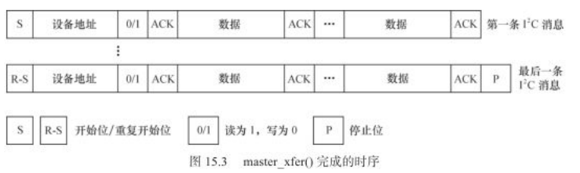

# I2C #

	参考
	http://blog.chinaunix.net/uid-25906157-id-3585430.html
	https://blog.csdn.net/skyflying2012/article/details/8237881

	https://blog.csdn.net/ypoflyer/article/details/6376545
	https://blog.csdn.net/tommy_wxie/article/details/7408328

	https://blog.csdn.net/hygzxf/article/details/17416725

	I2C是一种串行总线的外设接口，它采用同步方式串行接收或发送信息，两个设备在同一个时钟下工作。
	I2C总线只用两根线：串行数据SDA（Serial Data）、串行时钟SCL（Serial Clock）

	3种速率: 100k/400k/3.4M bps

	1）I2C总线数据传输的开始必须由主器件产生通信的开始条件（SCL高电平时，SDA产生负跳变）；
	通信结束时，由主器件产生通信的结束条件（SCL高电平时，SDA产生正跳变）

	2）在SCL高电平期间,SDA线上的数据必须保持稳定，否则会被误认为开始条件或结束条件
	
	3) 只有在SCL低电平期间才能允许改变SDA线上的数据

	4）空闲时SDA SCL都是高电平
	5）IIC总线是单工，同一时刻数据只有一个流向
	6）在SCL高电平时采样数据

  

- 字节传送与应答

		1) 每一个字节必须保证是8位长度。
		数据传送时，先传送最高位（MSB）; 每一个被传送的字节后面都必须跟随一位应答位ACK（即一帧共有9位）

		2）从机可以通过 对无法接收的第一个数据字节的“非应答”（此时必须将SDA置于高电平）通知主机，
		主机则应发出终止信号以结束数据的继续传送。
	  

- 寻址字节的位定义

		D7～D1位组成从机的地址。D0位是数据传送方向位，为0—>写，1->读。

		I2C slave设备的地址：在 datasheet中搜"slave address"
	  

- 数据帧格式

		I2C总线上传送的数据信号是广义的，既包括地址信号，又包括真正的数据信号。
		开始位和停止位都由 I 2 C 主设备产生。
		在起始信号后必须传送一个从机的地址（共7位），再传送方向位（0—>写，1->读）， 即MSB优选传送。
		
		若主机希望继续占用总线进行新的数据传送，则可以不产生终止信号，马上再次发出起始信号对另一从机进行寻址。
	
		a)主机向从机发送数据，数据传送方向在整个传送过程中不变：
		 注：有阴影部分表示数据由主机向从机传送，无阴影部分则表示数据由从机向主机传送。
		A表示应答， A-表示非应答（高电平）。S表示起始信号，P表示终止信号。
	  

		b)主机在第一个字节后，立即由从机读数据
	  

- I2C写过程

	  

- I2C读过程

		读时序与写的不同之处在于读需要2次传输才能完成一次读取：
		首先要写寄存器地址到从设备，其实是写到了从设备的控制寄存器或者命令寄存器，
		然后从设备内部会根据这个地址来寻址所要操作的寄存器。
	  

# I2C软件架构 #

linux软件上由3个部分组成：

  
 

- 1）i2c设备驱动 (也称为客户驱动)
	
		是对I2C硬件体系结构中设备端的实现，设备一般挂接在受CPU控制的I2C适配器上，通过I2C适配器与CPU交换数据。

		驱动工程师需要实现它：填充 i2c_driver 结构体，并实现其自身所对应的设备类型的驱动。
		i2c_driver中的(i2c_device_id *id_table) 是该driver所支持的I2C设备的ID表。

		i2c设备结构体： i2c_client
		
		i2c_driver对应多个i2c_client

	- 应用访问i2c设备的过程
	
			应用读写I2C设备的数据的过程是:
			通过i2c设备节点的read/write/ioctrl, 调用i2c驱动里的具体read/write/ioctrl函数，该函数内部：
			先组织好i2c_msg数组，然后调用 i2c_transfer()-> adapter对应的算法的 master_xfer(),
			来读取挂在i2c_adapter总线上的外设的指定寄存器里的数据（一般是在控制器的中断里读）
	
			i2c-dev.c 可以看做个I2C设备驱动，不过它实现的i2c_client是虚拟的、临时的，主要是为了便于用户空间操作I2C设备。
			对应的文件操作结构体：
				static const struct file_operations i2cdev_fops = {
					.owner		= THIS_MODULE,
					.llseek		= no_llseek,
					.read		= i2cdev_read,
					.write		= i2cdev_write,
					.unlocked_ioctl	= i2cdev_ioctl,
					.open		= i2cdev_open,
					.release	= i2cdev_release,
				};
		
- 2) i2c-core
		
		是总线驱动和设备驱动的中间枢纽

		I2C核心提供了I2C总线驱动和设备驱动的注册\注销方法，I2C通信方法(algorithm)上层的、与具体适配器无关的代码，以及探测设备，检测设备地址的上层代码等。
	
		文件： i2c-core.c

		接口：
		增加/删除i2c控制器的函数:
		int i2c_add_adapter(struct i2c_adapter *adapter)  或i2c_register_adapter()
		int i2c_del_adapter(struct i2c_adapter *adap)  

		增加/删除I2C设备驱动的函数:
		int i2c_register_driver(struct module *owner, struct i2c_driver *driver)  //封装函数是i2c_add_driver
		void i2c_del_driver(struct i2c_driver *driver)  

		增加/删除i2c设备的函数:
		struct i2c_client *  i2c_new_device(struct i2c_adapter *adap, struct i2c_board_info const *info)
		void i2c_unregister_device(struct i2c_client *client)

		i2c传输、发生、接收：
		int i2c_transfer(struct i2c_adapter *adap, struct i2c_msg *msgs, int num)
		=> i2c适配器和i2c设备间进行多条信息交互。 内部调用adapter对应的算法的 master_xfer()函数

		int i2c_master_send(const struct i2c_client *client, const char *buf, int count) //写一条消息
		int i2c_master_recv(const struct i2c_client *client, char *buf, int count) //读取一条消息

- 3）i2c总线驱动（有的叫控制器驱动，或适配器驱动）

		是对I2C硬件体系结构中适配器端的实现，适配器可由CPU控制，甚至可以直接集成在CPU内部。
		
		一般是SOC厂商会实现好：填充I2C_adapter(对应一个控制器)和I2C_algorithmn(对应一个通信方法)结构体
		参考函数：exynos5_i2c_probe()
	
		i2c总线驱动挂在platform总线上

		I2C适配器所对应的platform_driver的probe函数要完成2个工作：
		（1）初始化I2C适配器所使用的硬件资源,如申请I/O地址、中断号、时钟等
		（2）添加i2c_adapter实例，该实例实现了对应的i2c_algorithmn.master_xfer()

		master_xfer()： 也就I2C通信协议. 对该I2C总线上的设备的访问都是通过该函数来完成

		master_xfer()的模板： 
	  
	
		master_xfer()的时序： 
	  

		i2c消息结构体： i2c_msg, 包括了i2c传输的slave 地址，方向，缓冲区等信息

		struct i2c_adapter {
			struct module *owner;
			unsigned int class;		  /* classes to allow probing for */
			const struct i2c_algorithm *algo; /* 算法实例指针. the algorithm to access the bus */
			void *algo_data;  //=> 存放具体I2C总线驱动xxx_i2c结构体的指针
		
			/* data fields that are valid for all devices	*/
			struct rt_mutex bus_lock;
		
			int timeout;			/* in jiffies */
			int retries;
			struct device dev;		/* the adapter device */
		
			int nr;
			char name[48];
			struct completion dev_released;
		
			struct mutex userspace_clients_lock;
			struct list_head userspace_clients;
		
			struct i2c_bus_recovery_info *bus_recovery_info;
			const struct i2c_adapter_quirks *quirks;
		};

		* @master_xfer: Issue a set of i2c transactions to the given I2C adapter
		*   defined by the msgs array, with num messages available to transfer via
		*   the adapter specified by adap.
		*   
		* @smbus_xfer: Issue smbus transactions to the given I2C adapter. If this
		*   is not present, then the bus layer will try and convert the SMBus calls
		*   into I2C transfers instead.

		struct i2c_algorithm {
			/* If an adapter algorithm can't do I2C-level access, set master_xfer
			   to NULL. If an adapter algorithm can do SMBus access, set
			   smbus_xfer. If set to NULL, the SMBus protocol is simulated
			   using common I2C messages */
			/* master_xfer should return the number of messages successfully
			   processed, or a negative value on error */
			int (*master_xfer)(struct i2c_adapter *adap, struct i2c_msg *msgs, int num); //=>传输协议
			int (*smbus_xfer) (struct i2c_adapter *adap, u16 addr,  //=> smbus通信协议的方法？
					   unsigned short flags, char read_write,
					   u8 command, int size, union i2c_smbus_data *data);
		
			/* To determine what the adapter supports */
			u32 (*functionality) (struct i2c_adapter *); //支持的通信协议，如：
		
		#if IS_ENABLED(CONFIG_I2C_SLAVE)
			int (*reg_slave)(struct i2c_client *client);
			int (*unreg_slave)(struct i2c_client *client);
		#endif
		};

		实例: nvida tegra i2c总线驱动

		文件： i2c-tegra.c
		driver变量： tegra_i2c_driver
	
		static const struct i2c_algorithm tegra_i2c_algo = {
			.master_xfer	= tegra_i2c_xfer,
			.functionality	= tegra_i2c_func,
		};
	
		tegra_i2c_xfer()->tegra_i2c_xfer_msg():
			reinit_completion(&i2c_dev->msg_complete)
			i2c_writel() //写到寄存器(写时)
			tegra_i2c_unmask_irq(i2c_dev, int_mask); //打开中断寄存器，以允许通过收到的TX/RX的中断来获取状态或数据结果。
			wait_for_completion_timeout() //等待完成
	
		tegra_i2c_isr():
			读取收到的数据（读时），或者 写完后的状态
			...
			complete(&i2c_dev->msg_complete);

- 3者的关系图

	  

# 用GPIO模拟I2C总线 #

	i2c-gpio.c是gpio模拟I2C总线的驱动
	1) i2c_gpio driver变量
	2) i2c_bit_add_numbered_bus()会将模拟的i2c总线驱动添加到I2C core
	3）of_i2c_register_devices()会将所有 采用gipo模拟ic2方式进行操作的设备 添加到i2C core
	
	
# SM5705 #

	高通平台上的dtsi:
	
	&soc {
		i2c_13: i2c@13 {  //0x13是I2C设备地址
			cell-index = <13>;
			compatible = "i2c-gpio";   //说明这是软件I2C（用gpio来模拟I2C的）?
			gpios = <&tlmm 73 0 /* sda */   //SDA/SCL 的GPIO号
				&tlmm 74 0	/* scl */
				>;
			i2c-gpio,delay-us = <2>;
			#address-cells = <1>;
			#size-cells = <0>;

			muic-sm5705@25 {
				status = "okay";
				compatible = "muic-universal";
				reg = <0x25>;
				interrupt-parent = <&tlmm>;
				interrupts = <63 0>;  //中断号
				muic-universal,irq-gpio = <&tlmm 63 0x00>;
				sm5705,wakeup;
				muic-universal,chip_name = "sm,sm5705";
				pinctrl-names = "muic_i2c_pins_default","muic_i2c_pins_active","muic_i2c_pins_suspend";
				pinctrl-0 = <&sm5705_i2c_default &sm5705_interrupt_default &sm5705_rst_default>;  //多种pinctrl
				pinctrl-1 = <&sm5705_i2c_active &sm5705_interrupt_default>;
				pinctrl-2 = <&sm5705_i2c_suspend &sm5705_interrupt_default>;
				muic,sm570x_switch_gpio = <&tlmm 45 0>;
				muic,max-afc-support-volt = <4>;
				muic,max-afc-support-cur = <8>;
			};
		...
		

# 调试 #

	1）查看所有的I2C 设备文件
	
	$ ls -l /dev/ | grep i2c
	crw-------  1 root	  root		  89,   0 2017-03-04 08:47 i2c-0
	crw-------  1 root	  root		  89,   1 2017-03-04 08:47 i2c-1
	crw-------  1 root	  root		  89,   2 2017-03-04 08:47 i2c-2
	crw-rw----  1 audio	 audio		 89,   3 2017-03-04 08:47 i2c-3
	...

	2）查看所有的I2C device

	$ ls -l /sys/bus/i2c/devices
	total 0
	...
	lrwxrwxrwx 1 root root 0 2017-03-09 12:42 1-0033 -> ../../../devices/soc/78b6000.i2c/i2c-1/1-0033
	lrwxrwxrwx 1 root root 0 2017-03-09 12:42 2-0020 -> ../../../devices/soc/soc:i2c@23/i2c-2/2-0020
	...
	lrwxrwxrwx 1 root root 0 2017-03-09 12:42 i2c-0 -> ../../../devices/soc/soc:i2c@13/i2c-0
	lrwxrwxrwx 1 root root 0 2017-03-09 12:42 i2c-1 -> ../../../devices/soc/78b6000.i2c/i2c-1
	lrwxrwxrwx 1 root root 0 2017-03-09 12:42 i2c-2 -> ../../../devices/soc/soc:i2c@23/i2c-2
	lrwxrwxrwx 1 root root 0 2017-03-09 12:42 i2c-3 -> ../../../devices/soc/78b7000.i2c/i2c-3
	... 