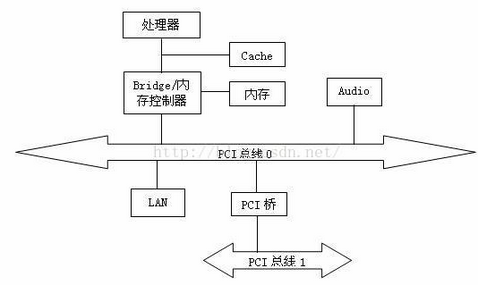
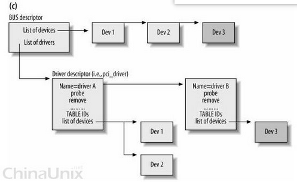

# PCI #
	
	参考
	https://blog.csdn.net/wstpt/article/details/75331241
	https://blog.csdn.net/jmq_0000/article/details/7517594  Linux设备驱动之——PCI 总线
	https://blog.csdn.net/WINGCREATE/article/details/6342933

	PCI 是外围设备互连（Peripheral Component Interconnect ）, 可以在33MHz时钟频率、32 bit数据总线宽度的条件下达到峰值132Mb/s的传输速率;它能支持一种称为线性突发的数据传输模式，可确保总线不断满载数据

	PCIE 是外围设备互连（Peripheral Component Interconnect Express）的简称。
	
	PCIE 总线支持3个独立的物理地址空间：存储器空间，IO空间和配置空间。
	每个PCIE设备都有一个配置空间，配置空间采用Id寻址方法，用总线号，设备号，功能号和寄存器号来唯一标识一个配置空间。
	配置空间只能由host桥来访问。

- PCI总线架构主要被分成三部分
	
		1) PCI  设备。
		符合 PCI 总线标准的设备就被称为 PCI 设备，PCI  总线架构中可以包含多个 PCI 设备。
		图中的 Audio 、LAN 都是一个 PCI 设备。
		PCI  设备同时也分为主设备和目标设备两种，主设备是一次访问操作的发起者，而目标设备则是被访问者。
	
		2) PCI  总线。
		PCI  总线在系统中可以有多条，类似于树状结构进行扩展，每条 PCI 总线都可以连接多个 PCI  设备/ 桥。
		上图中有两条 PCI 总线。
	
		3) PCI  桥。
		当一条 PCI 总线的承载量不够时，可以用新的 PCI 总线进行扩展，而 PCI 桥则是连接 PCI 总线之间的纽带。
		图中的 PCI 桥有两个，一个桥用来连接处理器、内存以及 PCI 总线，而另外一条则用来连接另一条 PCI 总线。
	  
	
		PCI控制器： struct pci_controller
		PCI总线: struct pci_bus
		
		PCI设备: struct pci_dev
		
		PCI驱动: struct pci_driver

- PCI 控制器驱动

		文件： pci-msm.c
		
		subsys_initcall_sync(pcie_init);
	
		int __init pcie_init(void)
		{
			...
			msm_pcie_debugfs_init();
			ret = platform_driver_register(&msm_pcie_driver); //
		
			return ret;
		}

- PCI设备与驱动关系

        PCI设备通常由一组参数唯一地标识，它们被vendorID，deviceID和class nodes所标识，即设备厂商，型号等，这些参数保存在 pci_device_id结构中。
		每个PCI设备都会被分配一个pci_dev变量，内核就用这个数据结构来表示一个PCI设备。

        PCI驱动程序都必须定义一个pci_driver结构变量，在该变量中包含了这个PCI驱动程序所提供的不同功能的函数。
		在注册PCI驱动程序时(pci_register_driver()), pci_driver变量会被链接到pci_bus_type中的驱动链上去。
        在pci_driver中有一个成员struct pci_device_id *id_table，它列出了这个设备驱动程序所能够处理的所有PCI设备的ID值。

- PCI设备与驱动的绑定过程

	  

# PCIE #

	参考
	https://blog.csdn.net/u010872301/article/details/78519371?locationnum=8&fps=1  linux设备驱动之PCIE驱动开发
	https://blog.csdn.net/abcamus/article/details/78009865  大话PCIe：实现host驱动

	PCIE（PCI Express)是INTEL提出的新一代的总线接口,目前普及的PCIE 3.0的传输速率为8GT/s，下一代PCIE 4.0将翻番为16GT/S，
	因为传输速率快广泛应用于数据中心、云计算、人工智能、机器学习、视觉计算、显卡、存储和网络等领域。

	PCIE插槽是可以向下兼容的，比如PCIE 1X接口可以插4X、8X、16X的插槽上。

	实现基本的PCIE设备驱动程序，实现以下模块：
	初始化设备、设备打开、数据读写和控制、中断处理、设备释放、设备卸载。

	PCIE驱动开发通用调试的基本框架，对于具体PCIE设备，需要配置相关寄存器才可以使用 ?
