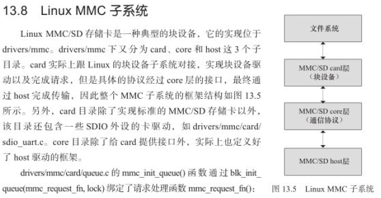
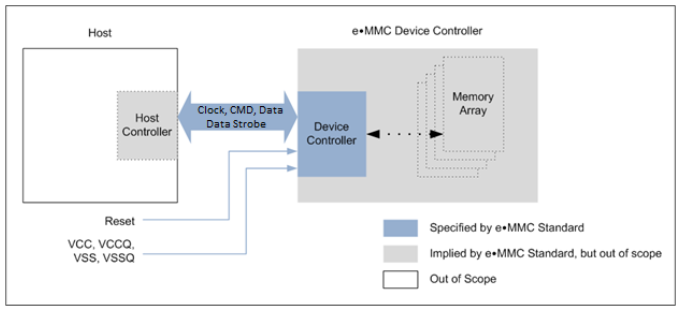

# SDIO协议 #

# MMC子系统 #
	
	参考： http://blog.chinaunix.net/uid-20321537-id-5683768.html

	目前MMC/SD/SDIO三种类型的控制器是 SDHCI(secure digital host controller interface),
	所以更多是直接重用driver/mmc/host/sdhci.c驱动。

  

# EMMC #

	参考
	http://www.cnblogs.com/smartjourneys/p/6652388.html
	http://news.mydrivers.com/1/528/528868.htm
	
	eMMC 5.0/5.1标准在目前来说仍算主流，理论带宽分别为400MB/s和600MB/s, 半双工
	UFS2.0: 5.8G bps， 全双工
	
- 总体架构

		1) bus部分
		有11条信号线：
		（1）CLK： 0~200MHZ，每个cycle可以在上升沿或下降沿传输，也可以在上升沿和下降沿都传输;
		（2）data strobe：由slave device 发送给host controller，主要用在HS400 mode，频率与clk一致,
			用于同步接收device的data,response和CRC status;
		（3）CMD：双向信号线，用于从host发送命令给device和device发送response给host,有两种操作模式：open drain和push pull
		（4）8 bit DATA bus: 双向数据信号线，工作在push pull mode,支持 1bit, 4bit, 8bit传输,
			默认上电或reset后只有DATA0用于数据传输，可以通过命令配置有多少条数据线用于传输数据。
			在device内部，DATA1~DATA7包含上拉电阻，平时不使用时保持上拉状态（也就是高电平？？），使用时则断开上拉。
		
		2) Host Controller
		通过发送CMD读写device端数据，或对device端进行配置
		
		3) eMMC device controller
		实现对memory的管理，接收bus端的CMD，实际读写I/O寄存器
		
		4) flash memory
		包含了实际的存储介质nand flash
	  

- eMMC总线协议

		1）包含四种token
		
			command:	  任何操作都要以CMD开始，只能由host发往device,且要串行完成；
			response:   在接收到host端发送的CMD,device作为回应将通过command line发送一个response,
						只能有device发往host，且只能通过command line串行传输；
			data:	 data可由host发送device（写）, 也可以由device发往host（读），data线可采用1线，4线，8线传输.
					对于每条data线，可以选择单沿传输（single data rate）还是双沿传输 （dual data rate）
			CRC status: 用于device发送给host告知接收到的写入数据校验是否成功
		
		注：有些CMD是不需要发送respnse回应的
		
		2）device地址采用session地址，由host controller在初始化阶段指定？？
		
		3）device通过CID进行识别
		
		4）bus操作由CMD,response,data中的一种或几种组成，包括三种：CMD; CMD+response；CMD+response+data
		
		5）读(写)数据时，data block后跟CRC bits,支持单个data block读(写)和multi blocks读(写).
		当multi blocks读(写)时，command发送stop命令表示读(写)结束
		
		6）写数据时，device通过DATA0的busy位来告知host当前block写入是否完成

- 查看emmc的属性信息
	
		ls -l /sys/devices/soc/7824900.sdhci/mmc_host/mmc0/mmc0:0001  // 可以查看cid, firmware信息
		=>
		-r--r--r-- 1 root root 4096 2017-02-08 14:53 bkops_enable
		-r--r--r-- 1 root root 4096 2017-02-08 14:53 bkops_support
		drwxr-xr-x 3 root root	0 2017-02-08 14:53 block
		-r--r--r-- 1 root root 4096 2017-02-08 14:53 caps
		-r--r--r-- 1 root root 4096 2017-02-08 14:53 caps2
		-r--r--r-- 1 root root 4096 2017-02-08 14:53 cid
		-r--r--r-- 1 root root 4096 2017-02-08 14:53 csd
		-r--r--r-- 1 root root 4096 2017-02-08 14:53 date
		...
