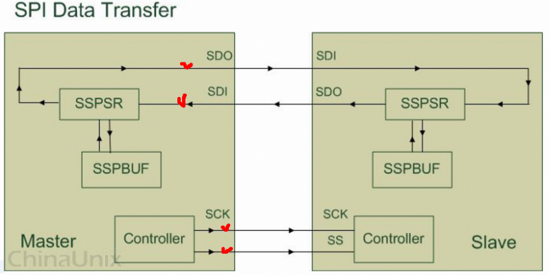
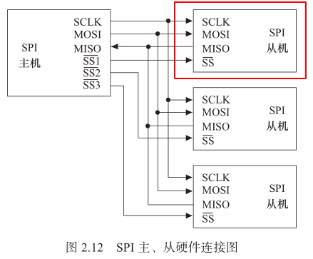
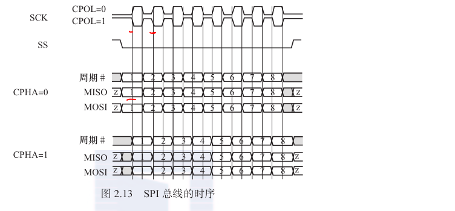
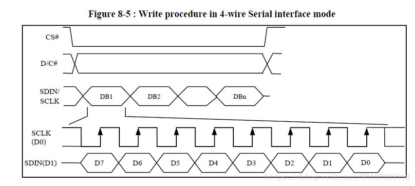
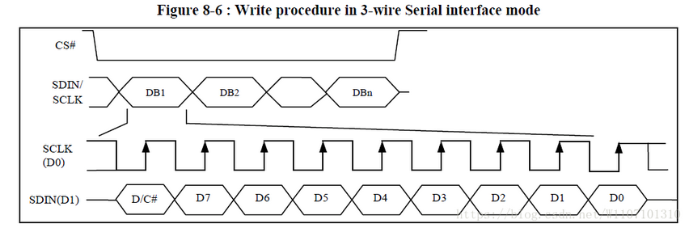
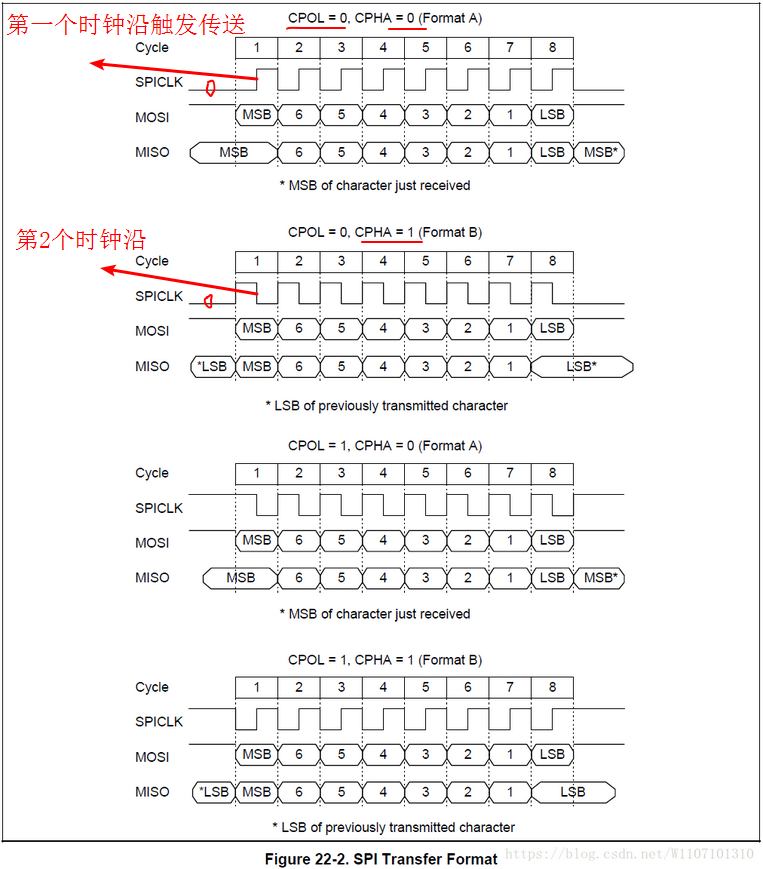
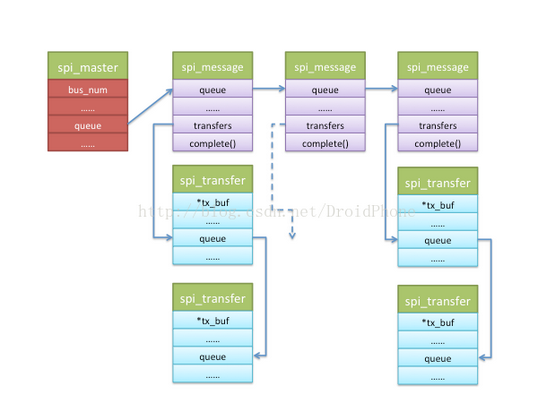

# SPI #

	参考
	https://blog.csdn.net/skyflying2012/article/details/11710801
	http://www.cnblogs.com/rongpmcu/p/7662706.html  linux spi驱动框架分析

	SPI, Serial Perripheral Interface, 串行外围设备接口, 是 Motorola 公司推出的一种同步串行接口技术.
	SPI 总线在物理上是通过接在外围设备微控制器上面的微处理控制单元 (MCU) 上叫作同步串行端口(Synchronous Serial Port) 的模块(Module)来实现的,
	它允许 MCU 以全双工的同步串行方式, 与各种外围设备进行高速数据通信.

	从下图中看出：master和slave端都有控制器
  

# 接口线 #

	SCK： Serial Clock，用于主设备Master给slave提供时钟信号
	CS: 片选择从设备，使被选中的 Slave 设备能够被 Master 设备所访问。也叫SS:Slave Select
	SDO/MOSI： Serial Data Output/Master Out Slave In, 在 Master 上面也被称为 Tx-Channel, 作为数据的出口, 主要用于 SPI 设备发送数据
	SDI/MISO： Serial Data Input/Master In Slave Out, 在 Master 上面也被称为 Rx-Channel, 作为数据的入口, 主要用于SPI 设备接收数据

# 控制方式：主从模式 #

	Master设备可以通过 提供 Clock 以及对 Slave 设备进行片选 (Slave Select) 来控制多个 Slave 设备
	下图中，SS就是我们说的CS

  
	
# 传输数据： 同步方式 #

	Master设备会根据将要交换的数据来产生相应的时钟脉冲(Clock Pulse), 时钟脉冲组成了时钟信号(Clock Signal) ,
	时钟信号通过时钟极性 (CPOL) 和 时钟相位 (CPHA) 控制着两个 SPI 设备间何时数据交换以及何时对接收到的数据进行采样, 来保证数据在两个设备之间是同步传输的.

	CPOL: 时钟极性, 表示SPI设备在空闲时 SCK 管脚上的时钟信号是高电平（CPOL=1）还是低电平（0）. 
	CPHA: 时钟相位, 表示SPI设备在SCK的第1个(CPHA= 0）还是第2个(CPHA= 1）跳变沿触发数据采样.

  

# 应用场景 #

	sensor与sensor hub(MCU)

# SPI裸板程序 #

	参考

	https://blog.csdn.net/W1107101310/article/details/80329183  2440裸机GPIO模拟SPI控制FLASH
	https://blog.csdn.net/W1107101310/article/details/80294596  2440裸机GPIO模拟SPI驱动OLED
	=> 包括 在OLED上显示我们要输入的字符串

	所用OLED 驱动芯片：SSD1306， 其指定了SPI协议

- 情况1： 4线SPI的函数接口

		根据slave上的SPI协议, 写过程如下
		注意:
		SPI是按MSB优先发送,下图中的D7是最先被发送的
		D/C#线，用于区分发送的是数据(高电平1时)还是命令
	  

		
		1）SPI Master上的初始化
	
		根据原理图上SPI设备（OLED)的连接方式，进行配置。
	
		这里是配置master上的GPIO的输入输出功能, 以及CS脚空闲时默认为高电平
	
		static void spi_gpio_init(void)  
		{  
		    /* GPF1 OLED_CS0 output */  
		    GPFCON &= ~(0x3<<(1*2));  
		    GPFCON |= (0x1<<(1*2));  
		    GPFDAT |= (0x1<<1);      /* 将OLED片选拉为高电平 */  
		  
		    /* GPG2 FLASH_CS0 output 
		    *  GPG4 OLED_D/C  output 
		    *  GPG5 SPI_MISO  input 
		    *  GPG6 SPI_MOSI  output 
		    *  GPG7 SPI_CLK   output 
		    */  
		    GPGCON &= ~((0x3<<(2*2)) | (0x3<<(4*2)) | (0x3<<(5*2)) | (0x3<<(6*2)) | (0x3<<(7*2)));  
		    GPGCON |= ((0x1<<(2*2)) | (0x1<<(4*2)) | (0x1<<(6*2)) | (0x1<<(7*2)));  
		    GPGDAT |= (0x1<<2);       /* 将FLASH片选拉为高电平 */  
		} 
	
		2）SPI控制接口
	
		void spi_oled_write_cmd(unsigned char cmd)  //写 命令 到spi设备的接口   
	    {  
	        spi_set_DC(0);  //DC线上写0，代表当前是发送命令     
	        spi_set_CS(0);  //拉低CS, 以片选SPI 从设备
	        spi_send_byte(cmd);   
	        spi_set_CS(1);  //取消片选
	        spi_set_DC(0);  //为什么不恢复为1呢？
	    }  
	
		void spi_oled_write_data(unsigned char dat) //写 数据 到spi设备的接口  
	    {  
	        spi_set_DC(1);  //DC线上写1，代表当前是发送数据    
	        spi_set_CS(0);  
	        spi_send_byte(dat);  
	        spi_set_CS(1);  
	        spi_set_DC(1);  //为什么不恢复为0呢？
	    }  
	
		void spi_send_byte(unsigned char val)  //写入一个字节
		{  
		    int i;  
		  
		    for(i=0;i<8;i++){  
		        spi_set_clk(0);  // 拉低clk
		        spi_set_DO(val & 0x80);  
		        spi_set_clk(1);  // 拉高clk
		        val <<= 1;  
		    }  
		}
	
		//这里是master上的GPIO连到spi设备的情况
	    static void spi_set_clk(char val)  
	    {  
	        if(val)  
	            GPGDAT |= (0x1<<7);  //将master上的GPIO的第7位为1
	        else  
	            GPGDAT &= ~(0x1<<7);  //将master上的GPIO的第7位为1
	    }  
	      
	    static void spi_set_DO(char val)  
	    {  
	        if(val)  
	            GPGDAT |= (0x1<<6);  
	        else  
	            GPGDAT &= ~(0x1<<6);  
	    }  
	      
	      
	    static void spi_set_CS(char val)  
	    {  
	        if(val)  
	            GPFDAT |= (0x1<<1);  
	        else  
	            GPFDAT &= ~(0x1<<1);  
	    }  
	      
	    static void spi_set_DC(char val)  
	    {  
	        if(val)  
	            GPGDAT |= (0x1<<4);  
	        else  
	            GPGDAT &= ~(0x1<<4);  
	    }  
	
	
		3) SPI 设备的初始化（slave端）
	
		根据OLED的datasheet, 初始化OLED.
	
		void oled_init(void)  
		{  
		    spi_oled_write_cmd(0xae);//--display off  
		    spi_oled_write_cmd(0x00);//---set low column address  
		    spi_oled_write_cmd(0x10);//---set high column address  
		    spi_oled_write_cmd(0x40);//--set start line address    
		    spi_oled_write_cmd(0xb0);//--set page address  
		    spi_oled_write_cmd(0x81); // contract control  
			...
		}

- 情况2： 3线SPI的函数接口

		对于3线的spi，3条线分别为数据输出线（MOSI，这里的输入输出是相对于主机而言的），串行时钟（CLK），片选（CS#，其中#表示低电平有效）。
		而相对于4线的spi，这里少了D/C#线。如何用来区分我们发的是数据还是命令那？

		我们看SSD1306的数据手册中3线spi的时序图：
		我们看到他一共发送了9位数据，其中最高位就是数据/命令位，用来区分后面发送的8位是数据还是命令。
		而其他的就与4线的spi一样了。

	  
		
		1）SPI Master上的初始化

		与4线spi的GPIO初始化相似，就是少了对DC引脚的初始化。

		2）SPI控制接口

		void spi_oled_write_9bit(unsigned char val,int DC)   //写数据/命令函数
	    {  
	        spi_set_CS(0);  
	        spi_send_byte(val,DC);  
	        spi_set_CS(1);  
	    }  
		
		//先判断发送的是命令还是数据，并相应的拉低或升高DO线，然后再发送8位数据。
		void spi_send_byte(unsigned char val,int DC)  
	    {  
	        int i;  
	        if(DC){  /* 判断发送的是数据还是命令 */  
	            spi_set_clk(0);  
	            spi_set_DO(1);  
	            spi_set_clk(1);  
	        }else{  
	            spi_set_clk(0);  
	            spi_set_DO(0);  
	            spi_set_clk(1);  
	        }  
	              
	        for(i=0;i<8;i++){  
	            spi_set_clk(0);  
	            spi_set_DO(val & 0x80);  
	            spi_set_clk(1);  
	            val <<= 1;  
	        }  
	    }  

		3) SPI 设备的初始化（slave端）

		void oled_3wire_init(void)  
		{  
		    spi_oled_write_9bit(0xae,OLED_CMD);//--display off  
		    spi_oled_write_9bit(0x00,OLED_CMD);//---set low column address  
		    spi_oled_write_9bit(0x10,OLED_CMD);//---set high column address  
		    spi_oled_write_9bit(0x40,OLED_CMD);//--set start line address    
		    spi_oled_write_9bit(0xb0,OLED_CMD);//--set page address  
			...
		}
		

# 2440 SPI控制器 #

	参考
	https://blog.csdn.net/W1107101310/article/details/80360025  2440SPI控制器控制OLED和flash

	SPI寄存器
	控制寄存器：SPCON0,...
	状态寄存器：SPSTA0,...
	波特率预分频寄存器：SPPRE0,...
	发送数据寄存器：SPTDAT0,...
	接收数据寄存器：SPRDAT0,...

	S3C2440A支持4种不同的传输格式，如下图。
	CPOL=0，CPHA=0，即时钟平时将处于低电平，第一个时钟沿一定是上升沿进行传输

  

# Linux下SPI驱动框架 #

	参考
	http://www.cnblogs.com/rongpmcu/p/7662706.html  Linux下SPI驱动框架分析（s3c24xx)
	https://blog.csdn.net/alleincao/article/details/7522418  深入浅出spi驱动之数据结构(一) （s3c24xx)
	https://blog.csdn.net/alleincao/article/details/7523169  深入浅出spi驱动之控制器驱动(二) （s3c24xx)
	https://blog.csdn.net/alleincao/article/details/7525977  深入浅出spi驱动之控制器驱动(三) （s3c24xx)
	https://blog.csdn.net/droidphone/article/details/24353293  Linux SPI总线和设备驱动架构之三：SPI控制器驱动 （S3C6410）

	https://blog.csdn.net/u010243305/article/details/78426058  SPI设备端驱动编写----基于linux4.9 driver核心层

	
	从三个方面来分析spi框架

- 1）spi控制器驱动

		控制器驱动的主要工作： ?
		是从BSP中取出master controller的信息(通过系统platform_bus)，产生master controller并注册到spi_bus_type，
		接着扫描BSP中注册的设备链表产生spi_device并将它们注册到spi_bus_type，这样，当spi_driver注册到spi_bus_type时就可以与spi_device进行匹配
		(具体是首先通过spi_bus_type的match函数(一般是通过比较两者的名字实现)，进一步通过spi_driver的probe函数实现)，看其初始化函数

		struct bus_type spi_bus_type = {   //spi_device和spi_driver都向其注册  
		    .name       = "spi",  
		    .dev_attrs  = spi_dev_attrs,  
		    .match      = spi_match_device, //总线的match函数  
		    .uevent     = spi_uevent,  
		    .suspend    = spi_suspend,  
		    .resume     = spi_resume,  
		};  

		BSP中注册的控制器名字和spi_s3c24xx.c注册的驱动名字可以通过名字进行匹配(platform_match)，紧接着会调用s3c24xx_spi_probe函数：

		struct platform_device s3c_device_spi0 = {    //spi控制器device, 是个platform_device 
		    .name         = "s3c2410-spi",  //
		    .id       = 0,  
		    .num_resources    = ARRAY_SIZE(s3c_spi0_resource),  
		    .resource     = s3c_spi0_resource,  
		        .dev              = {  
		                .dma_mask = &s3c_device_spi0_dmamask,  
		                .coherent_dma_mask = 0xffffffffUL  
		        }  
		};  

		static struct platform_driver s3c24xx_spi_driver = {  //spi控制器driver，是个platform_driver
		    .remove     = __exit_p(s3c24xx_spi_remove),  
		    .driver     = {  
		        .name   = "s3c2410-spi",   //
		        .owner  = THIS_MODULE,  
		        .pm = S3C24XX_SPI_PMOPS,  
		    },  
		};  
		static int __init s3c24xx_spi_init(void)  
		{  
		        return platform_driver_probe(&s3c24xx_spi_driver, s3c24xx_spi_probe);  
		} 

		struct bus_type platform_bus_type = {  
		    .name       = "platform",  
		    .dev_attrs  = platform_dev_attrs,  
		    .match      = platform_match,  
		    .uevent     = platform_uevent,  
		    .pm     = &platform_dev_pm_ops,  
		};  

		static int platform_match(struct device *dev, struct device_driver *drv)  
		{  
		    struct platform_device *pdev = to_platform_device(dev);  
		    struct platform_driver *pdrv = to_platform_driver(drv);  
		  
		    /* match against the id table first */  
		    if (pdrv->id_table)  
		        return platform_match_id(pdrv->id_table, pdev) != NULL;  
		  
		    /* fall-back to driver name match */  
		    return (strcmp(pdev->name, drv->name) == 0);  
		} 

		文件如：spi_s3c24xx.c
		如：s3c24xx_spi_probe()

		spi_master代表一个主机控制器，此处即S3C2440中的SPI控制器

		struct spi_master {  
		    struct device   dev;    //设备模型使用  
		    s16         bus_num;    //master编号，s3c2440有2个spi控制器，编号为0 1  
		    u16         num_chipselect;   //支持的片选的数量，从设备的片选号不能大于这个数量  
		    u16         dma_alignment;  
		    /* spi_device.mode flags understood by this controller driver */  
		    u16         mode_bits; //master支持的设备模式  
		  
		    /* other constraints relevant to this driver */  
		    u16         flags;      //一些额外的标志  

			#define SPI_MASTER_HALF_DUPLEX  BIT(0)      /* can't do full duplex */  
			#define SPI_MASTER_NO_RX    BIT(1)      /* can't do buffer read */  
			#define SPI_MASTER_NO_TX    BIT(2)      /* can't do buffer write */  
		  
		    int         (*setup)(struct spi_device *spi);  //设置模式、时钟等  
		  
		    int         (*transfer)(struct spi_device *spi, //数据发送函数  
		                        struct spi_message *mesg);  
		  
		    /* called on release() to free memory provided by spi_master */  
		    void            (*cleanup)(struct spi_device *spi);    
		};  

		s3c24xx_spi代表具体的s3c2440中的spi控制器，包含了控制器的信息，如中断，寄存器等信息
	
		 struct s3c24xx_spi {  
	        /* bitbang has to be first */  
	        struct spi_bitbang   bitbang;   //见下面分析  
	        struct completion    done;  
	      
	        void __iomem        *regs;  
	        int          irq;  
	        int          len;  
	        int          count;  
	      
	        void            (*set_cs)(struct s3c2410_spi_info *spi,  
	                          int cs, int pol);  
	      
	        /* data buffers */  
	        const unsigned char *tx;  
	        unsigned char       *rx;  
	      
	        struct clk      *clk;  
	        struct resource     *ioarea;  
	        struct spi_master   *master;  
	        struct spi_device   *curdev;  
	        struct device       *dev;  
	        struct s3c2410_spi_info *pdata;  
	    };  

		struct spi_bitbang是具体负责信息传输的数据结构，它维护一个workqueue_struct，
		每收到一个消息，都会向其中添加一个work_struct，由内核守护进程在将来的某个时间调用该work_struct中的function进行消息发送。 

	    struct spi_bitbang {  
	        struct workqueue_struct *workqueue; //工作队列头，spi master初始化时建立      
	        struct work_struct  work;   //spi master初始化时初始化  
	      
	        spinlock_t      lock;  
	        struct list_head    queue;  //挂接spi_message  
	        u8          busy;   //忙标志  
	        u8          use_dma;  
	        u8          flags;      /* extra spi->mode support */  
	      
	        struct spi_master   *master;    //对应的spi_master  
	      
	        /* setup_transfer() changes clock and/or wordsize to match settings 
	         * for this transfer; zeroes restore defaults from spi_device. 
	         */  
	        int (*setup_transfer)(struct spi_device *spi,   //对数据传输进行设置  
	                struct spi_transfer *t);  
	      
	        void    (*chipselect)(struct spi_device *spi, int is_on);   //控制片选  
		    #define BITBANG_CS_ACTIVE   1   /* normally nCS, active low */  
		    #define BITBANG_CS_INACTIVE 0  
	      
	        /* txrx_bufs() may handle dma mapping for transfers that don't 
	         * already have one (transfer.{tx,rx}_dma is zero), or use PIO 
	         */  
	        int (*txrx_bufs)(struct spi_device *spi, struct spi_transfer *t);   //实际的数据传输函数  
	      
	        /* txrx_word[SPI_MODE_*]() just looks like a shift register */  
	        u32 (*txrx_word[4])(struct spi_device *spi,  
	                unsigned nsecs,  
	                u32 word, u8 bits);  
	    };  

- 2）spi设备的驱动（我们更多的是编写设备的驱动）

		设备驱动完成的主要工作就是将spi_driver注册到spi_bus_type，并扫描spi_bus_type上的spi_device，
		如果其上的spi_device和spi_driver能（通过spi_bus_type的match函数？ 还是compatible属性值）进行匹配，
		则会调用spi_driver的probe函数进行资源分配

		struct spi_driver //spi driver
		struct spi_device //spi 外设

		Spi_device代表一个外围spi设备
		由master controller driver注册完成后扫描 BSP中注册设备产生的设备链表 并向spi_bus注册产生?
	
		    struct spi_device {  
			    struct device       dev;            //设备模型使用  
			    struct spi_master   *master;        //设备使用的master结构  
			    u32         max_speed_hz;   //通讯时钟  
			    u8          chip_select;    //该spi_device的片选号，每个master支持多个spi_device  
			    u8          mode;           //设备支持的模式，如片选是高or低？  
				#define SPI_CPHA    0x01            /* clock phase */  
				#define SPI_CPOL    0x02            /* clock polarity */  
				#define SPI_MODE_0  (0|0)           /* (original MicroWire) */  
				#define SPI_MODE_1  (0|SPI_CPHA)  
				#define SPI_MODE_2  (SPI_CPOL|0)  
				#define SPI_MODE_3  (SPI_CPOL|SPI_CPHA)  
				#define SPI_CS_HIGH 0x04            /* chipselect active high? */  
				#define SPI_LSB_FIRST   0x08            /* per-word bits-on-wire */  
				#define SPI_3WIRE   0x10            /* SI/SO signals shared */  
				#define SPI_LOOP    0x20            /* loopback mode */  
				#define SPI_NO_CS   0x40            /* 1 dev/bus, no chipselect */  
				#define SPI_READY   0x80            /* slave pulls low to pause */  
			    u8          bits_per_word;  //每个字长的比特数  
			    int         irq;                //中断号  
			    void            *controller_state;  //控制器寄存器状态  
			    void            *controller_data;  
			    char            modalias[SPI_NAME_SIZE];    //设备名称  
			};  

		spi_driver代表一个SPI protocol drivers，即外设驱动。

			struct spi_driver {  
			    const struct spi_device_id *id_table;       //支持的spi_device设备表  
			    int         (*probe)(struct spi_device *spi);   //probe函数  
			    int         (*remove)(struct spi_device *spi);  
			    void        (*shutdown)(struct spi_device *spi);  
			    int         (*suspend)(struct spi_device *spi, pm_message_t mesg);  
			    int         (*resume)(struct spi_device *spi);  
			    struct device_driver    driver;     //设备模型使用  
			};  

		调用spi_sync(at25->spi, &m) 将spi_message送到核心层，再由核心层调用具体的控制器的master->transfer() 送出数据

- 3）spi核心层的实现（上面1、2都是以各自的驱动实现为目标，并不深入到spi核心层）

		文件： spi.c, 提供spi_sync类的接口
	
		spi_transfer代表一个读写缓冲对，包含接收缓冲区及发送缓冲区

		struct spi_transfer {  
		    const void  *tx_buf;    //发送缓冲区  
		    void        *rx_buf;    //接收缓冲区  
		    unsigned    len;        //缓冲区长度  
		  
		    dma_addr_t  tx_dma;  
		    dma_addr_t  rx_dma;  
		  
		    unsigned    cs_change:1;  // 当前spi_transfer发送完成之后重新片选？  
		    u8      bits_per_word;  //每个字长的比特数，0代表使用Spi_device中的默认值  
		    u16     delay_usecs;    //发送完成一个spi_transfer后延时时间  
		    u32     speed_hz;       //速率  
		  
		    struct list_head transfer_list; //用于链接到spi_message  
		};

		spi_message代表spi消息，由多个 spi_ transfer 组成

		struct spi_message {
			struct list_head    transfers;      // spi_transfer链表队列  
		  
		    struct spi_device   *spi;           //该消息的目标设备  
		  
		    unsigned        is_dma_mapped:1;  
		  
		    /* completion is reported through a callback */  
		    void            (*complete)(void *context);  //处理完消息后调用的回调函数  
		    void            *context;       //回调函数参数  
		    unsigned        actual_length; //实际传输的数据长度  
		    int         status;  //该消息的发送结果，0：成功  
		  
		    struct list_head    queue;      //用于连到具体的spi_master的传输队列（如bitbang的list)
		    void            *state;  
		};  

# SPI数据传输的队列化  #

	参考
	https://blog.csdn.net/u010243305/article/details/78761766  SPI数据传输的队列化

	SPI数据传输可以有两种方式：同步方式和异步方式。
	所谓同步方式是指数据传输的发起者必须等待本次传输的结束，期间不能做其它事情
	而异步方式则正好相反，数据传输的发起者无需等待传输的结束，数据传输期间还可以做其它事情

	同步方式简单易用，很适合处理那些少量数据的单次传输。但是对于数据量大、次数多的传输来说，异步方式就显得更加合适。

	对于SPI控制器来说，要支持异步方式必须要考虑以下两种状况：

    1）对于同一个数据传输的发起者，既然异步方式无需等待数据传输完成即可返回，返回后，该发起者可以立刻又发起一个message，而这时上一个message还没有处理完。
    2）对于另外一个不同的发起者来说，也有可能同时发起一次message传输请求。

	队列化正是为了为了解决以上的问题.

- spi_message的队列化

		spi_async()是发起一个异步传输的API，它会把spi_message结构挂在spi_master的queue字段下，
		然后唤醒专门为spi传输准备的内核工作线程来实际处理message的传输工作.
		因为是异步操作，所以spi_async()会立刻返回，不会等待传输的完成.

		SPI内核工作线程会按先进先出的原则来逐个处理这些message，每个message传送完成后（由核心层调用具体的控制器的master->transfer() 送出数据），
		调用对应spi_message结构的complete回调函数，以通知协议驱动程序准备下一帧数据。

- spi_master、spi_message和spi_transfer之间的关系

		一个spi_message是一次数据交换的原子请求，而spi_message由多个spi_transfer结构组成（通过一个链表组织在一起），
		spi_message也以链表的形式被挂在表示控制器的spi_master结构体的queue字段下面.
	  

	    struct spi_transfer {  
            ……  
            const void      *tx_buf;  
            void            *rx_buf;  
            ……  
      
            struct list_head transfer_list;  // 连到所属的message上的spi_transfer链表
    	};  
      
	    struct spi_message {  
	            struct list_head        transfers; // 该message的spi_transfer 链表
	              
	            struct spi_device       *spi;  
	            ……          
	            struct list_head        queue;  // 连到所属的master上的spi_message队列
	            ……  
	    };  
	
		struct spi_master {  
	            struct device   dev;  
	            ……  
	            bool                            queued;  
	            struct kthread_worker           kworker;  
	            struct task_struct              *kworker_task;  
	            struct kthread_work             pump_messages;  
	            spinlock_t                      queue_lock;  
	            struct list_head                queue;  //该master上的spi_message队列
	            struct spi_message              *cur_msg;  
	            ……  
	    }  
	
	
		1) 向spi_message结构中添加一个spi_transfer：

		void  spi_message_add_tail(struct spi_transfer *t, struct spi_message *m)  
	    {  
	            list_add_tail(&t->transfer_list, &m->transfers);  
	    }  
	
		2) spi driver发起一个message传输操作：

		int spi_async(struct spi_device *spi, struct spi_message *message); 

# WIFI #

	参考
	http://www.cnblogs.com/rongpmcu/p/7662269.html  Linux下Spi接口Wifi驱动分析
	
	TBD