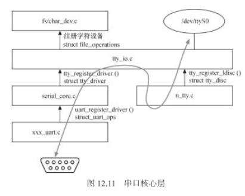

# TTY设备驱动 #

	参考
	https://blog.csdn.net/viewsky11/article/details/53679071
	
- TTY概念

		在Linux系统中，终端是一类字符型设备，它包括多种类型，通常使用tty来简称各种类型的终端设备。

		1）串口终端（/dev/ttyS*）
		串口终端是使用计算机串口连接的终端设备。Linux把每个串行端口都看作是一个字符设备。
		这些串行端口所对应的设备名称是 /dev/ttySAC0; /dev/ttySAC1……

		2）控制台终端（/dev/console）
		在Linux系统中，计算机的输出设备通常被称为控制台终端(Console), 这里特指printk信息输出到的设备。
		/dev/console是一个虚拟的设备，它需要映射到真正的tty上，比如通过内核启动参数”console=ttySAC0”就把console映射到了串口0，
		是一种虚拟的设备，可以和屏幕或者串口关联

		3）虚拟终端（/dev/tty*）
		当用户登录时，使用的是虚拟终端。使用Ctcl+Alt+[F1—F6]组合键时，我们就可以切换到tty1、tty2、tty3等上面去。
		tty1–tty6等称为虚拟终端，而tty0则是当前所使用虚拟终端的一个别名.

	
- 系统架构
	
		Linux tty子系统包含：tty核心，tty线路规程和tty驱动。
		tty核心是对整个tty设备的抽象，对用户提供统一的接口；
		tty线路规程是对传输数据的格式化；
		tty驱动则是面向tty设备终端的硬件驱动。它将字符转换成终端可以理解的字串，将其传给终端设备。
		
		写过程：用户空间通过设备文件同tty_core交互, tty_core根据用空间操作的类型再选择line discipline(线路规程驱动)与tty_driver交互.
		读过程：与写相反

	  

		tty_driver是字符设备的泛化，serial_core是tty_driver的泛化，而具体的uart驱动是serial_core的泛化。

	  
	  
	
- console

		参考：https://blog.csdn.net/skyflying2012/article/details/41078349
		
		1) kernel下的console是输入输出设备driver中实现的简单的输出console，只实现write函数，并且是直接输出到设备。
		
		kernel下每次printk打印，首先存log_buf，然后遍历console_drivers，找到合适console(execlusive_console或所有enable的)，刷出log。
		printk->vprintk->console_unlock->call_console_drivers->_call_console_drivers->_call_console_drivers->__call_console_drivers
		
		console_drivers 是已经注册的console driver链表
		
		如果在cmdline指定2个I/O设备，如“console==ttyS0,115200 console=ttyS1,115200”，因ttyS设备都是serial driver中注册的real console，
		所以会看到kernel的打印分别出现在2个串口上
		
		kernel下console的注册: register_console()
		
		2) user空间下的console，实际就是tty的一个例子，所有操作函数都继承与tty，全功能，可以打开 读写 关闭，
		所以对于console的读写，都是由kernel的tty层来最终发送到设备。
		
		如果cmdline指定2个I/O设备，“console=ttyS0,115200 console=ttyS1,115200”，user空间选择哪个作为console？
		=> 会选择ttyS1
		
		
		3) 对于一个新实现的输入输出设备，如果想让其即作为kernel的printk输出设备，也作为user空间的控制台，
		则需要实现device方法成员，来返回该设备的tty_driver。

# UART #
	
	UART之间以全双工方式传输数据
	最精确的连线方法只有3根电线：TxD用于发送数据，RxD用于接收数据，Gnd用于给双发提供参考电平

	发送数据时，CPU将并行数据写入UART，UART按照一定的格式在一根电线上串行发出；
	接收数据时，UART检测另一根电线上的信号，串行收集然后放在缓冲区中，CPU即可读取UART获得这些数据。

  

	数据传输流程如下：
	（1）平时数据线处于空闲状态（1状态）
	（2）当要发送数据时，UART改变TxD数据线的状态（变为0状态）并维持1位的时间，
		这样接收方检测到开始位后，在等待1.5位的时间就开始一位一位地检测数据线的状态得到所传输的数据。
	（3）UART一帧中可以有5、6、7或8位的数据，发送方一位一位地改变数据线的状态将他们发送出去(首先发送最低位)。
	（4）如果使用校验功能，UART在发送完数据后，还要发送1位校验位。
		有两种校验方法：奇校验、偶校验——数据位连同校验位中，1的数据等于奇数或偶数。
	（5）最后，发送停止位，数据线恢复到空闲状态（1状态）。停止位的长度有3种：1位、1.5位、2位。
  

- UART驱动调用关系

	  
	
- UART驱动的数据结构和接口
	
		串口驱动有3个核心数据结构：
		1）uart_driver
		struct uart_driver包含了串口设备名、串口驱动名、主次设备号、串口控制台(可选)等信息，还封装了tty_driver(底层串口驱动无需关心tty_driver)。
		
			struct uart_driver {
				struct module     *owner;           /* 拥有该uart_driver的模块,一般为THIS_MODULE */
				const char        *driver_name;     /* 串口驱动名，串口设备文件名以驱动名为基础 */
				const char        *dev_name;        /* 串口设备名 */
				int                major;           /* 主设备号 */
				int                minor;           /* 次设备号 */
				int                nr;              /* 该uart_driver支持的串口个数(最大) */
				struct console    *cons;    /* 其对应的console.若该uart_driver支持serial console,否则为NULL */
	
				/*
				 * these are private; the low level driver should not
				 * touch these; they should be initialised to NULL
				 */
				struct uart_state *state;
				struct tty_driver *tty_driver;
			};
		
		2）uart_port
		struct uart_port用于描述串口端口的I/O端口或I/O内存地址、FIFO大小、端口类型、串口时钟等信息。实际上，一个uart_port实例对应一个串口设备。
		
			struct uart_port {
				spinlock_t          lock;           /* 串口端口锁 */
				unsigned int        iobase;         /* IO端口基地址 */
				unsigned char __iomem *membase;     /* IO内存基地址,经映射(如ioremap)后的IO内存虚拟基地址 */
				unsigned int           irq;            /* 中断号 */
				unsigned int           uartclk;        /* 串口时钟 */
				unsigned int           fifosize;       /* 串口FIFO缓冲大小 */
				unsigned char          x_char;         /* xon/xoff字符 */
				unsigned char          regshift;       /* 寄存器位移 */
				unsigned char          iotype;         /* IO访问方式 */
				unsigned char          unused1;
			…
			}
			
		Msm支持3种port, 见msm_uart_ports[]
		
		3）uart_ops变量
		Serial core层的uart_ops涵盖了串口驱动可对串口设备进行的所有通用操作，其中每个操作最终调用到具体port的操作。

		以uart_open()为例，core层通过uart_open()->uart_startup()->uart_port_startup()最终调用具体uart_port的startup()方法

		接口：

		1）uart_register_driver()
		用于将串口驱动uart_driver注册到内核(串口核心层)中，通常在模块初始化函数调用该函数.

		2）uart_add_one_port()
		用于为串口驱动添加一个串口端口，通常在探测到设备后(驱动的设备probe方法)调用该函数.

- 高通 Msm_uart_driver

		Msm_uart_driver是msm uart的通用driver。
		uart驱动的初始化函数是msm_serial_init():
		1) 调用uart_register_driver()->tty_register_driver, 将msm uart driver添加到tty driver list上

		2) 注册对应的platform driver： msm_platform_driver（其中指定了probe函数是：msm_serial_probe()）

			static struct platform_driver msm_platform_driver = {
				.remove = msm_serial_remove,
				.probe = msm_serial_probe,  //
				.driver = {
					.name = "msm_serial",
					.owner = THIS_MODULE,
					.of_match_table = msm_match_table,
				},
			};
			
			static int __init msm_serial_init(void)
			{
				int ret;
			
				ret = uart_register_driver(&msm_uart_driver);  //
				if (unlikely(ret))
					return ret;
			
				ret = platform_driver_register(&msm_platform_driver); //
				if (unlikely(ret))
					uart_unregister_driver(&msm_uart_driver);
			
				pr_info("msm_serial: driver initialized\n");
			
				return ret;
			}
		
		Msm_startup()里会注册IRQ的handler, hanlde里会有RX和TX的处理。

- kernel里的配置

		参考
		https://blog.csdn.net/wuhzossibility/article/details/51221988  高通8610 -- 串口配置

		驱动文件： 
		低速版本：compatible = "qcom,msm-lsuart-v14";  msm_serial_hs_lite.c 
		高速版本：compatible = "qcom,msm-hsuart-v14";  msm_serial_hs.c 
		
		生成节点： 
		低速：/dev/ttyHSLx 
		高速：/dev/ttyHSx 

		高通很多管脚支持复用：支持GPIO，SPI，UART，I2C

		1) 项目的dtsi里：

		blsp1_uart0_bam: uart@78af000 {
			compatible = "qcom,msm-hsuart-v14";  //高速UART
			reg = <0x78af000 0x200>,  //地址
				<0x7884000 0x1f000>;
			reg-names = "core_mem", "bam_mem";
	
			interrupt-names = "core_irq", "bam_irq";
			#address-cells = <0>;
			interrupt-parent = <&blsp1_uart0_bam>;
			interrupts = <0 1 2>;
			#interrupt-cells = <1>;
			interrupt-map-mask = <0xffffffff>;
			interrupt-map = <0 &intc 0 107 0
					1 &intc 0 238 0>;
	
			qcom,inject-rx-on-wakeup;
			qcom,rx-char-to-inject = <0xFD>;
			qcom,master-id = <86>;
			clock-names = "core_clk", "iface_clk";
			clocks = <&clock_gcc clk_gcc_blsp1_uart1_apps_clk>,  //clock
				<&clock_gcc clk_gcc_blsp1_ahb_clk>;
			pinctrl-names = "sleep", "default";
			pinctrl-0 = <&hsuart_sleep>;  //sleep和active时pin的配置
			pinctrl-1 = <&hsuart_active>; //
			qcom,bam-tx-ep-pipe-index = <0>;
			qcom,bam-rx-ep-pipe-index = <1>;
			qcom,msm-bus,name = "blsp1_uart0_bam";
			qcom,msm-bus,num-cases = <2>;
			qcom,msm-bus,num-paths = <1>;
			qcom,msm-bus,vectors-KBps =
					<86 512 0 0>,
					<86 512 500 800>;
			status = "disabled";
			qcom,unuse-pm;
		};

		2) pinctrl_xx.dtsi里：

		hsuart_active: default {
			mux { //1. 使用复用功能中的哪个
				pins = "gpio12", "gpio13", "gpio14", "gpio15";  //GPIO
				function = "blsp_uart4";  //功能
			};

			config {  //2. 对应功能的配置
				pins = "gpio12", "gpio13", "gpio14", "gpio15"; //GPIO
				drive-strength = <16>;  //驱动能力（对应相应的电流）
				bias-disable;
			};
		};

		hsuart_sleep: sleep {
			mux {
				pins = "gpio12", "gpio13", "gpio14", "gpio15";
				function = "gpio";  //功能
			};

			config {
				pins = "gpio12", "gpio13", "gpio14", "gpio15";
				drive-strength = <2>;
				bias-disable;
			};
		};

- uboot里设置输出log到串口

		当bootloader是UBOOT时。

		在uboot阶段，按下enter暂停启动
		输入printenv后可以看到当前的console参数=ram, 而不是串口设备对应的ttySAC2
		help后可以看到命令的使用方法
		setenv CMDLINE xxxxxxxxxxxx  console=ttySAC2,115200 loglevel=8
		Saveenv
		reset
		最后printenv确认参数修改正确

- 串口调试

		https://blog.csdn.net/u010503912/article/details/51853286  高通平台串口调试 AP与模块串口通讯调试总结

# vibrator #

	1) 项目的dtsi里：

		msm_vibrator {
			compatible = "vibrator";
			motor-vdd_type = <1>; /* 0: gpio, 1: pmic */
			vibr_vdd-supply = <&pm8953_l10>;  //
			pinctrl-names = "tlmm_motor_active","tlmm_motor_suspend";  //这只是 pinctrl-0，1的别名
			pinctrl-0 = <&motor_pwm_active>; //pinctrl
			pinctrl-1 = <&motor_pwm_suspend>;
			motor-pwm = <&tlmm 34 0x1>;
			gp_clk = <0x01855000>;
			m_default = <3>;
		    n_default = <137>;
		    motor_strength = <99>;
			status = "ok";
		};

	2) pinctrl 的dtsi里：

	/* motor */
	tlmm_motor_pwm_active {
		qcom,num-grp-pins = <1>;
		qcom,pin-func = <2>;
		label = "motor_pwm_active";
		motor_pwm_active: motor_pwm_active {
			mux {
				pins = "gpio34";  //gpio
				function = "gcc_gp1_clk_a";  //功能
			};
			config {
				pins = "gpio34";
				drive-strength = <2>;
				bias-disable;
				output-low;
			};
		};
	};
