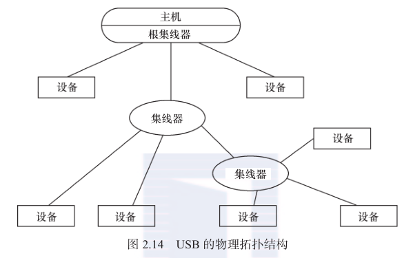
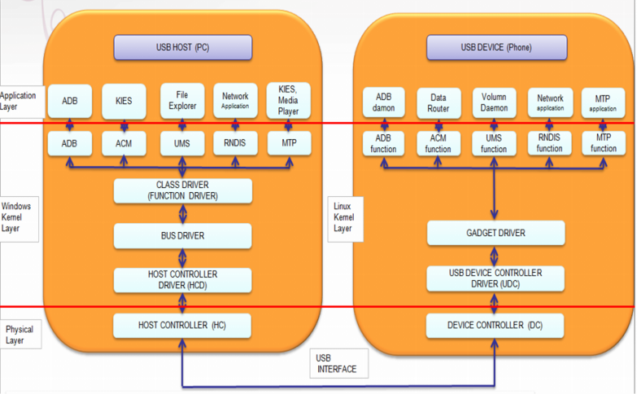
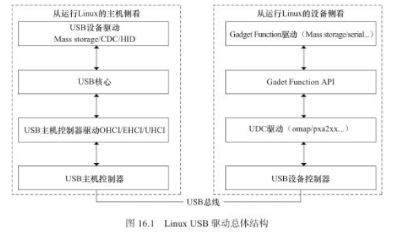
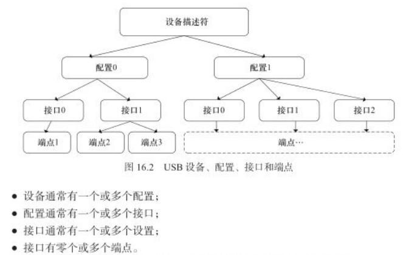
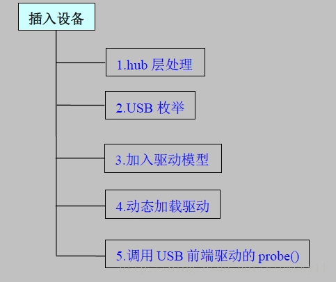
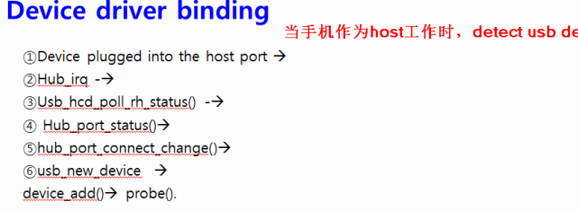
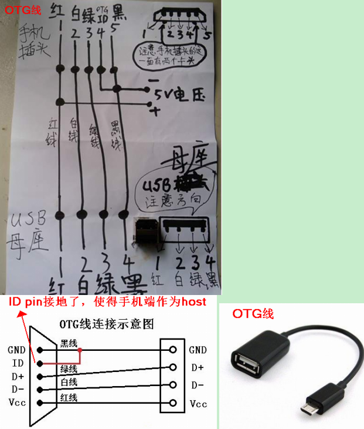

# USB #

	参考
	https://blog.csdn.net/myarrow/article/details/7012230/

	1) USB 1.1 包含全速和低速两种模式，低速方式的速率为 1.5Mbit/s, 全速模式为 12Mbit/s.

	2) 在 USB 2.0 中，增加了一种高速方式，数据传输率达到 480Mbit/s，半双工;
	USB 2.0总线采用 4 芯的屏蔽线，一对差分线（D+、D-）传送信号，另一对（电源VBUS、电源地）传送 +5V 的直流电。

	3) USB 3.0（也被认为是 Super Speed USB）的最大传输带宽高达 5.0Gbit/s（即 640MB/s），全双工;
	USB 3.0 线缆则设计了 8 条内部线路，除电源VBUS、电源地之外，其余 3 对均为数据传输线路。

# 物理结构 #

	usb系统一般由三个部分组成: 主机，一个或多个usb hub, 以及与hub连接的usb设备。

	集线器负责检测设备的连接和断开，利用其中断 IN 端点（Interrupt IN Endpoint）来向主机报告；
	一旦获悉有新设备连接上来，主机就会发送一系列请求给集线器，再由集线器建立起一条连接主机和新设备之间的通信通道；
	然后主机以控制传输的方式，通过端点 0 对新设备发送各种请求，新设备收到主机发来的请求后回复相应的信息，进行枚举（Enumerate）操作；
	先usb_new_device(),再通过device_add()将新设备添加到 usb 总线的设备列表里；
	然后 usb总线会遍历驱动列表里的每个驱动，调用自己的 match（usb_device_match）函数看它们和新设备是否匹配，
	如果有匹配的driver，则调用driver的probe()函数。

	因此 USB 总线具备热插拔的能力。

 

- 传输方式

		每一个 USB 设备会有一个或者多个端点。 一个端点可以选择如下一种传输方式， 以适应各种设备的需要。

		1) 控制（Control）传输
		双向传输，数据量通常较小，主要用来进行查询、配置和向 USB 设备发送通用命令。
		所有 USB 设备必须支持标准请求（Standard Request），控制传输方式和 端点 0

		2) 中断（Interrupt）传输
		单向的，对于 USB 主机而言，只有输入。
		主要用于定时查询设备是否有中断数据要传送。
		适于少量分散的、不可预测的数据传输场合。
		如 键盘、游戏杆和鼠标设备。

		3) 批量（Bulk）传输
		应用在没有带宽、间隔时间要求的 批量数据的 传送和接收中，它要求保证传输。
		如 打印机和扫描仪。

		USB 2.0 的 Bulk 模式只支持 1 个数据流；
		USB 3.0 则增加了一种 Bulk Streams传输模式，可以支持多个数据流，每个数据流被分配一个 Stream ID（SID），
		每个 SID 与一个主机缓冲区对应。

		4) 同步（Isochronous）传输
		同步传输提供了确定的带宽和间隔时间。
		用于时间要求严格 并具有较强容错性的 流数据传输，或者用于要求 恒定数据传送率 的即时应用。
		如进行语音业务传输。
		同步传输也常称为“Streaming Real-time”传输。

# 框架 #

 

  

# 从主机侧看，要实现的驱动包括2类 #

	1）USB设备驱动：用来控制USB设备如何与USB主机通信。

	文件： usb.h

	usb接口driver结构体： usb_driver
	注意：usb_driver只是起到挂接总线的作用，它的probe函数里会注册相应的字符、tty等设备，
		工作的主体是具体的设备驱动，如键盘是input,usb串口是tty。

	注册usb_driver到usb core：
		#define usb_register(driver) usb_register_driver(driver, THIS_MODULE, KBUILD_MODNAME)
	
		//struct usb_driver - identifies USB interface driver to usbcore
		struct usb_driver {
			const char *name;
		
			int (*probe) (struct usb_interface *intf,  //探测函数（插入时）
					  const struct usb_device_id *id);
		
			void (*disconnect) (struct usb_interface *intf);  //断开函数（拔出时）
		
			int (*unlocked_ioctl) (struct usb_interface *intf, unsigned int code,
					void *buf);
		
			int (*suspend) (struct usb_interface *intf, pm_message_t message);
			int (*resume) (struct usb_interface *intf);
			int (*reset_resume)(struct usb_interface *intf);
		
			int (*pre_reset)(struct usb_interface *intf);
			int (*post_reset)(struct usb_interface *intf);
		
			const struct usb_device_id *id_table;  //usb driver支持的USB设备列表（指向usb_device_id数组）
		
			struct usb_dynids dynids;
			struct usbdrv_wrap drvwrap;
			unsigned int no_dynamic_id:1;
			unsigned int supports_autosuspend:1;
			unsigned int disable_hub_initiated_lpm:1;
			unsigned int soft_unbind:1;
		};

	usb设备driver结构体:
	struct usb_device_driver - identifies USB device driver to usbcore

	实例：
	usb键盘驱动
	文件： usbkbd.c
	driver变量:  struct usb_driver usb_kbd_driver

	2) USB主机控制器驱动：用来控制插入的USB设备。

	通用的USB主机控制器结构体：usb_hcd
	控制器的规格有OHCI, UHCI, EHCI和XHCI，它们有对应的控制器的结构体

	文件： hcd.h
		struct usb_hcd {
			/*
			 * housekeeping
			 */
			struct usb_bus		self;		/* hcd is-a bus */
			struct kref		kref;		/* reference counter */
		
			const char		*product_desc;	/* product/vendor string */
			int			speed;		/* Speed for this roothub.
								 * May be different from
								 * hcd->driver->flags & HCD_MASK
								 */
			char			irq_descr[24];	/* driver + bus # */
		
			struct timer_list	rh_timer;	/* drives root-hub polling */
			struct urb		*status_urb;	/* the current status urb */
			#ifdef CONFIG_PM_RUNTIME
			struct work_struct	wakeup_work;	/* for remote wakeup */
			#endif
		
			/*
			 * hardware info/state
			 */
			const struct hc_driver	*driver;	/* hw-specific hooks */  =>  具体控制器的driver
		
			/*
			 * OTG and some Host controllers need software interaction with phys;
			 * other external phys should be software-transparent
			 */
			struct usb_phy		*usb_phy;
			struct phy		*phy;
			...
	
			/* The HC driver's private data is stored at the end of
			 * this structure.
			 */
			unsigned long hcd_priv[0]  //=> 具体的hcd控制的实例，保存在这里. 之后可以用hcd_to_ehci()等函数进行转换。
					__attribute__ ((aligned(sizeof(s64))));
		};

	控制流程： ?
	上层(应用)通过usb_submit_urb()提交一个请求后，struct usb_hcd.urb_enqueue() -> usb_hcd_submit_urb()
	-> usb_hcd的driver成员(struct hc_driver)的urb_enqueue()
	
	

- URB请求块

		URB结构体： struct urb (usb reqeust block)
		用于usb设备 与 usb host间进行数据传输 (可以是双向的)
		
		USB设备的每个端点都有一个urb队列。

		urb的生命周期:

		1)被usb设备驱动创建
		接口：usb_alloc_urb()
		
		2)分配到usb设备的指定端点
		中断类型URB, 通过：usb_fill_int_urb()
		BULK类型，通过：usb_fill_bulk_urb()
		控制类型URB, 通过：usb_fill_control_urb()
		
		3)由Usb设备驱动提交到usb core
		接口：usb_submit_urb()
		
		4)再由Usb core提交到usb 主机控制器
		5)最后由Usb主机控制器 控制设备进行数据传输

		6)当urb完成后，usb主机控制器驱动通知 usb设备驱动：
		通过回调函数（由usb_fill_xxx_urb()传入的）

# 从设备侧看，分为3个层次 #

	1）USB设备控制器(UDC)驱动： 直接访问硬件，控制USB设备与主机间的底层通信，向上提供与硬件相关操作的回调函数
	简单的说，是负责将一个USB设备依附于一个USB主机控制器上。

	如：当手机作为PC的U盘时，手机行使UDC的功能，运行UDC驱动, 此外，为了表现为U盘的特性，
	还要在UDC驱动的基础上运行另一个驱动，如file storage驱动（这被称为function驱动）

	文件目录： /driver/usb/gadget/udc/

	描述UDC的结构体：usb_gadget
	UDC操作的结构体：usb_gadget_ops

	描述端点的结构体：usb_ep
	端点操作的结构体：usb_ep_ops

	注册UDC:
	int usb_add_gadget_udc(struct device *parent, struct usb_gadget *gadget)

	2）gadget function API: 是UDC驱动程序的回调函数的简单封装

	3）gadget function驱动：具体USB设备的功能实现，使设备表现出“网络连接”，“打印机”，“USB mass storage”等特性。
	如：ethernet over usb, file-backed storage gadget, serial gadget, gadget MIDI, usb video class gadget.
	
	文件目录： /driver/usb/gadget/function/

	function结构体： usb_function - describes one function of a configuration
	端点的结构体： usb_endpoint_descriptor
	接口的接头体： usb_interface_descriptor

	注册gadget function:
	int usb_function_register(struct usb_function_driver *newf)

- usb_request

		描述一次传输请求的结构体： usb_request, 类似于主机侧的URB
		
		分配一个依附于某个端点的usb_request：
		struct usb_request * usb_ep_alloc_request(struct usb_ep *ep, gfp_t gfp_flags)
		
		提交一个usb_request:
		usb_ep_queue(struct usb_ep *ep, struct usb_request *req, gfp_t gfp_flags)

# 设备、配置、接口、端点 #
		
	它们都有对应的描述符.
	1）一个设备可以有不同的配置，每个配置是不同功能的组合；
	2）配置由多个接口组成，一个接口是多个端点的汇集；
	3）一个端点代表一个基本的功能

	如: USB扬声器可以包含一个音频接口以及 对旋钮和按钮的接口。
	一个配置中的所有接口可以同时有效，并可被不同的驱动程序连接

	端点有唯一的地址：设备地址和端点号。
	端点都有一定的属性，包括传输方式、总线访问频率、带宽、端点号和数据包的最大容量等。
	一个USB端点只能在一个方向上承载数倨, 是一个单向管道， 从主机到设备<称为输出端点) 或 从设备到主机。
	端点0 通常为控制端点，用于设备切始化参数等，只要设备连接到USB上并且上电,端点0就可以被访问；
	端点1、2等一般用作数据端点,存放主机与设备间往来的数据。

 

	1）USB设备描述符
	包含关于设备的通用信息，如供应商ID、产品ID和修订ID，支持的设备类、子类和适用的协议，以及默认端点最大包大小等

	USB设备: struct usb_device
	USB设备描述符: struct usb_device_descriptor

	struct usb_device_descriptor
	{
		_u8 bLength;  //此描述符的字节数
		_u8  bDescriptorType; //描述符的种类为设备
		_u16 bcdUSB;  //此设备与描述符兼容的usb设备说明版本号(BCD码)
		_u8   bDeviceClass; //设备类码
		
		_u8   bDeviceSubClass; //设备子类码
		_u8   bDeviceProtocol; //协议码
		
		_u8   bMaxPacketSize0; //端点0的最大包大小
		_u16 idVendor; //厂商标志
		_u16  idProduct; //产品标志
		_u16 bcdDevice; //设备发行号
		_u8   iManufacturer; //描述厂商的字串索引
		_u8   iProduct; //描述产品信息的字串索引
		
		_u8  iSerialNumber; //描述设备序列号信息的字串索引
		
		_u8  bNumConfigurations; //此设备支持的配置数
	
	}_attribute_ ((packed));
	
	设备类码的典型值如下:

	#define USB_CLASS_PER_INTERFACE 0
	#define USB_CLAS_AUDIO 1		 //声音设备
	#define USB_CLASS_COMM 2		   // 调制解调器，网卡，ISDN连接
	#define USB_CLASS_HID  3		//HID设备，如鼠标，键盘
	#define USB_CLASS_PHYSICAL 5	 //物理设备
	#define USB_CLASS_STILL_IMAGE 6 //静止图像捕捉设备
	#define USB_CLASS_PRINTER 7		//打印机
	#define USB_CLASS_MASS_STORAGE	 //8 批量存储设备
	#define USB_CLASS_HUB 9		   //USB HUBS
	#define USB_CLASS_CSCID 0x0B	  //智能卡
	#define USB_CLASS_VIDEO 0X0E	 //视频设备，如网络摄像头
	#define USB_CLASS_VENDOR_SPEC 0xFF //厂商自定义的设备

	2）USB配置描述符
	包括配置中的接口数，支持的挂起和恢复能力，以及功率要求。

	usb配置：struct usb_host_config
	USB配置描述符: struct usb_config_descriptor

	 struct usb_config_descriptor{
		 _u8 bLength ;  //此描述符的字节数
		
		_u8 bDescriptorType; //配置描述符类型
		_u16 wTotalLength;   //此配置信息的总长(包括配置，接口，端点和设备类型及厂商定义的描述符)
		_u8 bNumInterfaces;  //此配置所支持的接口数
		
		_u8 bConfigurationValue;  //在setConfiguration()请求中用作参数来选定此配置
		_u8 iConfiguration; //描述此配置的字串描述符索引
		_u8 bmAttributes; //电源配置特性
		_u8 bMaxpower; //此配置下的总线电源耗电量
	}_attribute_ ((packed));

	3）USB接口描述符

	usb接口： sturct usb_interface
	USB接口描述符: struct usb_interface_descriptor

	struct usb_interface_descriptor{
		_u8 bLength; //此描述符的字节数
		
		_u8 bDescriptorType; //接口描述符类
		_u8 bInterfacNumber; //接口编号：当前配置所支持的接口数组索引,从0开始
		
		_u8 bNumEndpoints; //此接口用的端点数量，如果是0,说明此接口只有缺省控制通道
		
		_u8 bAlernateSetting; //可选设备的索引值
		_u8 bInterfaceClass; //类值,0值作为将来保留使用如果是0FFH,此接口由厂商说明
		_u8 bInterfaceSubClass; //子类码
		_u8 bInterfaceProtocol; //协议码
		_u8 iInterface;  //描述此接口的字串描述符索引
	}_attribute_ ((packed));

	4）USB端点描述符
	包括：端点地址，方向和类型，支持的数据大小。如果是中断端点，还包括轮休频率。

	usb端点： struct usb_host_endpoint
	USB端点描述符: struct usb_endpoint_descriptor

	struct usb_endpoint_descriptor{
		_u8 bLength; //此描述符的字节数
		
		_u8 bDescriptorType; //端点描述符类
		
		_u8 bEndpointAddress; //此描述符所描述的端点的地址: bit[0~3]是端点号，bit[7]是方向（0:输出，1：输入）
		
		_u8 bmAtrributes;  //所指定的端点的特性，bit[0~1]=0:控制传送, 1:同步传送, 2：批量传送, 3：中断传送

		_u8 wMaxPacketSize;  //当前配置下端点能够发送与接收的最大数据包大小
		
		_u8 bInterval;  //轮询数据传送端点的时间间隙
		
		_u8 bRefresh；
		_u8 bSynchAddress；
	}_attribute_ ((packed));

	5) 字符串描述符
	在其他描述符中会为某些字段提供字符串索引, 它们可被用来检索描述性字符串.
	字符串描述符 是可选的, 有的没有。

	字符串描述符: struct string_descriptor
		

# USB枚举过程 #

	参考

	https://blog.csdn.net/skyflying2012/article/details/41915475  USB枚举过程分析 (图文概述)

	https://blog.csdn.net/u011279649/article/details/41654527  USB枚举过程图示分析 （usb tracker)
	https://blog.csdn.net/viewsky11/article/details/54092672  linux usb枚举过程分析(代码层面）

	1) 主机给设备挂载驱动（复合设备除外）

	主机通过解析描述符后对设备有了足够的了解，会选择一个最合适的驱动给设备。  
	然后tell the world（announce_device）说明设备已经找到了，最后调用设备模型提供的接口device_add将设备添加到 usb 总线的设备列表里，
	然后 usb总线会遍历驱动列表里的每个驱动，调用自己的 match（usb_device_match） 函数看它们和你的设备或接口是否匹配，
	匹配的话调用device_bind_driver函数，现在就将控制权交到设备驱动了。   
  
  
	
# USB OTG #
	
	http://www.usb.org/developers/onthego/

	OTG允许设备既可以作为主机host(被称为A设备), 也可以作为外设peripheral(被称为B设备）
	两用型AB插座使用了5个PIN（新增ID pin), ID pin接地是A设备，悬空的是B设备。

	我们将PC的USB线(Micro-B cable)插入到手机上，此时手机侧启动的是peripheral mode。
	要想手机作为host, 需特别的USB connector，即OTG线, OTG线上插在手机端那个接口是micro/min A 型（ID pin接地）
 

	android OTG方式连接USB外设时：

	UsbHostManager:/android/frameworks/base/services/java/com/android/server/usb/
	com_android_server_UsbHostManager.cpp : /android/frameworks/base/services/jni/

	插入usb设备，usbHostManager收到来自kernel的uvent:
	1) 通过UsbNotificationHandler将该事件往UsbSettingManager发送，进而显示“device attached”
	2) 通过NetLinkManager将事件发送到volume, 之后再像MountSerice.java发生广播？

# Android USB Service #

- HAL

		usbhost.c

- JNI
	
		android_hardware_UsbDeviceConnection.cpp //usb device链接和请求
		com_android_server_UsbHostManager.cpp
		com_android_server_UsbDeviceManager.cpp
	
- framework
		
		IUsbManager 提供给APP的接口定义
		usbHostManager.java和usbDeviceManager.java分别处理host和device事件
	
- app

		usbsettings.java

# 调试 #

	1) USB 信息的目录

		$ ls -l /d/usb/
		total 0
		-r--r--r-- 1 root root 0 1970-01-01 08:00 devices
		drwxr-xr-x 2 root root 0 1970-01-01 08:00 ehci
		drwxr-xr-x 2 root root 0 1970-01-01 08:00 usbmon

	2) 图像化工具USBView

	3）查看USB设备信息： cat /sys/kernel/debug/usb/devices
	
	4）插入一个USB设备后，运行 lsusb 命令后得到这个USB设备的描述符信息

	5) sysfs中看所有的usb device和driver信息

		信息的显示，好像取决于当前视角（是作为host还是slave)

		$ ls -l /sys/bus/usb
		total 0
		drwxr-xr-x  2 root root	0 2017-03-09 05:51 devices
		drwxr-xr-x 36 root root	0 2017-03-09 06:02 drivers
		-rw-r--r--  1 root root 4096 2017-03-09 06:02 drivers_autoprobe
		--w-------  1 root root 4096 2017-03-09 06:02 drivers_probe
		--w-------  1 root root 4096 2017-03-09 06:02 uevent