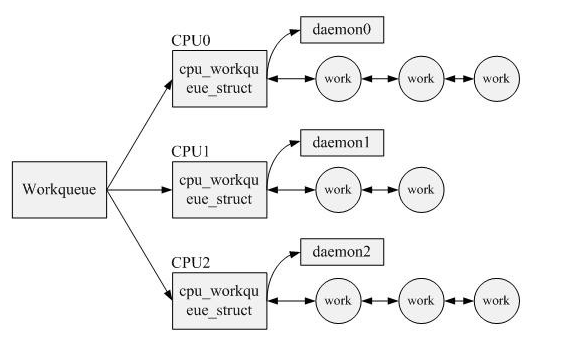
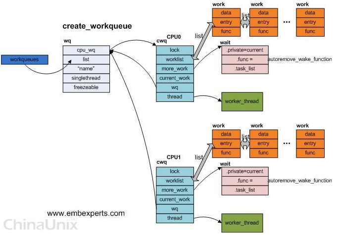
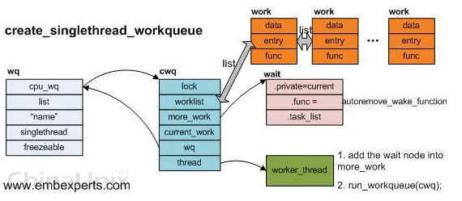

# 中断和软中断 #

- 中断上下文的注意事项

		1）中断中(包括软中断中)不能使用引起睡眠的函数. 以下不能使用：
			调用 wait_event
			使用除 GFP_ATOMIC 之外的标记来分配内存
			使用信号量和互斥锁(应该使用自旋锁 spin lock及其变体)
			不可以调用schedule()函数及其封装函数，如msleep(msecs)
		
		2) 中断中可以调用wake_up_process(task)及其封装函数，如 schedule_work(work）和 tasklet_schedule()
			
		3）不能在中断处理的上半部调用disable_irq(), 因为这样可能导致死锁。只能调用disable_irq_nosync().
			这种情况在驱动程序的中断handler中要特别注意。
			
		4）中断ISR在最小量的时间内执行完成, 不管是一个快速或慢速处理者。
			如果需要进行长时间的处理, 最好的方法是使用一个 tasklet 或者 workqueue 来将工作安排在一个更安全的时间点执行。
			
		5）共享中断
			(1)调用irq_request时，要将dev_id传入，以使得自己的设备action能被free.
			(2)因为同一根中断线上的所有action->handler(也就是ISR)都会被调用（见handle_irq_event_percpu函数），
			所以要在自己的ISR中读取寄存器的状态判断是否真的是自己的设备发生了中断， 如果不是则要返回IRQ_NONE, 
			否则返回其他值，如IRQ_HANDLED.

- 中断和软中断被调用的流程

		 /* Interrupt dispatcher */   //entry-armv.S定义了中断向量表
		 vector_stub irq, IRQ_MODE, 4
		 .long __irq_usr   @  0  (USR_26 / USR_32)   //irq_usr
		 .long __irq_invalid   @  1  (FIQ_26 / FIQ_32)
		 .long __irq_invalid   @  2  (IRQ_26 / IRQ_32)
		 .long __irq_svc   @  3  (SVC_26 / SVC_32)  //irq_svc
		->__irq_usr:
				irq_handler    //中断处理入口
				b ret_to_user_from_irq
			ENDPROC(__irq_usr)
			->.macro irq_handler
				  arch_irq_handler_default  //这是默认的irq hanlder, 一般在liunx中会定义MULTI_IRQ_HANDLER配置项，
											它意味着允许平台的代码可以动态设置irq处理程序：平台代码可以修改全局变量 handle_arch_irq，从而可以修改irq的处理程序。
				 .endm
				  -> .macro arch_irq_handler_default
					  bne asm_do_IRQ   //asm_do_IRQ(unsigned int irq, struct pt_regs *regs) 
					  .endm
					->handle_IRQ(irq) //处于中断上下文
						-> irq_enter()
						-> generic_handle_irq(irq)  //处理硬中断irq
							 ->desc->handle_irq(irq, desc)   //==handle_level_irq()或handle_edge_irq()
										  <- __irq_set_handler_locked()?
							  ==handle_level_irq()
								 ->handle_irq_event()
									 ->handle_irq_event_percpu()
										  {
												do {
													res = action->handler(irq, action->dev_id);  //irq中断处理函数
													switch (res) {
														case IRQ_WAKE_THREAD:
																irq_wake_thread(desc, action);  //唤醒irq thread（置为TASK_WAKING状态）
													}
													irqaction* action = action->next;  //一个共享中断有多个irqaction(如多个设备共享一个中断号)               
												 } while (action);
										   }
						
						->irq_exit()  //由此可以看出，软中断是中断下半部分的一种处理机制。
							 ->invoke_softirq()
								  ->__do_softirq()
									{
										softirq_action *h =softirq_vec;
										//开始遍历HRTIMER_SOFTIRQ、TIMER_SOFTIRQ、TASKLET_SOFTIRQ等类型的软中断
										do { 
										  h->action(h) //==tasklet_action(),如果当前遍历的是TASKLET_SOFTIRQ类型的软中断的话; 当然也有可能是run_timer_softirq()
												->(tasklet_struct*)t->func(t->data) //遍历tasklet_vec tasklet由DECLARE_TASKLET定义的；
																					此时tasklet运行于中断上下文, 因此tasklet中不能睡眠。
											h++;
											pending >>= 1;
										  } while (pending);
										  
										  pending = local_softirq_pending(); 
										  if (pending)  
											 wakeup_softirqd();  
										 
									}
		
		irq_set_irq_type() ?
		-> __irq_set_trigger()
			 -> ret = chip->irq_set_type(&desc->irq_data, flags);

- irq thread

		1) irq thread是TASK_INTERRUPTIBLE的
		2) 入口函数是：irq_thread()

- CPU中断的开和关

		#define local_irq_save(flags)
		->raw_local_irq_save(flags);
			->flags = arch_local_irq_save();
				static inline unsigned long arch_local_irq_save(void)//CPU interrupt mask handling.
				{
					unsigned long flags;
					asm volatile(
					"mrs %0, cpsr @ arch_local_irq_save\n"  //将CPSR状态寄存器读取，保存到flags中
					"cpsid  i"  //关中断
					: "=r" (flags) : : "memory", "cc");
					return flags;
				}
		
		另外，
		#define local_irq_restore(flags)
		   ->raw_local_irq_restore
				->arch_local_irq_restore
					->arch_local_irq_restore
						static inline void arch_local_irq_restore(unsigned long flags) // restore saved IRQ & FIQ state
						{
							asm volatile(
							"msr cpsr_c, %0 @ local_irq_restore"  //将flags写会到CPSR
							:
							: "r" (flags)
							: "memory", "cc");
						}
						
						
# Tasklet #

	tasklet 在 kernel/softirq.c 中实现
	
	tasklet_schedule() //一般是在中断处理函数中调用，也就是说在中断上下文中raise这类型的softirq,等待在下半段irq_exit()中来执行。
	->raise_softirq_irqoff(TASKLET_SOFTIRQ) //在禁止中断的情况下触发tasklet类型的软中断.
											它是由open_softirq(TASKLET_SOFTIRQ,tasklet_action) 来注册的。
		 -> wakeup_softirqd()
			-> wake_up_process(ksoftirqd)  // 唤醒ksoftirqd内核线程处理软中断（即中断的下半部分处理），每个CPU有这样一个内核线程
	
	run_ksoftirqd() //ksoftirqd 内核线程的入口函数
		->__do_softirq()
	
	
	从tasklet_action()可以看出，tasklet有以下几个特征：
	1)一个tasklet只能同时在一个cpu上执行，但不同的tasklet可以同时在不同的cpu上执行；所以tasklet不必是可重入的
	2)一旦tasklet_schedule被调用，内核会保证tasklet一定会在某个cpu上执行一次；
	3)如果tasklet_schedule被调用时，tasklet不是处于正在执行状态，则它只会执行一次；
	4)如果tasklet_schedule被调用时，tasklet已经正在执行，则它会在稍后被调度再次被执行；
	5)两个tasklet之间如果有资源冲突，应该要用自旋锁进行同步保护；

# 工作队列 workqueue #

	参考
	https://blog.csdn.net/geng823/article/details/37728643
	https://www.cnblogs.com/zxc2man/p/6604290.html

	文件： <linux/workqueue.h>

	工作（work），描述它的数据结构为work_struct
	工作队列（workqueue），其数据结构为workqueue_struct
	如果是多线程，Linux根据当前系统CPU的个数创建cpu_workqueue_struct

 

	struct workqueue_struct *create_workqueue(const char *name)
	=> 对于多CPU系统而言，对每一个CPU，都会为之创建一个per-CPU的cwq结构，对应每一个cwq，都会生成一个新的worker_thread内核进程；
	该内核进程被创建之后，会先定义一个图中的wait节点，然后在一循环体中检查cwq中的 worklist，如果该队列为空，
	那么就会把wait节点加入到cwq中的more_work中，然后休眠在该等待队列中。

	但是当driver用queue_work()向cwq上提交work节点时，是哪个CPU调用该函数，那么便向该CPU对应的cwq上的worklist上增加work节点，
	同时会调用wake_up来唤醒休眠在cwq->more_work上的 worker_thread进程，即：
	wake_up先调用wait节点上的autoremove_wake_function函数，然后将wait节点从 cwq->more_work中移走;
	之后worker_thread再次被调度，开始处理cwq->worklist中的所有work节点，当所有work节点处理完毕后，
	worker_thread重新将wait节点加入到cwq->more_work，然后再次休眠在该等待队列中直到Driver调用queue_work。

 

	struct workqueue_struct *create_singlethread_workqueue(const char *name)
	=> 即使是对于多CPU系统，内核也只负责创建一个worker_thread内核进程。

 

	声明和初始化工作队列入口的宏:
	DECLARE_WORK(name, void (*function)(void *), void *data);
	INIT_WORK(struct work_struct *work, void (*function)(void *), void *data);
	PREPARE_WORK(struct work_struct *work, void (*function)(void *), void *data);

	调度work thread处理work：
	1）schedule_work(&work)  //将work添加到工作队列wq中
	2) schedule_delayed_work(&work,delay)  //延迟delay后，被定时器唤醒，将work添加到工作队列wq中

	