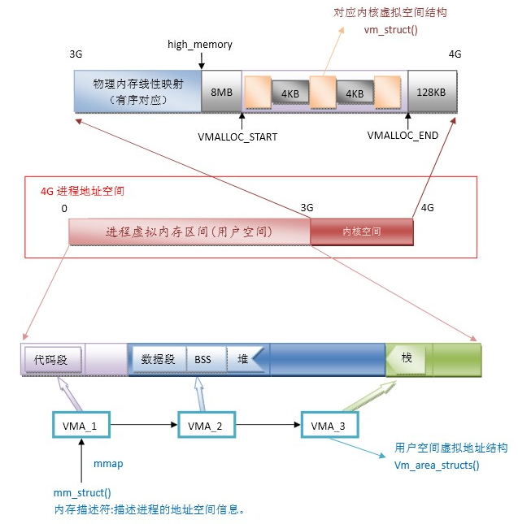
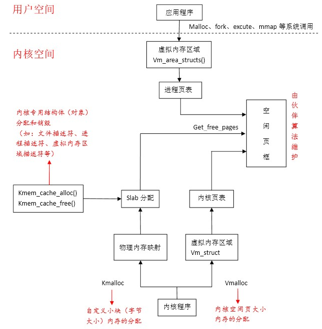
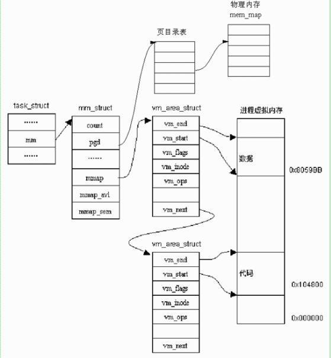
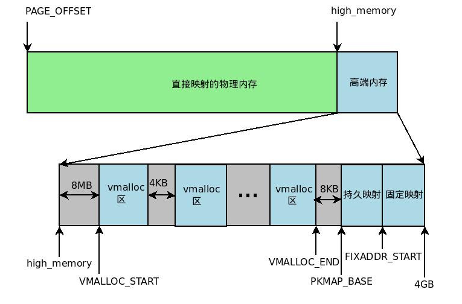
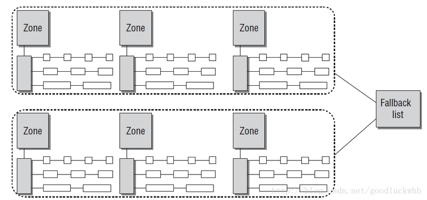
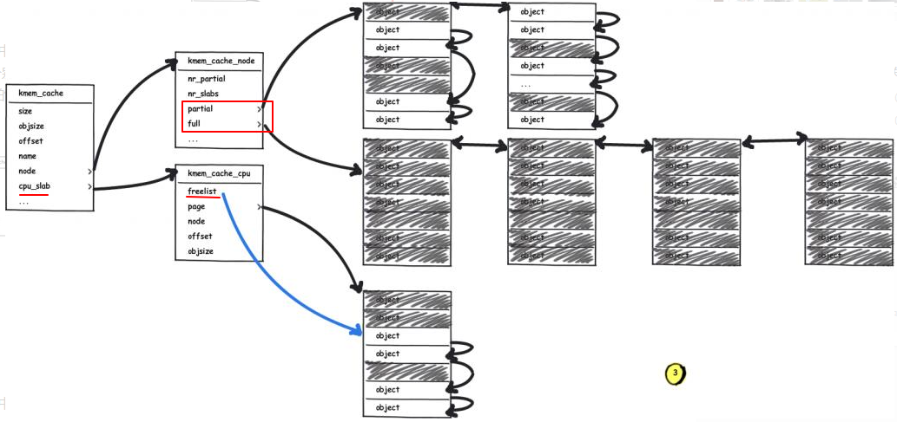

# 虚拟内存 #

	参考： https://www.cnblogs.com/wuchanming/p/4465188.html

	1) 4G进程地址空间被分为两个部分： 用户空间与内核空间
	用户空间从0~3G（0xc0000000，PAGE_OFFSET）,内核空间占据3G~4G。
	用户进程通常情况下只能访问用户空间的虚拟地址，不能访问内核空间的虚拟地址。
	例外情况只有用户进程进行系统调用（代表用户进程在内核态执行）等时刻可以访问到内核空间。

	2) 用户空间对应进程，所以每当进程切换，用户空间就会跟着变化；
	而内核空间是由内核负责映射，它并不会跟着进程变化，是固定的，即每个进程虚拟空间的3G~4G部分是相同的。

	内核空间地址有自己对应的页表(swapper_pg_dir变量/init_mm.pgd)，用户进程各自有不同的页表(struct_task.mm.pgd)。
	进程切换的时候，内核会把进程的页表地址填入MMU实现进程切换，从而实现各个进程地址空间的隔离.

	3) 每个进程的用户空间都是完全独立、互不相干的。

	4）MMU如何实现内存权限保护？
	比如定义一个const 常量，那么C编译器就会把这个const常量链接到rodata（只读数据段），
	载入内存建立页表时被标记为readonly，MMU提供运行时检查，如果有人试图去写它，
	那么就会被MMU拦截发出segmentfault，实现了内存保护的机制.

	TLB保存最频繁使用的页表数据，属于MMU的高速缓存.

- 4G地址空间

	  

- 虚拟地址空间分配及其与物理内存对应图

	  
	

# 用户空间的内存分配与释放 #

- 用户虚拟地址 vm_area_struct

		在内核中,这样每个区域用一个结构struct vm_area_struct 来表示.
		它描述的是一段连续的、具有相同访问属性的虚存空间，该虚存空间的大小为物理内存页面的整数倍。

		1）查看一个进程的内存使用情况：
		cat /proc/pid/maps 、 /proc/pid/smaps
		其中显示的每一行对应进程的一个vm_area_struct结构
	
		2）如果vm_area_struct描述的是一个文件映射的虚存空间，成员vm_file便指向被映射的文件的file结构，
		vm_pgoff是该vm_area_struct虚存空间在vm_file文件里面的文件偏移，单位为物理页面。
  

- page fault的可能性

		a: 动态内存分配，写时拷贝，属于次要的page fault，因为不需要去硬盘load数据，开销小
		b: 进程访问不可读写的非法地址，会被MMU拦截，内核发出segment fault信号，导致oops
		c: 进程访问VMA区域，但是权限不对，比如代码段权限是R+X，但是你尝试去写，也会和上面一样的结局
		d: 进程访问VMA区域，权限检查通过，但是需要从硬盘load数据到内存，这种属于大开销，所谓主要的page fault，
			比如代码段首次被载入内存的时候，这也就是为什么第一次启动进程比第二次慢的原因.(内存大手机跑得更流程原因之一)

- malloc/free

		malloc 是libc的库函数，不是系统调用，libc库对申请的内存做二次管理，其最终是通过brk和mmap向内核要内存.
		free后不一定还给内核，具体什么时候还，由libc算法决定，这是为了性能的考量，因为对物理内存频繁的申请释放对性能有影响.
	
		malloc内存的时候并没有真正拿到物理内存，只是将分配的连续VMA映射到一片清零的物理地址并标注为readonly，
		只有当有进程去写这块VMA的时候，MMU执行地址转换检查权限发现是只读，会被MMU拦截而触发page fault；
		但是内核检查到当前的地址权限是R+W，而且是malloc导致的page fault，然后分配物理内存页，改写权限，此刻才真正拿到物理内存，而且是边写边拿.
		这就是所谓内核为应用程序分配内存的lazzy性，这样做的目的是内核无法控制应用程序的行为，要尽量防止申请了不用的浪费情况.
	
		内核不信任应用程序 只相信内核本身. lazzy只针对应用程序，不针对内核，内核调用kmalloc或者vmalloc是立即拿到内存.

# 内核空间的内存分配与释放 #

	参考： https://blog.csdn.net/gatieme/article/details/52384791
	
- 高端物理内存

		对于32位系统，内核虚拟地址空间只有1GB大小（从3GB到4GB），当物理内存超出1GB时，高端物理内存(>1G的部分)就不能映射到内核空间。
		为此，内核采取了下面的方法使得内核可以使用所有的物理内存。
		以1个GB的物理内存为例：
	
		1) 高端物理内存不能全部映射到内核空间，也就是说高端物理内存没有对应的线性地址。
		内核为每个物理页框都分配了对应的页框描述符struct page，所有的页框描述符都保存在mem_map数组中，因此每个页框描述符的线性地址都是固定的。
		内核使用alloc_pages()和alloc_page()来分配高端内存，因为这些函数返回页框描述符的线性地址。
	
		2) 内核虚拟地址空间的最后128MB专门用于映射高端物理内存，而直接能够映射的物理内存大小只有896MB，该值保存在high_memory中。
		显然高端内存的内核映射是暂时映射的，否则也只能映射128MB的高端内存。
		当内核需要访问高端内存时就临时在这个区域进行地址映射，使用完之后再用来进行其他高端内存的映射。
	
		内核地址空间的映射如下图所示：
	  

		映射高端物理内存的方式：内核将高端虚拟内存划分为3部分来映射高端物理内存

		1）vmalloc区： VMALLOC_START ~ VMALLOC_END
		通过vmalloc()

		2）持久内核映射区(permanent kernel mapping)： KMAP_BASE ~ FIXADDR_START
		通过 kmap()来映射一个page到KMAP区, kunmap()来释放这个映射

		3）临时映射区(temporary kernel mapping)： FIXADDR_START ~ 4G，用于特殊需求
		通过 kmap_atomic() 可实现临时映射，一次临时映射会导致以前的映射被覆盖

		常见问题：
		1）用户进程没有高端内存概念。只有物理内存超过内核地址空间范围，才会存在高端内存。
		对于32位系统，内核虚拟地址空间只有1G，所以会有高端内存（如果物理地址范围超过1G)。
		32位系统的用户进程最多只可以访问3G物理内存（因为虚存范围是0~3G)，而内核进程可以访问所有物理内存。
		
		2）64位Linux内核不存在高端内存。
		因为64位采用48位的物理寻址，就可以寻找256TB的地址空间，这对于目前的应用来说已经足够了，但是虚拟地址仍然采用64位。

		用户和内核空间的划分，以48位寻址为例：
		●用户虚拟空间：0x0000_0000_0000_0000到0x0000_FFFF_FFFF_FFFF  //共256TB
		●内核虚拟空间：0xFFFF_0000_0000_0000到0xFFFF_FFFF_FFFF_FFFF  //共256TB
		
		而内核虚拟空间又可以分为多个区域，以39位寻址为例(内核和用户空间各512GB=2^39)：
		Virtual kernel memory layout:
			modules : 0xffffff8000000000 - 0xffffff8008000000   (   128 MB)
			vmalloc : 0xffffff8008000000 - 0xffffffbdbfff0000   (   246 GB)
			  .init : 0xffffff8009c44000 - 0xffffff800a3e4000   (  7808 KB)
			  .text : 0xffffff8008114000 - 0xffffff8009274000   ( 17792 KB)
			.rodata : 0xffffff8009274000 - 0xffffff8009c44000   ( 10048 KB)
			  .data : 0xffffff800a3e4000 - 0xffffff800a740c00   (  3443 KB)  
			vmemmap : 0xffffffbdc0000000 - 0xffffffbfc0000000   (	 8 GB maximum) //CONFIG_SPARSEMEM_VMEMMAP
					  0xffffffbdc0000000 - 0xffffffbdc3f93000   (	63 MB actual)
			fixed   : 0xffffffbffe7fd000 - 0xffffffbffec00000   (  4108 KB)
			PCI I/O : 0xffffffbffee00000 - 0xffffffbfffe00000   (	16 MB)
			memory  : 0xffffffc000000000 - 0xffffffc0fe4c0000   (  4068 MB)  //DDR
		
		关于用户和内核虚拟空间如何划分，可以查看以下kernel的config:
		CONFIG_ARM64_PGTABLE_LEVELS=3  //页表级数
		CONFIG_ARM64_4K_PAGES=y  //页大小
		CONFIG_ARM64_VA_BITS=39  //寻址位数

- 内核虚拟地址 vm_struct

		struct vmap_area 和struct vm_struct 代表内核虚拟地址块，用于内核虚拟地址的管理.
		如mmap时，所有的内核虚拟地址区域被链到vmap_area_root 红黑树 和 vmap_area_list(for kexec only) 上，
		见函数：
		get_vm_area()->__get_vm_area_node()->alloc_vmap_area()
		vmap_area()

		vm_struct表示的地址范围是对应高端物理内存对应的内核虚拟地址空间，即(3G + 896M + 8M) ~ 4G。
		为什么不是整个内核的3G~4G呢？因为，3G ~ (3G + 896M)范围已经是直接映射连续的0~896M的物理页面，物理与虚拟的差值是PAGE_OFFSET。

- 内存分配标记 GFP_

		所有内存分配标记定义在 <linux/gfp.h>

		1) GFP_KERNEL
		
			使用GFP_KERNEL标记申请内存时，如果暂时不能满足，那么进程会睡眠等待.
			因此不能在中断上下文或持有自旋锁的环境下使用GFP_KERNEL申请内存
			（此时应该使用GFP_ATOMIC标准来申请（如果失败则不等待，立即返回））
		
			GFP_USER： 用于为用户空间分配内存, 可能会引起休眠

		2) GFP_ATOMIC

			使用该标记，分配根本不会睡眠，kmalloc 甚至能够使用最后一个空闲页.
			如果这最后一个空闲页不存在, 则返回分配失败.
		
			在中断上下文中分配内存时，只能使用这个标记。

		3）GFP_NOFS 和 GFP_NOIO： 禁止文件系统操作和所有的 I/O 操作

		4) GFP_DMA: 请求分配发生在可进行DMA的内存区中（DMA要求分配的虚拟地址和物理地址连续）
		
		5) __GFP_HIGHMEM: 表明分配的内存位于高端内存。

		6) __GFP_COLD: 表示从冷高速缓存分配，即per cpu pages的cold page。

		GFP的用法：

		　|– 进程上下文，可以睡眠　　　　　GFP_KERNEL
		　|– 进程上下文，不可以睡眠　　　　GFP_ATOMIC
		　|　　|– 中断处理程序　　　　　　　GFP_ATOMIC
		　|　　|– 软中断　　　　　　　　　　GFP_ATOMIC
		　|　　|– Tasklet　　　　　　　　　GFP_ATOMIC
		　|– 用于DMA的内存，可以睡眠　　　GFP_DMA | GFP_KERNEL
		　|– 用于DMA的内存，不可以睡眠　　GFP_DMA |GFP_ATOMIC
			
- kmalloc(size_t size, int flags)： 分配物理地址上是连续的内核虚拟地址空间, 即线性映射关系
		
		kmalloc 适用于频繁申请释放、且小块的内存，效率高，但是注意kmalloc有可能休眠（使用GFP_KERNEL标记），特别是内存紧张的时候.
		flags是GFP分配标记。

		kmalloc分配的内存大小有限制（128KB），它是从slub中获取内存.

		kmalloc是立即获得虚拟内存和物理内存，不存在延迟分配。

		kmalloc/kfree与slub系统对应，所以执行kfree后默认是放到slub的partial链表中，不一定还给buddy，
		具体什么时候还给buddy, 由slub算法决定，这样做的目的是为了应对频繁申请释放内存的场景对性能的影响.

		kzalloc()是强制清零的 kmalloc 操作
	
- vmalloc(unsigned long size)： 分配物理上不一定连续的内核虚拟地址空间， 即非线性映射关系

		vmalloc 使用红黑树数据结构管理，用于申请大块的、对物理内存没有连续性要求的场景，有可能产生阻塞.
		
		kmalloc分配的内存没有大小限制，它通过alloc_page()从buddy拿内存，且优先从highmem区域(高端物理内存)分配.

		kmalloc是立即获得虚拟内存和物理内存，不存在延迟分配。

		vmalloc使用了GFP_KERNEL标记，因为可能引起睡眠，所以它不能在中断上下文中使用。

# Buddy伙伴系统 #

	参考
	https://blog.csdn.net/goodluckwhh/article/details/9989695
	
	
- 伙伴算法
 
		一种物理内存分配和回收的方法，物理内存所有空闲页都记录在BUDDY链表中。
		首先，系统建立一个链表，链表中的每个元素代表一类相同大小的物理内存页块，分别为2的0次方、1次方、2次方个页大小，对应4K、8K、16K的内存，
		每一类相同大小的内存又有一个链表，表示目前可以分配的物理内存。
		当需要分配8K的物理内存，系统首先从8K那个链表中查询有无可分配的内存，若有直接分配；
		否则查找16K大小的链表，若有，首先将16K一分为二，将其中一个分配给进程，另一个插入8K的链表中，若无，继续查找32K，以此类推。
		当内存释放时，查看相邻内存有无空闲，若存在两个相连的8K的空闲内存，直接合并成一个16K的内存，插入16K链表中。

		目的是： 将内存的可移动性分组，解决内存碎片化。
		如果某种迁移类型的free list中没有空间，那么会从备用列表fallbacks[][]中按顺序获取指定迁移类型中的free page.

		enum {
			MIGRATE_UNMOVABLE,   //不能移动到其他位置的free内存，如内核代码
			MIGRATE_RECLAIMABLE, //不能直接移动但可以回收的free内存，它的内容可以从某个源重新载入，如映射自文件的数据区.
									在内存紧张的情况下，可以由kswap进程根据页的访问频繁程度，周期性地回收。
			MIGRATE_MOVABLE,	 //可以随意移动的free页。如用户进程的页。数据移动到其它位置后，可以通过修改页表后来使得用户程序毫无察觉。
		
			MIGRATE_PCPTYPES,	/* the number of types on the pcp lists */
			MIGRATE_RESERVE = MIGRATE_PCPTYPES,
		
		#ifdef CONFIG_MEMORY_ISOLATION
			MIGRATE_ISOLATE,	/* can't allocate from here */
		#endif
			MIGRATE_TYPES
		};

		static int fallbacks[MIGRATE_TYPES][4] = {
			[MIGRATE_UNMOVABLE]   = { MIGRATE_RECLAIMABLE, MIGRATE_MOVABLE,	 MIGRATE_RESERVE },
			[MIGRATE_RECLAIMABLE] = { MIGRATE_UNMOVABLE,   MIGRATE_MOVABLE,	 MIGRATE_RESERVE },
			[MIGRATE_MOVABLE]	 = { MIGRATE_RECLAIMABLE, MIGRATE_UNMOVABLE,   MIGRATE_RESERVE },
		...

- 数据组织

		1）每个内存节点node划分成多个区（zone）：
			ZONE_DMA：低于16MB的内存页
			ZONE_NORMAL：高于16MB而低于896MB的内存页
			ZONE_HIGHMEM：高于896MB的内存页（具体值可以查看变量high_memory）

		2）每个zone使用free_area[]数组管理该zone中的页面: 每个数组项free_area[i]管理一个具有相同的2^i个page大小的空闲内存页链表
	
		struct free_area  free_area[MAX_ORDER];  //2^i个page大小的空闲内存页块链表（它会再按迁移属性分组）
		
		struct free_area {  
			   structlist_head  free_list[MIGRATE_TYPES];  //每种MIGRATE_TYPES(迁移属性）的free list
			   unsignedlong	 nr_free;  //free list中的free page总数
		};

		基于伙伴系统的内存管理方式专注于内存节点的某个内存域的管理，但是系统中的所有zone都会通过备用列表连接起来。
		伙伴系统和内存域/节点的关系如下图所示：
	  
	
		contig_page_data = (  //物理内存的全局变量
			node_zones = ( //zones数组
			  ( //当前为: ZONE_NORMAL
				watermark = ( //watermark用于监测该zone的内存压力情况，见enum zone_watermarks of mmzone.h
				  799,	  //WMARK_MIN, 当空闲页面数目低于WMARK_MIN时，buddy allocator将代替kswapd线程来同步释放pages，也就是直接回收
				  998,	  //WMARK_LOW, 当空闲页面数目低于WMARK_LOW时，kswapd被buddy allocator唤醒来释放pages
				  1198),	//WMARK_HIGH, 当kswapd被唤醒来释放pages时，如果回收的pages数已经达到WMARK_HIGH标记的页面数，kswapd将停止回收，进入休眠

				percpu_drift_mark = 0,
				lowmem_reserve = (0, 2435, 2435), //对低位zone内存的保护力度
				dirty_balance_reserve = 3633,
				pageset = 0xC0E0D330,  //per cpu缓存, 是个链表，其中存放每个cpu即将归还给伙伴系统的free page* 指针
				compact_blockskip_flush = FALSE,
				compact_cached_free_pfn = 194560,
				compact_cached_migrate_pfn = 190556,
				cma_alloc = FALSE,
				free_area = (
				  (free_list = ( //该zone中order为0的free page链表，即大小是2^0=1个page 的 freelist. order值的范围，见struct zone in mmzone.h
					  (next = 0xC215BF54, prev = 0xC2552654),  //每种MIGRATE_TYPES(迁移类型）的free list
					  (next = 0xC265F8B4, prev = 0xC25CE654),
					  (next = 0xC248FD34, prev = 0xC24A5C54),
					  (next = 0xC0EB0750, prev = 0xC0EB0750),
					  (next = 0xC0EB0758, prev = 0xC0EB0758),
				   nr_free = 1584),  
			
				  (free_list = ((next = 0xC262A6D4, prev = 0xC2111414), (next = 0xC211E254, prev = 0xC263A5D4),  //oder为1（2个page）的freelist
				  (free_list = ((next = 0xC2384C94, prev = 0xC2110F14), (next = 0xC2154E14, prev = 0xC25CB194),
				  (free_list = ((next = 0xC2110E14, prev = 0xC2110E14), (next = 0xC211DE14, prev = 0xC211DE14),
				  (free_list = ((next = 0xC2628C14, prev = 0xC2628C14), (next = 0xC0EB0810, prev = 0xC0EB0810),

				ruvec = ( //zone全局缓存的并以LRU方式组织的正在使用的page *指针的list
				  lists = ( //每种类型的LRU list, 见 enum lru_list
					[0] = (next = 0xC187E794, prev = 0xC18E3514),   //LRU_INACTIVE_ANON, 不活动链表
					[1] = (next = 0xC1AC1874, prev = 0xC1AD3914),	  //LRU_ACTIVE_ANON， 活动链表
					[2] = (next = 0xC187AEB4, prev = 0xC1A2D614),	  //LRU_INACTIVE_FILE, 不活动链表
					[3] = (next = 0xC1756CD4, prev = 0xC1A884B4),	  //LRU_ACTIVE_FILE， 活动链表
					[4] = (next = 0xC0C23440, prev = 0xC0C23440)),  //LRU_UNEVICTABLE

				vm_stat = ( //zone中各种状态的页面数统计值
				  (counter = 3508),  //该zone中类型为 NR_FREE_PAGES 的page数，即真正free状态的 page数，
									多个zone的该值和==vm_stat[0(NR_FREE_PAGES)] 见enum zone_stat_item (mmzone.h)
									增加该计数的接口是：__inc_zone_state(), zone_page_state_add()及其封装函数__mod_zone_page_state()等,
									见vmstat.h,  free_one_page() in page_alloc.c
									init.c中 nr_free_pages()会获取 vm_stat[0]值来得到free的page数目。
				  (counter = 13),
				  (counter = 114103),
				  (counter = 1156),
				  (counter = 1157),
				  (counter = 0),

				zone_pgdat = 0xC0EB0700, //== contig_page_data
				zone_start_pfn = 0,	  //该zone的起始物理页的逻辑编号（取决于ddr的physical address）
				spanned_pages = 194560,  //加上hole数后的page数目
				present_pages = 159760,  //该zone中的page 数目
				name = 0xC0B218B3 -> "Normal"),  //zone名称
			...
			...
			...
			node_zonelists = (  //zone的备用列表。当预期zone没有空闲空间的情况下，该列表确定了扫描系统其他zone的顺序。
			  (
				zlcache_ptr = 0x0,
				_zonerefs = (
				  (zone = 0xC0C23540, zone_idx = 1), //1表示high memory zone, zone指针等于相应的node_zones[zone_idx]
				  (zone = 0xC0C23140, zone_idx = 0), //0表示normal zone
				  (zone = 0x0, zone_idx = 0),
				  (zone = 0x0, zone_idx = 0)))),

			nr_zones = 2,  //zone的总个数(不包括moveable zone)
			node_mem_map = 0xC20A1000,  //该node的所有页的页描述符数组,== mem_map 的值
			bdata = 0xC0E03AFC,  //==bootmem_node_data, 用于kernel boot阶段的memory
			node_start_pfn = 0,  //该node的起始页帧号
			node_present_pages = 357632, //该node中除去hole外的物理页面数
			node_spanned_pages = 393216,  //该node中包括了hole后的物理页面数
			node_id = 0,  //对于UMA系统，只有一个node, 所以默认是0

# Slub #

	参考
	https://blog.csdn.net/lukuen/article/details/6935068
	http://www.wowotech.net/memory_management/247.html
	https://blog.csdn.net/jus3ve/article/details/79285745
	
	slub算法是基于buddy算法的二次管理，用于分配更小粒度的物理内存。

	一定size的memory是从哪个slub中来分配的，见Slub index的计算：kmalloc_index(),
	每个index对应的slab是 kmalloc_caches[i]
	
- slub系统

		一个kmem_cache结构体看做是一系列特定大小的slub object的总管.
		系统默认定义了12个： kmalloc_caches[12]
		struct kmem_cache kmalloc_caches[PAGE_SHIFT] __cacheline_aligned
		
		每个kmem_cache有两个对象：kmem_cache_node和kmem_cache_cpu:
		1) kmem_cache_node里有多个slub，其中partial链表里是部分满的slub(slab中有空闲的object),
		full链表里是全满的slub(slab中没有空闲的object)
		2) kmem_cache_cpu里只保留一个slab，只有在其中没有空闲内存的情况下才会从kmem_cache_node中换入其他的slab

		分配给object内存的情况：
		1）kmem_cache_cpu中的slab上有空闲的object时，直接把其中一个空闲object返回给用户，并把freelist指向下一个空闲的object。
		2）kmem_cache_cpu中已经没有空闲的object了，但kmem_cache_node的partial中有空闲的object时，
		从kmem_cache_node的partial链表中获取有空闲object的slab，将kmem_cache_cpu指向该slub, 并把一个空闲的object返回给用户。
		3）kmem_cache_cpu中已经没有空闲的object了，而此时kmem_cache_node中slub也全满了，只能向buddy申请一个新的slab。

		释放object内存的情况：
		1) object所在的slab在释放之前是full状态时（slab中的object都是被占用的），释放该object后，该slab就是半满（partail）的状态了，这时需要把该slab添加到kmem_cache_node中的partial链表中。
		2) object所在的slab是partial状态时（slab中既有object被占用，又有空闲的），直接把该object加入到该slab的freelist中即可。
		3）object在释放后，slab中的object全部是空闲的，需要把该slab归还给buddy。
	  

# ioremap #

	1. ioremap() 用来将I/O内存的物理地址映射到内核虚地址空间中，常被驱动使用。
	
	ioremap宏定义在: /arch/arm64/include/asm/io.h

	#define ioremap(addr, size)			__ioremap((addr), (size), __pgprot(PROT_DEVICE_nGnRE))
	#define ioremap_nocache(addr, size)	__ioremap((addr), (size), __pgprot(PROT_DEVICE_nGnRE))
	#define ioremap_wc(addr, size)		__ioremap((addr), (size), __pgprot(PROT_NORMAL_NC))
	#define iounmap		__iounmap

	其中相关的页表属性定义在: /arch/arm64/include/asm/pgtable.h
	#define PROT_DEVICE_nGnRE	(PROT_DEFAULT | PTE_PXN | PTE_UXN | PTE_ATTRINDX(MT_DEVICE_nGnRE))
	#define PROT_NORMAL_NC		(PROT_DEFAULT | PTE_PXN | PTE_UXN | PTE_ATTRINDX(MT_NORMAL_NC))

	__ioremap函数定义在： /arch/arm64/mm/ioremap.c
	void __iomem *__ioremap(phys_addr_t phys_addr, size_t size, pgprot_t prot)
	
	参数
	phys_addr：要映射的起始的IO地址
	size：要映射的空间的大小
	prot：要映射的IO空间和权限有关的标志？？
	该函数返回映射后的内核虚拟地址.

	1) cachable与non cachable的不同：

	ARM32/64上，ioremap和ioremap_nocache()的memory是按指令顺序直接写到device上的，不是我们通常说的cache和memory的一致性。
	如果是cacheable的话，假设我们：
	write reg1
	write reg2
	如果是cacheable的话，值就会被cache在cpu cache里，这两个值写到memory的顺序就是不定的。
	
	而cache一致性只是保证cache和memory里的值的一致性。
	假如cache里的值是新的，memory里的是旧的, 那么另外一个cpu或者device想访问这块memory的值，
	那么cache一致性就保证他们会得到最新的值。

	2) ioremap_wc  //wc: write-combining, 写合并

	因为使用ioremap_nocache做映射的地址在64位系统中使用memcpy操作时会发生对齐错误导致kernel panic，
	所以在64位系统中，我们要对一个映射后的虚拟地址做memcpy操作，就要使用ioremap_wc来做映射。（？）

	2. iounmap() 用于取消ioremap所做的映射
	原型如下：
	void iounmap(void * addr)

	3. 为了驱动程序的可移植性，我们应该使用Linux中特定的read/write函数来访问I/O内存资源，
	而不应该通过ioremap返回的内核虚地址来访问。

	void writel (unsigned char data , unsigned short addr ) //往内存映射的 I/O 空间上写32位数据
	unsigned char readl (unsigned int addr ) //从内存映射的 I/O 空间上读32位数据

# mmap #

	参考
	https://blog.csdn.net/u014089131/article/details/54409900
	https://www.cnblogs.com/huxiao-tee/p/4660352.html  认真分析mmap：是什么 为什么 怎么用
	
	mmap() 是将(文件或设备)的物理地址 映射到用户进程的虚拟地址空间, 使得用户进程可以对文件进行直接读写，常被应用程序使用。

	mmap分为以下3步：

	1) 在当前进程的虚拟地址空间中找一个空闲连续的VMA（vm_area_struct），将它插入到进程的VMA链表中;
	2) 如果设备驱动程序或文件系统的file_operation定义了mmap函数, 则调用它，
	以建立VMA虚拟地址与（文件或设备的物理地址）之间的映射。(由设备驱动或内核完成)

	其中, 内核mmap函数的原型为：int mmap(struct file *filp, struct vm_area_struct *vma)
	
	具体是：
	(a) 通过fd找到进程的struct file * 指针，进而得到file_operations.mmap, 
	该内核mmap函数通过虚拟文件系统inode定位到文件的磁盘物理地址;
	(b) 通过remap_pfn_range函数建立页表，即实现了文件地址？和虚拟地址区域的映射关系

	int remap_pfn_range(struct vm_area_struct *vma, unsigned long addr,
		    unsigned long pfn, unsigned long size, pgprot_t prot)
	
	3) 进程发起对这片映射空间的访问，引发缺页异常，实现文件内容到物理内存的拷贝

	mmap的内核实现： https://blog.csdn.net/u014089131/article/details/54574964
	
	这个函数优点：
	1. 只有一次内存拷贝
	一般的读写文件操作open/read/write，因缺页，内核先通过磁盘调页操作 将磁盘文件读到内核的page cache(如果swap空间中没有的话）
	（注意：内核的page cache只能由内核操作），然后将其拷贝到用户空间的内存区，涉及两次读写操作。

	而mmap先会建立用户虚拟地址到磁盘文件的映射(vma.vm_file和.vm_pgoff)；当进程读写文件时，发生缺页，
	内核通过FS的磁盘调页操作 将磁盘数据读到物理内存上，期间会建立该用户虚拟内存与物理内存的映射？，
	这样用户空间就可以读取文件数据。整个过程只有一次内存拷贝。
	
	2. 用于进程间大量数据通信
	两个进程映射了同一个文件，一个进程操作了文件，另一个文件立即可见，可用于通信：

	以下需要确认？

	两个进程的不同虚拟内存空间，映射到同一个文件； 
	当一个进程操作文件时，先通过缺页获取物理内存，再通过磁盘调页操作将文件数据读入内存;
	另一个进程访问文件的时候，发现自己的虚拟内存没有分配对应的物理页面，之后会通过fs的缺页处理 查找cache区是否有读入的磁盘文件，
	有的话建立映射关系，这样两个进程通过共享内存就可以进行通信。
	
	3. 文件关闭后，mmap可以继续操作使用，因为在内核中已经通过fd找到了对应的磁盘文件，从而将文件跟vma关联。
	
- 用户空间mmap的定义

		void *mmap(void *addr, size_t length, int prot, int flags, int fd, off_t offset);
		
		函数说明： 将地址为addr，长度length的文件数据映射到进程空间
		返回说明：
		成功执行时，mmap()返回被映射区的指针。失败时，mmap()返回MAP_FAILED[其值为(void *)-1]， error被设为以下的某个值：
		
		参数
		start：用户指定的映射区的开始地址，一般为NULL，由内核确定映射地址
		length：映射区的长度
		
		prot：期望的内存保护标志，不能与文件的打开模式冲突。是以下的某个值，可以通过or运算合理地组合在一起
		
		1 PROT_EXEC ：页内容可以被执行
		2 PROT_READ ：页内容可以被读取
		3 PROT_WRITE ：页可以被写入
		4 PROT_NONE ：页不可访问
		
		flags：指定映射对象的类型，映射选项和映射页是否可以共享。它的值可以是一个或者多个以下位的组合体
		
		1 MAP_FIXED //使用指定的映射起始地址addr. 如果由start和len参数指定的内存区重叠于现存的映射空间，重叠部分将会被丢弃。
					如果指定的起始地址不可用，操作将会失败。并且起始地址必须落在页的边界上。
					考虑到可移植性，addr 通常设为 NULL ，不指定 MAP_FIXED。
		
		2 MAP_SHARED //与其它所有映射这个对象的进程共享映射空间。对共享区的写入，相当于输出到文件。
					(??直到msync()或者munmap()被调用，文件实际上不会被更新。)
		
		3 MAP_PRIVATE //建立一个写入时拷贝的私有映射。映射内存区域的写入不会影响到原文件。
					这个标志和以上标志是互斥的，只能使用其中一个。
		
		4 MAP_DENYWRITE //这个标志被忽略。
		5 MAP_EXECUTABLE //同上
		6 MAP_NORESERVE //不要为这个映射保留交换空间。当交换空间被保留，对映射区修改的可能会得到保证。
						当交换空间不被保留，同时内存不足，对映射区的修改会引起段违例信号。
		7 MAP_LOCKED //锁定映射区的页面，从而防止页面被交换出内存。
		
		8 MAP_GROWSDOWN //用于堆栈，告诉内核VM系统，映射区可以向下扩展。
		9 MAP_ANONYMOUS //匿名映射，映射区不与任何文件关联。
		
		10 MAP_ANON //MAP_ANONYMOUS的别称，不再被使用。
		11 MAP_FILE //兼容标志，被忽略。
		12 MAP_32BIT //将映射区放在进程地址空间的低2GB，MAP_FIXED指定时会被忽略。当前这个标志只在x86-64平台上得到支持。
		13 MAP_POPULATE //为文件映射通过预读的方式准备好页表。随后对映射区的访问不会被页违例阻塞。
		14 MAP_NONBLOCK //仅和MAP_POPULATE一起使用时才有意义。不执行预读，只为已存在于内存中的页面建立页表入口。
		
		fd：有效的文件描述符。如果MAP_ANONYMOUS被设定，为了兼容问题，其值应为-1
		
		offset：被映射对象内容的起点
	
- 使用实例

		https://blog.csdn.net/luckywang1103/article/details/50619251  mmap - 用户空间与内核空间

# 写时拷贝COW(copy on write) #

	参考： https://www.cnblogs.com/biyeymyhjob/archive/2012/07/20/2601655.html

	写时拷贝是一种可以推迟甚至避免无谓的数据拷贝的技术。

- fork场景

		fork会产生一个和父进程完全相同的子进程，但子进程在此后多会exec系统调用，出于效率考虑，linux中引入了“写时复制“技术，
		也就是只有进程空间的某段的内容要发生变化时，才会将父进程的内容复制一份给子进程。
	
		在fork之后exec之前, 子进程的代码段、数据段、堆栈的虚拟地址空间是新创建的，但这些地址指向父进程的物理空间，
		也就是说，两者的虚拟空间不同，但其对应的物理空间是同一个。
		当父子进程中有更改相应段的行为发生时，再为子进程相应的段分配物理空间：
		1）如果不是因为exec，内核会给子进程的数据段、堆栈段分配相应的物理空间（至此两者有各自的进程空间，互不影响），
		而代码段继续共享父进程的物理空间（两者的代码完全相同）。
		2）如果是因为exec，由于两者执行的代码不同，子进程的代码段也会分配单独的物理空间。	  
		
		另外，fork之后内核会将子进程放在队列的前面，以让子进程先执行，
		避免 因父进程先执行写操作导致写时复制（无意义的复制）、而后子进程执行exec系统调用 造成的效率低下。

		一般情况下，通过fork创建子进程后，都会马上exec运行一个可执行文件，这种优化可以避免拷贝父进程中大量根本不会被使用的数据；
		fork()的实际开销就是复制父进程的页表以及给子进程创建惟一的进程描述符。

# min_free_kbytes 参数#

	参考： https://blog.csdn.net/joyeu/article/details/20063429
	
	先看官方解释：
	This is used to force the Linux VM to keep a minimum number of kilobytes free.
	The VM uses this number to compute a watermark[WMARK_MIN] value for each lowmem zone in the system.
	Each lowmem zone gets a number of reserved free pages based proportionally on its size.
	Some minimal amount of memory is needed to satisfy PF_MEMALLOC allocations;
	if you set this to lower than 1024KB, your system will become subtly broken, 
	and prone to deadlock under high loads.
	Setting this too high will OOM your machine instantly.
	
	1. 代表系统所保留空闲内存的最低限。
	
	2. min_free_kbytes的主要用途是计算影响内存回收的三个参数 watermark[min/low/high]
	
	1) watermark[high] > watermark [low] > watermark[min]，各个zone各一套

	2)在系统空闲内存低于 watermark[low]时，开始启动内核线程kswapd进行内存回收（每个zone一个），
		直到该zone的空闲内存数量达到watermark[high]后停止回收。
	如果上层申请内存的速度太快，导致空闲内存降至watermark[min]后，内核就会进行direct reclaim（直接回收），
	即直接在应用程序的进程上下文中进行回收，
	再用回收上来的空闲页满足内存申请，因此实际会阻塞应用程序，带来一定的响应延迟，而且可能会触发系统OOM。
	这是因为watermark[min]以下的内存属于系统的自留内存，用以满足特殊使用，所以不会给用户态的普通申请来用。

	3）三个watermark的计算方法：
	 watermark[min] = min_free_kbytes换算为page单位即可，假设为min_free_pages。（因为每个zone各有一套watermark参数，
						实际计算是根据各个zone大小所占内存总大小的比例而算出来的per zone min_free_pages）
	 watermark[low] = watermark[min] * 5 / 4
	 watermark[high] = watermark[min] * 3 / 2

	4）可以通过/proc/zoneinfo查看每个zone的watermark
	Node 0, zone	  DMA
	pages free	 3960
		   min	  65
		   low	  81
		   high	 97
	
	3. min_free_kbytes大小的影响

	1）min_free_kbytes设的越大，watermark的线越高，同时三个线之间的buffer量也相应会增加。
	这意味着会较早地启动kswapd进行回收，且回收上来较多的内存（直至watermark[high]才会停止），
	这会使得系统预留过多的空闲内存，从而在一定程度上降低了应用程序可使用的内存量。
	极端情况下设置min_free_kbytes接近内存大小时，留给应用程序的内存就会太少而可能会频繁地导致OOM的发生。

	2）min_free_kbytes设的过小，则会导致系统预留内存过小，有可能会导致内核deadlock。
	以下情况会使用系统预留内存：
	a)kswapd回收的过程中也会有少量的内存分配行为（会设上PF_MEMALLOC）标志，这个标志会允许kswapd使用预留内存；
	b)被OOM选中杀死的进程在退出过程中，如果需要申请内存也可以使用预留部分。
	这两种情况让他们使用预留内存可以避免系统进入deadlock状态。

# lowmem_reserve_ratio 参数 #

	参考
	https://blog.csdn.net/joyeu/article/details/20063429
	http://blog.2baxb.me/archives/1065
	
	官方解释：
	For some specialised workloads on highmem machines it is dangerous for the kernel to allow process memory to be allocated from the "lowmem"zone.
	This is because that memory could then be pinned via the mlock() system call, or by unavailability of swapspace.
	And on large highmem machines this lack of reclaimable lowmem memory can be fatal.
	So the Linux page allocator has a mechanism which prevents allocations which _could_ use highmem from using too much lowmem.
	This means that a certain amount of lowmem is defended from the possibility of being captured into pinned user memory.
	The `lowmem_reserve_ratio' tunable determines how aggressive the kernel is in defending these lower zones.
	If you have a machine which uses highmem or ISA DMA and your applications are using mlock(),
	or if you are running with no swap then you probably should change the lowmem_reserve_ratio setting.
	
	在有高端内存的机器上，从低端内存域给应用层进程分配内存，有时是很危险的，因为这些内存可以被来自用户空间的mlock()系统调用锁定，
	变成不能被放到swap空间的内存，最终导致内核尝试分配内存不成功（缺少低端内存）的致命错误。
	因此如果可以使用高端内存，Linux页面分配器不会使用低端内存。

	参考： https://www.yiibai.com/unix_system_calls/mlock.html
	mlock() and mlockall() respectively lock part or all of the calling process’s virtual address space into RAM, 
	preventing that memory from being paged to the swap area.

	
	这意味着，内核会保护一定数量的低端内存，避免它被用户空间锁定。
	“lowmem_reserve_ratio”参数可以调整内核对于lower zone的保护力度。
	
	
	1. lowmem_reserve_ratio 作用
	除了min_free_kbytes会在每个zone上预留一部分内存外，lowmem_reserve_ratio是在各个zone之间进行一定的防卫预留，
	主要是防止在高端zone在没内存的情况下过度使用低端zone的内存。
	
	2. lowmem_reserve_ratio[] 和 protection[]
	
	lowmem_reserve_ratio[]是一个数组，数组的长度=内存zone数量+1（？）
	可以通过以下命令查看：
		cat /proc/sys/vm/lowmem_reserve_ratio
		256	 256	 32
	
	其中每个数是一个比例，代表1/256或1/32，即对低端zone的内存的保护力度（比例越大，力度越强）.
	它的用途是计算出zone[i].protection[]数组

	lowmem_reserve_ratio[i]数值越低，则protection值越大（要预留的低位内存越多），则更不容易在当前区域进行分配.
	如果不希望低位zone的内存被较高位zone分配使用，那么可以设置系数为1，得到最大的保护效果.

	zone[i].protection[j]的意义是： 当高位zone[j]尝试从低位zone[i]分配内存时，低位zone至少要预留的页数

	zone[i]->protection[j] 的计算规则：
	
		(i < j):
		 zone[i]->protection[j]  //表示当高端zone[j]尝试从低端的zone[i]中分配内存时，
									要确保低端zone[i]有一点的空闲内存时，zone[i]才比较安全
		 = (total sums of present_pages from zone[i+1] to zone[j] on the node) / lowmem_reserve_ratio[i];
		(i = j):
		  (should not be protected. = 0;）
		(i > j):
		  (not necessary, but looks 0)
	
	protection[]数组可以从zoneinfo里可以看到：
	
		Node 0, zone	DMA  //DMA zone
		 pages free	 1355
			   min	  3
			   low	  3
			   high	 4
			   :
			   :
		   numa_other   0
			   protection: (0, 2004, 2004, 2004)
			   ^^^^^^^^^^^^^^^^^^^^^^^^^^^^^^^^^
		 pagesets
		   cpu: 0 pcp: 0
		 ...
	
	3. 高位zone尝试从低位zone分配内存的过程

	如果低位zone的free pages数 > (预留页面数 zone[low zone]->protection[high zone] + watermark[low zone])，则满足分配请求，
	否则认为低位zone的空闲内存量过低, 内核继续查找下一个lower zone. 
	也就是说只有在higher zone内存不足时才会尝试从lower zone继续申请。
	
	例如：
	(1）如果一个来自normal区(index = 2，高位zone)的页申请试图分配低位DMA区的内存，且当前使用的判断标准是watermark[low]时，
	DMA zone的page_free= 1355，但 page_free < watermark[low]+protection[2]= 3+2004= 2007，
	则认为DMA zone空闲内存太少而不予以分配；
	
	(2）如果分配请求来自DMA zone自身，因 page_free > watermark[low]+protection[0]= 3+0, 所以予以分配。
	
# 预留memory #

	在dts文件里可以预留某个子系统的memory,这些memory不能被kernel使用。

		reserved-memory {  //<==
			#address-cells = <0x2>;
			#size-cells = <0x2>;
			ranges;
	
			other_ext_region@0 {
				compatible = "removed-dma-pool"; //<==
				no-map;
				reg = <0x0 0x86300000 0x0 0x500000>;
			};
	
			modem_region@0 {
				compatible = "removed-dma-pool";
				no-map-fixup;
				reg = <0x0 0x86c00000 0x0 0x6a00000>;
				linux,phandle = <0x105>;
				phandle = <0x105>;
			};
		...
		}

	另外, cmdline中mem=size@address这种保留内存的方法最好不要再用了，
	在3.x的内核中，/dev/mem的mmap会将这种内存强制搞成uncache的——性能不好;
	ATAG_MEM和dtb中的memory节点与mem=这种方法是等价的，也不要用他们来保留内存。

	使用memblock_reserve才显得更标准一些。

# android ion heap #

	io.h中定义的ion heap类型：
	
		/**
		 * enum ion_heap_types - list of all possible types of heaps
		 * @ION_HEAP_TYPE_SYSTEM:	 memory allocated via vmalloc
		 * @ION_HEAP_TYPE_SYSTEM_CONTIG: memory allocated via kmalloc
		 * @ION_HEAP_TYPE_CARVEOUT:	 memory allocated from a prereserved
		 *				 carveout heap, allocations are physically
		 *				 contiguous
		 * @ION_HEAP_TYPE_DMA:		 memory allocated via DMA API
		 * @ION_NUM_HEAPS:		 helper for iterating over heaps, a bit mask
		 *				 is used to identify the heaps, so only 32
		 *				 total heap types are supported
		 */
		enum ion_heap_type {
			ION_HEAP_TYPE_SYSTEM, //vmalloc出来的
			ION_HEAP_TYPE_SYSTEM_CONTIG, //kmaloc出来的
			ION_HEAP_TYPE_CARVEOUT,  //物理上连续，carveout出来的
			ION_HEAP_TYPE_CHUNK,  //从chunk的page pool里分配出来的
			ION_HEAP_TYPE_DMA,  //从预留的CMA内存中分配

			ION_HEAP_TYPE_CUSTOM, /* must be last so device specific heaps always
						 are at the end of this enum */
			ION_NUM_HEAPS = 16,
		};
	   详见 ion_heap_create()

	dts中定义的ion:
		qcom,ion {
				compatible = "qcom,msm-ion";
				#address-cells = <0x1>;
				#size-cells = <0x0>;
	
				qcom,ion-heap@25 {
					reg = <0x19>;
					qcom,ion-heap-type = "SYSTEM"; //物理上不一定连续
				};
	
				qcom,ion-heap@21 {
					reg = <0x15>;
					qcom,ion-heap-type = "SYSTEM_CONTIG"; //SYSTEM_CONTIG类型的ion memory, 物理上是连续的
				};
	
				qcom,ion-heap@8 {
					reg = <0x8>;
					memory-region = <0x3e>;
					qcom,ion-heap-type = "SECURE_DMA"; 
				};
	
				qcom,ion-heap@27 {
					reg = <0x1b>;
					memory-region = <0x3f>;
					qcom,ion-heap-type = "DMA"; //SECURE_DMA/DMA类型的ion memory,是从cma管理的内存里分配的，物理上是连续的
				};
			};

	ion_dev/ion_client/ion_buffer/ion_handle, process间的关系

		(1) 一个ion_dev有多个ion_client, 一个ion_client有多个ion_buffer, 一个ion_buffer对应多个ion_handler.
		
		(2) 一个进程有多个ion_client
		
		(3) 多个进程间共享ion_buffer，貌似就是通过共享ion_handler来实现的（BINDER方式）
	
# memory 优化 #

	参考：
	80-nv303-1sc_m_memory_optimization_guidelines
	kba-170915001432_1_lowmemory_issue_debug_and_related_parameter_tuning
	
	
	Memory map calculation
	adb shell cat /proc/iomem >iomem.txt
	adb shell cat /proc/meminfo >meminfo.txt
	adb shell dumpsys meminfo >dump_meminfo.txt
	HLOS = all the “System RAM” region in iomem.txt
	Non-HLOS = physical_ram_toal– HLOS.
	MemTotal = MemTotal in meminfo.txt
	Kernel = HLOS – MemTotal
	Kernel_code_data = kernel code/data region in iomem.txt
	page_struct = (physical_ram_toal /4K per page) * 64
	initialization = Kernel – (kernel_code_data – page_struct)
	Free+Cache= “Free RAM” in meminfo.txt
	APP+FW = MemTotal – (Free+Cache) 

	参数：overcommit_memory，overcommit_ratio，
	https://blog.csdn.net/i3myself/article/details/8663801  linux服务器lowmem不足引起系统崩溃的解决

- overcommit_memory、 overcommit_ratio
 
		1）overcommit_memory： 指定了内核针对内存分配的策略，其值可以是0、1、2
	
		0，表示内核将检查是否有足够的可用内存 供应用进程使用；如果有足够的可用内存，内存申请允许；
			否则，内存申请失败，并把错误返回给应用进程。
		1，表示内核允许分配所有的物理内存，而不管当前的内存状态如何
		2，表示内核允许分配超过所有物理内存和交换空间总和的内存，即CommitLimit
	
		如果内存情况比较紧张的话，需要设定内核参数：
		echo 1 > /proc/sys/vm/overcommit_memory
		
		2）overcommit_ratio： 一个百分比的数字，50表示可以使用50％的totalram_pages（总的物理内存）
	
		3）虚拟内存 CommitLimit = SwapTotal + MemTotal * overcommit_ratio
		        总的虚拟内存 = 总的交换分区 + 总的物理内存 * overcommit_ratio
		
		4）Committed_AS： 系统已经用了的内存情况
	
		这些信息可以到cat /proc/meminfo中看到

