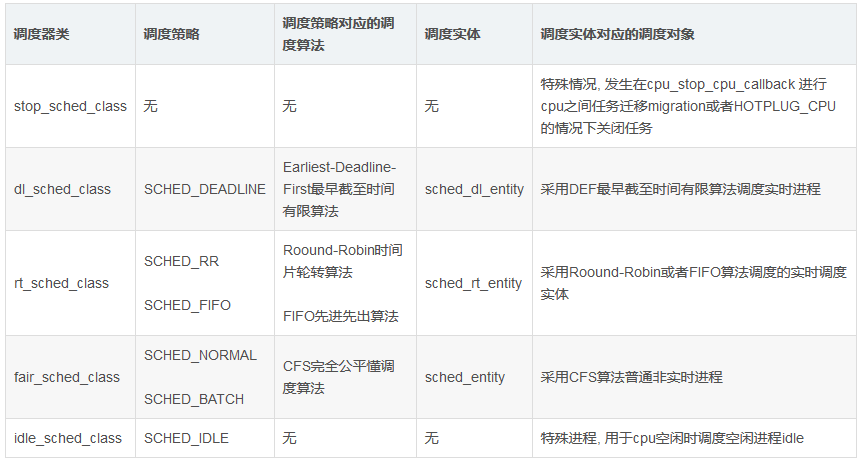

# 调度器 #
	
	参考
	https://blog.csdn.net/gatieme/article/details/52067665

	linux为了提升多核调度的效率，每个cpu上都有一个runqueue结构，这样就避免了多核争抢同一个runqueue造成的瓶颈。
	在每个runqueue中，包含了多个调度类(sched_class)，调度类的子类主要有RT(实时调度器), cfs(完全公平调度器)，其他的子类使用不多。
	调度器子类间的优先级顺序: deadline class -> rt class -> cfs class -> idle class

	对于cfs rq来讲，为了更好地体现公平性原则以及负载均衡需要，从高到低按照cpu物理架构依次划分成:
	调度域(sched_domain), 调度组(sched_group), 调度组里包含调度实体(sched_entity)，
	一个调度实体既可以是单个task_struct，也可以是一个task_group。

- 激活调度器的方式
	
		1）直接schedule, 比如进程打算睡眠或出于其他原因放弃CPU. //==>主调度器
		2）通过周期性的机制, 以固定的频率运行, 不时地检测是否有必要调度, 如时钟中断 //==>周期性调度器

- 调度器整体框架
	
		每个进程都属于某个调度器类(由task_struct->sched_class标识),
		调度器类采用进程的调度策略调度(由task_struct->policy )进行调度.

		task_struct也存储了进程对应的调度实体标识seched_XX_entity.
	
		linux实现了6种调度策略, 依据其调度策略的不同实现了5个调度器类,
		一个调度器类可以用一种或者多种调度策略调度某一类进程, 也可以用于特殊情况或者调度特殊功能的进程.
	 

- 调度器参数
	
		参考： http://blog.chinaunix.net/uid-27767798-id-3552111.html
	
		ls /proc/sys/kernel/   //带sched的是调度相关的参数
	
		1) 调度延迟: sysctl_sched_latency, 即保证每个可运行的进程都应该至少运行一次的时间间隔.
			也就是调度一个sched_entity的最大延时.
			可通过/proc/sys/kernel/sched_latency_ns控制, 默认值为20毫秒.
	
		2) sysctl_sched_min_granularity：调度的最小粒度(时间).
			如果调度的时间间隔小于这个时间段，内核不会挑选其他sched_entity进行调度，否则需要切换到其他就绪的进程
			可通过/procsys/kernel/sched_min_granularity_ns控制，默认值是4毫秒

		3) sched_nr_latency: 在一个调度延迟周期中能处理的最大可运行的进程(即sched_entity)数.
			如果可运行的进程的数目超过该上限, 则延迟周期也成比例的线性扩展，否则一个调度延迟周期内无法让所有的进程运行一次：
			sched_nr_latency = sysctl_sched_latency/sysctl_sched_min_granularity
		
		4）__sched_period：调度一轮所有的sched_entity需要的时间.
			通常就是sysctl_sched_latency, 但如果有更多的进程在运行, 其值有可能按比例线性扩展：
			
			static u64 __sched_period(unsigned long nr_running)
			{
				if (unlikely(nr_running > sched_nr_latency))
					return nr_running * sysctl_sched_min_granularity;
				else
					return sysctl_sched_latency;
			}

		5) /proc/sys/kernel/sched_short_sleep_ns
		调度器在任务运行短暂峰值时总是试图避免唤醒idle cpu。
		如果任务平均峰值小于sysctl_sched_short_burst_ns，并且睡眠平均时间大于sysctl_sched_short_sleep_ns，那么此任务倾向被打包。
		
		提高这个值会导致任务更频繁被打包，有利于功耗，但是会损害性能。
		将这个值设置为0将会disable 任务打包。
		
		6) /proc/sys/kernel/sched_short_burst_ns
		跟上面参数一起使用，确定任务是否适宜打包。

		提高这个值也会导致任务任务打包更频繁，设置为0将disable此值
		
		7) /proc/sys/kernel/sched_group_upmigrate
		这个值是个百分比。任务需求相对cpu能力的百分比
		如果这个任务组的总需求超过这个cpu，那么这个cpu对这个任务组来说太小。
		调度器将尝试找到一个更强劲的cpu来处理此任务组。
		
		提高这个值将会阻止任务往大核迁移，有利于功耗，不利于性能
		
		8) /proc/sys/kernel/sched_group_downmigrate
		同上，也是个百分比
		如果任务组已经迁移到大核，并且任务组总需求cpu将会降到sched_group_downmigrate以下，
		此时调度器将会找到一个最佳能耗的cpu来完成任务组执行；

		降低此值将会阻止任务迁移到小核上，对性能有利。
		
		9) /proc/sys/kernel/sched_freq_aggregate
		一个标志，用来控制调度器是否应该将相关线程组的总的cpu忙时间报告给Governor
		用来设置cpu频率，
		关闭此功能有利于降低功耗
		
		10) /proc/sys/kernel/sched_freq_aggregate_threshold
		时间阈值(ms),这个是cpu忙时间，
		当总的任务组的忙时间超过这个值时，调度器才会进行频率聚合

# CFS调度的虚拟运行时间 #

	CFS为了实现公平，必须惩罚当前正在运行的进程，以使那些正在等待的进程下次被调度。
	具体实现是：
	1) 每一个进程拥有一个虚拟运行时间vruntime，通过每个进程的vruntime来衡量哪个进程最值得被调度.
	2）CFS中的就绪队列是一棵以vruntime为键值的红黑树，虚拟时间越小的进程越靠近红黑树的最左端.
	(准确的来说同一个就绪队列所有进程(或者调度实体)依照其键值se.vruntime - cfs_rq.min_vruntime进行排序？？)
	
	调度器每次选择位于红黑树最左端的那个进程，因为该进程的vruntime最小.
	
	虚拟运行时间是通过进程的实际运行时间和进程的权重（weight）计算出来的.
	vruntime在时钟中断里面被维护，每次时钟中断都要更新当前进程的vruntime, 具体是update_curr():
	curr->vruntime += calc_delta_fair(delta_exec, curr)

- vruntime行走速度

		系统规定：默认权重值(1024)对应的进程的vruntime行走时间与实际运行时间runtime是1：1的关系。
		由于vruntime的行走速度和进程权重值成反比，那么其它进程的vruntime行走速度都通过以下两个参数计算得到：
		1) 当前进程的权重值
		2) 默认进程的权重值1024

		公式：
			1)curr.nice != NICE_0_LOAD时，curr−>vruntime+= delta_exec * (NICE_0_LOAD/curr−>se−>load.weight)
			2)curr.nice == NICE_0_LOAD时，curr−>vruntime+= delta
		
		例如，权重为3096的进程的vruntime行走速度为：(wall clock) * (1024/3096) ，wall clock为实际时间

- 睡眠进程被唤醒时的vruntime

		进程在睡眠过程中vruntime值是不改变的，但是队列的cfs_rq->min_vruntime的值却是单调增加的，
		所以进程唤醒时 cfs_rq->min_vruntime >= 进程的vruntime，
		可见进程醒来后，在红黑树中的位置会更靠左, 因为其键值相对来说变得更小了.

		进程受到的不公平待遇大还是小，一律只补偿sysctl_sched_latency这么多？？？

- 调度实体(sched_entity)的虚拟时间

		sched_entity.sum_exec_runtime
		=> 用于记录该进程的真实的CPU消耗时间，在进程撤销时会将sum_exec_runtime保存到prev_sum_exec_runtime中

		sched_entity.prev_sum_exec_runtime
		sched_entity.vruntime //=> 虚拟时间

		虚拟时间在调度实体内的分配:

		sched_entity是内核进行调度的基本实体单位, 其可能包含一个或者多个进程, 因此这个虚拟运行时间需要在内部再次分配到各个进程上。
		方法： sched_entity的理论运行时间是按照当前sched_entity的load与cfs_rq中的总的load来平分sysctl_sched_latency的。
		分配的函数：sched_slice()

		static u64 sched_slice(struct cfs_rq *cfs_rq, struct sched_entity *se)
		{
			//获得总的运行时间段，这个时间有可能比sysctl_sched_latency要大
			u64 slice = __sched_period(cfs_rq->nr_running + !se->on_rq);  

			for_each_sched_entity(se) {
				struct load_weight *load;
				struct load_weight lw;

				cfs_rq = cfs_rq_of(se);
				load = &cfs_rq->load;  //获得cfs_rq总的load

				if (unlikely(!se->on_rq)) { //如果se不再rq中，说明rq中的load不包括se的load，这个时候需要把se的load加到rq上
						lw = cfs_rq->load;

						update_load_add(&lw, se->load.weight);
						load = &lw;
				}
				//根据slice是一轮调度总的时间，load是rq总的load，se->load.weight是se的load，
				这样就可以算出load占总load的百分比，然后体现在平分slice上
				slice = calc_delta_mine(slice, se->load.weight, load);
			}
			return slice;
		}
		
	
- 就绪队列上的虚拟时间

		cfsq_rq.nr_running   //当前就绪队列的进程数
	
		cfs_rq.min_vruntime  //=>队列的虚拟时钟
	
		cfs_rq.tasks_timeline //红黑树的头结点
		cfs_rq.b_leftmost   //红黑树的最左面节点
	
		cfs_rq.curr	  //当前执行进程的可调度实体

# 进程运行时间的更新 #

	实现函数：update_curr()，它在时间中断上下文中被调用，流程是：

		update_process_times()
		->scheduler_tick()
			->curr->sched_class->task_tick()  //具体调度器的函数, 如：task_tick_fair()
				->entity_tick() //更新运行队列中的当前进程及其父进程的运行时间
					->update_curr()
						->__update_curr()

- update_curr()具体工作

		1）计算delta_exec来获得进程已经运行的时间。
		注意，如果进程已经被调度出去了，那么在此进程再被调度时，delta_exec的意思就是进程多久没有被调度了。

		2）根据delta_exec，调用 __update_curr()函数完成：
			更新当前进程的总的实际运行时间
			更新当前进程的虚拟时间vruntime，以便CFS调度器来决定下次调度哪个进程
			更新运行队列cfs_rq->min_vruntime

		3）更新进程的最后运行时间到exec_start
	
		static void update_min_vruntime(struct cfs_rq *cfs_rq)
		{
			u64 vruntime = cfs_rq->min_vruntime;
		
			if (cfs_rq->curr)
				vruntime = cfs_rq->curr->vruntime;
		
			if (cfs_rq->rb_leftmost) { //下一个将要被调度的进程
				struct sched_entity *se = rb_entry(cfs_rq->rb_leftmost,
											   struct sched_entity,
											   run_node);
		
				if (!cfs_rq->curr)
					vruntime = se->vruntime;
				else
					//在当前进程和下一个将要被调度的进程中选择vruntime较小的值,用它作为运行队列的min_vruntime的候选值
					vruntime = min_vruntime(vruntime, se->vruntime);
			}
		
			//运行队列的min_vruntime总是取当前和新的候选值两者中的较大者，这样运行队列的虚拟时间才不会后退
			/* ensure we never gain time by being placed backwards. */
			cfs_rq->min_vruntime = max_vruntime(cfs_rq->min_vruntime, vruntime);
		
		#ifndef CONFIG_64BIT
			smp_wmb();
			cfs_rq->min_vruntime_copy = cfs_rq->min_vruntime;
		#endif
		}

# RT调度器 #

	参考： https://blog.csdn.net/u014089131/article/details/54865073

	RT(RealTime scheduler)实时调度器，对应用户设定的调度策略为 SCHED_FIFO/SCHED_RR。
	SCHED_FIFO 先进先出队列调度，高优先级任务一直运行，直到任务阻塞，或者主动退出，或者被更高优先级任务抢占。
	SCHED_RR 时间片轮转调度，每个实时任务划分一个时间片，时间片用完会切换到其他任务执行。

	RT调度器的核心是优先级队列，调度程序从最高优先级队列头部选择一个task运行，调度结束会将任务放到对应的优先级队列尾部。
	bitmap标示优先级，某个bit置1标示该优先级队列不为空。

	struct rt_prio_array {
	DECLARE_BITMAP(bitmap, MAX_RT_PRIO+1); /* include 1 bit for delimiter */
	struct list_head queue[MAX_RT_PRIO];
	};

# 进程的NICE/优先级/权重 #

	参考： https://blog.csdn.net/gatieme/article/details/52067665

	linux内核采用了nice‐prio‐weight的转换关系来确定每个调度实体权重

- NICE和prio间的转换

		prio: 数值范围0~139, 数值越低, 优先级越高,其中0~99是实时进程的优先级;
		100~139是普通进程的优先级，对应nice值范围 -20~19
	
		nice值为0的进程对应的优先级是120
		进程的nice值是可以被修改的，修改命令分别是nice和renice
	
		文件： prio.h
	
		#define MAX_NICE	19
		#define MIN_NICE	-20
		#define NICE_WIDTH	(MAX_NICE - MIN_NICE + 1)   //40
	
		#define MAX_USER_RT_PRIO	100
		#define MAX_RT_PRIO		MAX_USER_RT_PRIO  //100, 实时进程优先级应该 < 100
		
		#define MAX_PRIO		(MAX_RT_PRIO + NICE_WIDTH)  //140，进程优先级应该 < 140
		#define DEFAULT_PRIO		(MAX_RT_PRIO + NICE_WIDTH / 2)  //120, 默认的进程优先级
	
		/*
		 * Convert user-nice values [ -20 ... 0 ... 19 ]
		 * to static priority [ MAX_RT_PRIO..MAX_PRIO-1 ],
		 * and back.
		 */
		#define NICE_TO_PRIO(nice)	((nice) + DEFAULT_PRIO)  //nice+120，
		#define PRIO_TO_NICE(prio)	((prio) - DEFAULT_PRIO)

- 进程的静态、动态、普通、实时优先级

		struct task_struct
		{
			int prio, static_prio, normal_prio;
			unsigned int rt_priority; /* 实时进程优先级 */
		}
	
		static_prio: 静态优先级，是进程启动时分配的优先级, 值为100~139.
			可以通过nice和sched_setscheduler系统调用来进行修改
	
		prio: 动态优先级，范围为100~139，与静态优先级和补偿(bonus)有关
		
		normal_prio: 基于进程的静态优先级static_prio和调度策略计算出的优先级.
		因此即使普通进程和实时进程具有相同的静态优先级, 其普通优先级也是不同的, 进程分叉(fork)时, 子进程会继承父进程的普通优先级

- prio和负荷权重间的转换

		内核版本<=linux 4.4的转换表: prio_to_weight[]
		内核版本>=linux 4.5的转换表: sched_prio_to_weight[]
	
		从以下可以看出，每级NICE间乘积因子是1.25，即每级的weight间相差10%，体现在CPU利用率上是%10的差别

		NICE为0的进程的权重是： 1024（NICE_0_LOAD）
	
		文件：sched/sched.h
		
		/*
		 * Nice levels are multiplicative, with a gentle 10% change for every
		 * nice level changed. I.e. when a CPU-bound task goes from nice 0 to
		 * nice 1, it will get ~10% less CPU time than another CPU-bound task
		 * that remained on nice 0.
		 *
		 * The "10% effect" is relative and cumulative: from _any_ nice level,
		 * if you go up 1 level, it's -10% CPU usage, if you go down 1 level
		 * it's +10% CPU usage. (to achieve that we use a multiplier of 1.25.
		 * If a task goes up by ~10% and another task goes down by ~10% then
		 * the relative distance between them is ~25%.)
		 */
		static const int prio_to_weight[40] = {
		 /* -20 */	 88761,	 71755,	 56483,	 46273,	 36291,
		 /* -15 */	 29154,	 23254,	 18705,	 14949,	 11916,
		 /* -10 */	  9548,	  7620,	  6100,	  4904,	  3906,
		 /*  -5 */	  3121,	  2501,	  1991,	  1586,	  1277,
		 /*   0 */	  1024,	   820,	   655,	   526,	   423,  
		 /*   5 */	   335,	   272,	   215,	   172,	   137,
		 /*  10 */	   110,		87,		70,		56,		45,
		 /*  15 */		36,		29,		23,		18,		15,
		};
	
		
		prio_to_wmult[]与prio_to_weight[]一一对应，每个元素的值是 2^32/prio_to_weigh[i]

- 进程的负荷权重 load_weight

		struct load_weight
		{
			unsigned long weight;   // 权重
			u32 inv_weight;	// 权重值用于重除的结果: inv_weight = 2^32/weight
		};
	
		可以通过task_statuct->se.load获取负荷权重的信息, 而set_load_weight()负责根据进程类型及其静态优先级计算负荷权重.
	
		实时进程不需要CFS调度, 因此无需计算其负荷权重值

- 就绪队列的负荷权重

		struct rq.load
		struct cfs_rq.load
	
		由于负荷权重仅用于调度普通进程(非实时进程), 因此只在cpu的就绪队列队列rq和cfs调度器的就绪队列cfs_rq上需要保存其就绪队列的信息,
		而实时进程的就绪队列rt_rq和dl_rq 是不需要保存负荷权重的.

		权重计算:
		就绪队列的负荷权重是队列上所有进程的负荷权重的总和, 因此每次进程被加到就绪队列的时候, 就需要在就绪队列的负荷权重中加上进程的负荷权重
		进程从就绪队列上入队或者出队的时候, 就绪队列的负荷权重就加上或者减去进程的负荷权重

		增加/减少/重置就绪队列负荷权重的的函数：
		update_load_add, update_load_sub, update_load_set

- 用top或者ps命令输出PRI/PR、NI、%ni/%nice这三种指标值

		参考： http://blog.csdn.net/longdel/article/details/7317511

		RI：进程优先级，其值越小，优先级就越高，越早被执行
		
		NI：进程Nice值
		
		%nice：改变过优先级的进程的占用CPU的百分比

# cpu的运行队列 #

	DECLARE_PER_CPU(struct rq, runqueues);

# 其他 #

- **/proc/< pid >/schedstat**
	
		schedstats also adds a new /proc/<pid>/schedstat file to include some of
		the same information on a per-process level.  There are three fields in
		this file correlating for that process to:
			 1) time spent on the cpu
			 2) time spent waiting on a runqueue
			 3) # of timeslices run on this cpu
		
		schedstat   #为所有相关的 CPU 显示特定于运行队列的统计信息以及 SMP 系统中特定于域的统计信息。
		kernel/sched_stats.h 中定义的 show_schedstat() 函数将处理 proc 条目中的读操作。
		/android/art/runtime/thread.cc
		// Grab the scheduler stats for this thread.
		1321  std::string scheduler_stats;

- ps -Z -t -p -P -x --abi
	
		state=S schedstat=( 303590361913 618664734427 651535 ) utm=19466 stm=10893 core=0
	
		state是调度状态；schedstat从 /proc/[pid]/task/[tid]/schedstat读出，
		三个值分别表示线程在cpu上执行的时间、线程的等待时间和线程执行的时间片长度.
		有的android内核版本不支持这项信息，得到的三个值都是0；
		utm是线程用户态下使用的时间值(单位是jiffies）;stm是内核态下的调度时间值；core是最后执行这个线程的cpu核的序号。
		
		schedstat=( 217991249 1074429 82 ) 表示：（累计运行的物理时间（ns）   累计在就绪队列里的等待时间   主动切换和被动切换的累计次数）
		
		/android/kernel/fs/proc/base.c
		proc_pid_schedstat()
	
		load average: 0.06, 0.60, 0.48 //系统负载，即任务队列的平均长度。三个数值分别为 1分钟、5分钟、15分钟前到现在的平均值。