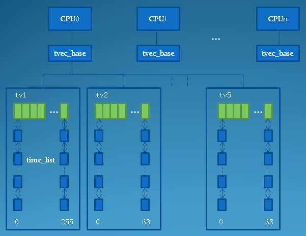

# 时钟中断 #

	参考
	https://blog.csdn.net/anonymalias/article/details/52022787
	https://blog.csdn.net/droidphone/article/details/8051405

	Linux时间与RTC的关系是：
	当Linux启动时，从RTC（硬时钟）读取时间和日期的基准值，然后在Kernel运行期间便抛开RTC，
	以软件的形式维护系统的时间日期，并在适当时机将时间写回RTC Register.

	时钟周期（clock cycle）：晶体振荡器在1秒时间内产生的时钟脉冲个数
	时钟中断：当时钟计数器减到0时就会产生一次中断
	时钟中断频率(HZ): 1秒内timer产生的时钟中断个数
	
- jiffies

		jiffies作为全局变量用来记录自系统启动以来的节拍数。
		linux启动时，kernel将该变量初始为0，每次时钟中断处理程序timer_interrupt()将该变量加1。
		因为一秒钟内增加的时钟中断次数等于Hz，所以jiffies一秒内增加的值也是Hz。
		由此可得系统运行时间是jiffies/Hz 秒(还要+300 s, 因为初始化jiffies为：INITIAL_JIFFIES= -300HZ)。
	
		extern u64 __jiffy_data jiffies_64;
		extern unsigned long volatile __jiffy_data jiffies;
		在64位系统上用64位表示，在32位系统上jiffies取jiffies_64的低32位。
	
		内核时钟的频率是由CONFIG_HZ决定的.
	
- 内核定时器: 低精度时钟/高精度时钟

		Linux 2.6.16之前，内核只支持低精度时钟，其工作方式：

		1）系统启动后，会读取时钟源设备(RTC, HPET，PIT…),初始化当前系统时间；
		2）内核根据HZ(系统定时器频率，节拍率)参数，设置时钟事件设备，启动tick(节拍)中断。
		HZ表示1秒种产生多少个时钟硬件中断，tick就表示连续两个中断的间隔时间。
		3）设置时钟事件设备后，时钟事件设备会定时产生一个tick中断，触发时钟中断处理函数，更新系统时钟,并检测timer wheel，进行超时事件的处理。

		所以说这之前，linux只能支持ms级别的时钟，随着时钟源硬件设备的精度提高和软件高精度计时的需求，有了高精度时钟的内核设计。
	
		Linux 2.6.16，内核支持了高精度的时钟，内核采用新的定时器hrtimer，其实现逻辑和Linux 2.6.16 之前定时器的区别：
		1) hrtimer采用红黑树进行高精度定时器的管理，而不是时间轮；
		2) 高精度时钟定时器不在依赖系统的tick中断，而是基于事件触发。
	
		hrtimer的工作原理：
		将高精度时钟硬件的下次中断触发时间设置为红黑树中最早到期的 Timer 的时间，时钟到期后从红黑树中得到下一个 Timer 的到期时间，并设置硬件，如此循环反复。
		具体来说，系统创建了一个模拟 tick 时钟的特殊 hrtimer，将其超时时间设置为一个tick时长，在超时回来后，完成对应的工作，
		然后再次设置下一个tick的超时时间，以此达到周期性tick中断的需求。
	
		新内核对相关的时间硬件设备进行了统一的封装，主要定义了下面两个结构：
	
		1）时钟源设备(closk source device)： 
		抽象那些能够提供计时功能的系统硬件，比如 RTC(Real Time Clock)、TSC(Time Stamp Counter)，HPET，ACPI PM-Timer，PIT等。
		不同时钟源提供的精度不一样，现在大都是支持高精度模式(high-resolution mode)也支持低精度模式(low-resolution mode)。
		
		2）时钟事件设备(clock event device)： 
		系统中可以触发 one-shot（单次）或者周期性中断的设备都可以作为时钟事件设备。
	
		当前内核同时存在新旧timer wheel 和 hrtimer两套timer的实现。
		在高精度时钟模式下，操作系统内核仍然需要周期性的tick中断，以便刷新内核的一些任务。
		内核启动后会从低精度模式切换到高精度，hrtimer模拟的tick中断将驱动 传统的低精度定时器系统和内核进程调度。

- 从周期性中断模式 切换到 一次性中断模式

		kernel下timer的中断模式支持2种：周期性和一次性，也就是periodic和oneshot

		对于固定tick（1/HZ）系统的timer使用periodic。
		但是对于tickless系统，则必须要使用oneshot 模式了，因为每次timer中断间隔不一样长。
		系统选用NOHZ，也就是tickless系统，不应该使用periodic mode的timer，而应该是oneshot mode的timer。

		那么kernel在哪里进行mode的变换呢？

		1）tick_check_new_device()中: 如果newdev支持CLOCK_EVT_FEAT_ONESHOT，
		调用tick_oneshot_notify设置set_bit(0, &ts->check_clocks)；
		2）hrtimer的softirq的处理函数调用tick_check_oneshot_change：检查check_clocks的bit0，
		如果置位，则会调用tick_nohz_switch_to_nohz()完成timer mode到oneshot的切换以及中断处理函数evt_handler的切换。

		关键代码是 tick_switch_to_oneshot(tick_nohz_handler)：
		修改当前clockevent的evt_handler为tick_nohz_handler，设置timer的mode为oneshot。
		
		在平台clockevent注册时，第一次初始化tick_device，timer默认使用periodic mode，
		evt_handler是tick_handle_periodic，系统还是固定tick的（1/HZ秒）；
		但是在timer中断使能，第一次中断处理完成后，timer就切换成了oneshot mode，
		evt_handler替换为tick_nohz_handler，kernel正式开始了tickless。

- 低精度timer(timer wheel)

	 

	- 定时器的分组
	
			内核为每个cpu定义了一个tvec_base结构指针：
			static DEFINE_PER_CPU(struct tvec_base *, tvec_bases) = &boot_tvec_bases;  

			struct tvec_base {  
				spinlock_t lock;  
				struct timer_list *running_timer;   //当前cpu正在处理的定时器所对应的timer_list结构。
				unsigned long timer_jiffies;   //当前cpu定时器所经历过的jiffies数
				unsigned long next_timer;   //该cpu下一个即将到期的定时器
				struct tvec_root tv1;  // 这5个字段用于对定时器进行分组，实际上，tv1--tv5都是一个链表数组，
										其中tv1的数组大小为TVR_SIZE， tv2 tv3 tv4 tv5的数组大小为TVN_SIZE
										没有使能CONFIG_BASE_SMALL，TVR_SIZE的大小是256，TVN_SIZE的大小则是64
				struct tvec tv2;  
				struct tvec tv3;  
				struct tvec tv4;  
				struct tvec tv5;  
			} ____cacheline_aligned;  

			struct tvec {  
				struct list_head vec[TVN_SIZE];  
			};  
			  
			struct tvec_root {  
				struct list_head vec[TVR_SIZE];  
			};

	- 定时器的添加
		
			当有一个新的定时器要加入时，系统根据定时器到期的jiffies值和timer_jiffies字段的差值来决定该定时器被放入tv1至tv5中的哪一个数组中.
			函数internal_add_timer():
			
			(1) 计算定时器到期时间expires 与 所属cpu的tvec_base结构中的timer_jiffies字段的差值，记为idx；
			(2) 根据idx的值，按如下规则，将该定时器放到tv1--tv5中一个链表数组中：
			
			链表数组	 idx范围
			tv1		 0-255(2^8)
			tv2		 256--16383(2^14)
			tv3		 16384--1048575(2^20)
			tv4		 1048576--67108863(2^26)
			tv5		 67108864--4294967295(2^32)
			
			可以认为tv1 ~ tv5分别占据一个32位数的不同比特位: tv1占据最低的8位，tv2占据紧接着的6位，然后tv3再占6位，以此类推，最高的6位分配给tv5
		
	- 定时器的到期
		
			base.timer_jiffies代表者该cpu定时器系统当前时刻。
			tv1中放置着在接下来的256个jiffies即将到期的定时器列表。
			
			(1)每次tick事件中，定时器系统只要以base.timer_jiffies的低8位作为索引，取出tv1中相应的链表，里面正好包含了所有在该jiffies值到期的定时器列表。
			
			(2)如果base.timer_jiffies的低8位为0时，这表明进位到了base.timer_jiffies的第8-13位上，这6位正好代表着tv2，
			这时只要按base.timer_jiffies的第8-13位的值作为下标，移出tv2中对应的定时器链表，然后用internal_add_timer把它们从新加入到定时器系统中来，
			因为这些定时器一定会在接下来的256个tick期间到期，所以它们肯定会被加入到tv1数组中，这样就完成了tv2往tv1迁移的过程。
			
			同样地，当base.timer_jiffies的第8-13位为0时，这表明进位到了base.timer_jiffies的第14-19位上，这6位正好代表着tv3，
			按base.timer_jiffies的第14-19位的值作为下标，移出tv3中对应的定时器链表，它们会被加入到tv2中，从而完成tv3到tv2的迁移。
			tv4，tv5的处理以此作类推。
		
	- 总结
	
			内核的低分辨率定时器的实现非常精妙，既实现了大量定时器的管理，又实现了快速的O(1)查找到期定时器的能力，利用巧妙的数组结构，
			使得只需在间隔256个tick时间才处理一次迁移操作，5个数组就好比是5个齿轮，它们随着base->timer_jifffies的增长而不停地转动，
			每次只需处理第一个齿轮的某一个齿节，低一级的齿轮转动一圈，高一级的齿轮转动一个齿，同时自动把即将到期的定时器迁移到低一级的某一个齿轮中，
			所以低分辨率定时器通常又被叫做时间轮：time wheel。事实上，它的实现是一个很好的空间换时间软件算法。
		
- issues
		
		1）del_timer返回时不能保证没有正在执行的定时器

		那么当定时器还在执行的时候，这个动态结构就被释放了，定时器也会随着动态结构的释放而释放。
		这样的代码肯定是有问题的。如何解决这个问题呢？第一个念头，就是保证同步删除定时器。
		根据搜索的结果，可以使用del_timer_sync。然而我仔细一想，这样仍然有问题。
		本来这个动态结构是使用定时器来释放，但是这里确实强制释放，那么即使使用了del_timer_sync停掉了定时器，
		那么这时定时器可能已经完成了超时，并释放了动态结构。这时再强制释放等于double free。
		同时del_timer_sync还有一个问题，这种同步操作，必然带来性能上的下降。
		所以最终的选择方案是增加一个标志，在强制删除时，将标志置位，保证释放操作只有一个执行者，同时引入引用计数。

- timer是基于软中断来实现的

		start_kernel()  //内核启动时
			->init_timers() //注册低精度timer软中断
			{
				open_softirq(TIMER_SOFTIRQ,run_timer_softirq);
			}
			->hrtimers_init()  //注册高精度timer软中断
			{
				open_softirq(HRTIMER_SOFTIRQ,run_hrtimer_softirq);
			}
			->softirq_init()
			{
				 open_softirq(TASKLET_SOFTIRQ,tasklet_action);
				 open_softirq(HI_SOFTIRQ, tasklet_hi_action);  
			}
			

		当cpu的每个tick事件到来时，在事件处理中断中，update_process_times会被调用
		tick_period()
		 ->update_process_times()
		  ->run_local_timers()  //运行本地timer
			  ->hrtimer_run_queues();  
				->__run_hrtimer(timer, &base->softirq_time)
				   ->__remove_hrtimer()
					fn= timer->function;
					fn(timer);
			  ->raise_softirq(TIMER_SOFTIRQ);

		run_timer_softirq() //低精度timer的软中断处理函数   
		{
		 struct tvec_base *base = __this_cpu_read(tvec_bases);   
		 hrtimer_run_pending();   //处理高精度timer
		 if (time_after_eq(jiffies, base->timer_jiffies))
			  __run_timers(base);   
			 {   
				while (time_after_eq(jiffies, base->timer_jiffies))  //本地CPU上的timer到期   
				{   
					  while (!list_empty(head)) {
					   timer = list_first_entry(head, struct timer_list,entry);
					   fn= timer->function;
					   data = timer->data;   
					   call_timer_fn(timer,fn, data);  //运行timer中的到期函数
					  }   
				}   
			}
		}   
		
		run_hrtimer_softirq（）//高精度timer的软中断处理函数   
			->hrtimer_peek_ahead_timers()   
				->hrtimer_interrupt()   
					->__run_hrtimer(timer, &basenow)   
						->__remove_hrtimer()   
							fn = timer->function;  //hrtimer_wakeup为定时器超时时的回调函数   
							fn(timer);   

		在do_nanosleep中，请求睡眠的进程会主动schedule()，主动让出CPU
		void hrtimer_init_sleeper(struct hrtimer_sleeper *sl, struct task_struct *task)
		{
			sl->timer.function = hrtimer_wakeup;  //该hrtimer过期时调用的回调函数，该函数会唤醒task
			sl->task = task;
		}

		static int __sched do_nanosleep(struct hrtimer_sleeper *t, enum hrtimer_mode mode)
		{
			hrtimer_init_sleeper(t, current); //初始化一个用于当前task的timer

			do {
				set_current_state(TASK_INTERRUPTIBLE);
				hrtimer_start_expires(&t->timer, mode); //将hrtimer加到percpu的timerqueue中
				if (!hrtimer_active(&t->timer))
					t->task = NULL;

				if (likely(t->task))
					schedule();  //主动schedule()

				hrtimer_cancel(&t->timer);
				mode = HRTIMER_MODE_ABS;

			} while (t->task && !signal_pending(current));

			__set_current_state(TASK_RUNNING);

			return t->task == NULL;
		}

		struct hrtimer {
			struct timerqueue_node		node;  //如果不允许该timer有slack时（比如对于RT（实时）进程），node->expires==_softexpires
			ktime_t				_softexpires; //该timer的最早过期时间（当允许该timer有slack时，默认的slack是50000ns, 见task_struct->timer_slack_ns）
			enum hrtimer_restart		(*function)(struct hrtimer *);  //到期的callback
			struct hrtimer_clock_base	*base;
			unsigned long			state;  //见#define HRTIMER_STATE_ENQUEUED	 0x01等
		#ifdef CONFIG_TIMER_STATS
			int				start_pid;	 //启动该hrtimer的进程的信息，见timer_stats_hrtimer_set_start_info()
			void				*start_site;  
			char				start_comm[16];
		#endif
		};

		struct timerqueue_node {
			struct rb_node node;
			ktime_t expires;
		};