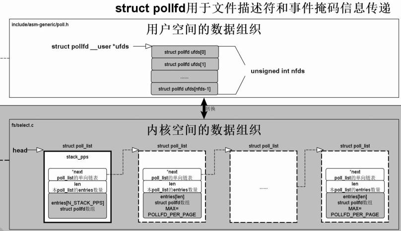

# epoll #

	参考

	http://blog.csdn.net/myarrow/article/details/7095503
	http://www.cnblogs.com/Anker/archive/2013/08/17/3263780.html
	http://blog.chinaunix.net/uid-23146151-id-3069427.html

	epoll的改进在于采用基于事件的就绪通知方式。
	epoll事先通过epoll_ctl()来监听一个文件描述符及其事件类型，然后调用epoll_wait()等待事件发生。
	一旦事件就绪时，内核会采用类似callback的回调机制，迅速激活这个文件描述符，epoll_wait返回后就可以处理对应的事件。

- epoll的原理

		epoll由3个系统调用组成：epoll_create，epoll_ctl，epoll_wait
		
		（1）sys_epoll_create，主要做一些准备工作，比如创建数据结构，初始化数据并返回一个文件描述符。该文件描述符表示新建的虚拟epoll文件。
		
		（2）sys_epoll_ctl，每次调用该函数只处理一个文件描述符。以下是op为EPOLL_CTL_ADD时的执行过程。
		sys_epoll_ctl首先做一些安全检查，然后进入ep_insert，ep_insert里将ep_poll_callback作为回调函数加入设备的等待队列

		下面描述ep_poll_callback的作用，非常关键，它在所等待的设备就绪后被系统回调，执行两个操作：
		①将就绪设备加入就绪队列，这一步避免了像poll那样在有设备就绪后再次轮询所有设备
		②唤醒虚拟的epoll文件

		（3）sys_epoll_wait，这里实际执行操作的是ep_poll函数。
		它将等待 一个将进程自身（epollfd）插入的等待队列，直到被唤醒（见（2）中ep_poll_callback的描述）。
		被唤醒后就执行ep_events_transfer将结果拷贝到用户空间。

- 接口
	
		1）int epoll_create(int size)
		
		创建一个epoll的句柄，size用来告诉内核监听的数目一共有多大。这个参数不同于select()中的第一个参数，给出最大监听的fd+1的值。
		需要注意的是，当创建好epoll句柄后，它就是会占用一个fd值，在linux下如果查看/proc/进程id/fd/，是能够看到这个fd的，
		所以在使用完epoll后，必须调用close()关闭，否则可能导致fd被耗尽。

		2）int epoll_ctl(int epfd, int op, int fd, struct epoll_event* event)
		
		epoll的事件注册函数，即注册要监听的fd和事件类型，把某个句柄(?)添加到epoll里面.
		第一个参数是epoll_create()的返回值: epoll的句柄，
		
		第二个参数表示动作，用三个宏来表示：
			EPOLL_CTL_ADD：注册新的fd到epfd中；
			EPOLL_CTL_MOD：修改已经注册的fd的监听事件；
			EPOLL_CTL_DEL：从epfd中删除一个fd；
			
		第三个参数是需要监听的fd，
		第四个参数是告诉内核需要监听什么事件，struct epoll_event结构如下：
		
		typedef union epoll_data {
			void *ptr;
			int fd;  //需要监听的fd, 也就是第3个参数
			__uint32_t u32;
			__uint64_t u64;
		} epoll_data_t;

		struct epoll_event {
			__uint32_t events; /* Epoll events */
			epoll_data_t data; /* User data variable */  //==> 貌似
		};

		其中events 可以是以下几个宏的集合：
		EPOLLIN ：表示fd上有数据可以读（包括对端SOCKET正常关闭）；
		EPOLLOUT：表示fd上可以写；
		EPOLLPRI：表示fd上有紧急的数据可读（这里应该表示有带外数据到来）；
		EPOLLERR：表示fd上发生错误；
		EPOLLHUP：表示fd被挂断；
		EPOLLONESHOT：只监听一次事件，当监听完这次事件之后，如果还需要继续监听这个socket的话，需要再次把这个socket加入到EPOLL队列里
		EPOLLET： 将EPOLL设为边缘触发ET(Edge Triggered)模式（默认为水平触发），这是相对于水平触发LT(Level Triggered)来说的。

		3）int epoll_wait(int epfd, struct epoll_event *events, int maxevents, int timeout)
		
		等待事件的产生。只要注册的句柄发生了变化即会检查到有epoll事件的产生。
		参数events 用来从内核得到事件的集合，
		maxevents 告之内核这个events 有多大，这个maxevents 的值不能大于创建epoll_create()时的size，
		参数timeout是超时时间（毫秒，0会立即返回，-1将不确定，也有说法说是永久阻塞）。
		该函数返回需要处理的事件数目，如返回0表示已超时。

- 工作模式
	
		epoll对文件描述符的操作有两种模式：LT（level trigger）和ET（edge trigger）。LT模式是默认模式，
		LT模式与ET模式的区别如下：
		
		LT模式：当epoll_wait检测到描述符事件发生并将此事件通知应用程序，应用程序可以不立即处理该事件。
		下次调用epoll_wait时，会再次响应应用程序并通知此事件。

		ET模式：当epoll_wait检测到描述符事件发生并将此事件通知应用程序，应用程序必须立即处理该事件。
		如果不处理，下次调用epoll_wait时，不会再次响应应用程序并通知此事件。
		
		ET模式在很大程度上减少了epoll事件被重复触发的次数，因此效率要比LT模式高。
		epoll工作在ET模式的时候，必须使用非阻塞套接口，以避免由于一个文件句柄的阻塞读/阻塞写操作把处理多个文件描述符的任务饿死。
	
- 实例： epoll与eventfd一起使用
	
		#include <stdio.h>
		#include <unistd.h>
		#include <sys/time.h>
		#include <stdint.h>
		#include <pthread.h>
		#include <sys/eventfd.h>
		#include <sys/epoll.h>

		int efd = -1;  //待监听的event fd

		void *read_thread(void *dummy)
		{
			int ret = 0;
			uint64_t count = 0;
			int ep_fd = -1;
			struct epoll_event events[10];

			if (efd < 0)
			{
				printf("efd not inited.\n");
				goto fail;
			}

			ep_fd = epoll_create(1024);  //创建epoll fd
			if (ep_fd < 0)
			{
				perror("epoll_create fail: ");
				goto fail;
			}

			{
				struct epoll_event read_event;

				read_event.events = EPOLLHUP | EPOLLERR | EPOLLIN; //
				read_event.data.fd = efd;

				ret = epoll_ctl(ep_fd, EPOLL_CTL_ADD, efd, &read_event);  //注册监听event fd上的事件(有数据可读，发生错误, hup)
				if (ret < 0)
				{
					perror("epoll ctl failed:");
					goto fail;
				}
			}

			while (1)
			{
				ret = epoll_wait(ep_fd, &events[0], 10, 5000);  //等待event fd上事件发生. 阻塞在这里
				if (ret > 0)
				{
					int i = 0;
					for (; i < ret; i++)
					{
						if (events[i].events & EPOLLHUP)
						{
							printf("epoll eventfd has epoll hup.\n");
							goto fail;
						}
						else if (events[i].events & EPOLLERR)
						{
							printf("epoll eventfd has epoll error.\n");
							goto fail;
						}
						else if (events[i].events & EPOLLIN)
						{
							int event_fd = events[i].data.fd;
							ret = read(event_fd, &count, sizeof(count));  //读取event fd上的数据
							if (ret < 0)
							{
								perror("read fail:");
								goto fail;
							}
							else
							{
								struct timeval tv;

								gettimeofday(&tv, NULL);
								printf("success read from efd, read %d bytes(%llu) at %lds %ldus\n",
									   ret, count, tv.tv_sec, tv.tv_usec);
							}
						}
					}
				}
				else if (ret == 0)
				{
					/* time out */
					printf("epoll wait timed out.\n");
					break;
				}
				else
				{
					perror("epoll wait error:");
					goto fail;
				}
			}

		fail:
			if (ep_fd >= 0)
			{
				close(ep_fd);  //
				ep_fd = -1;
			}

			return NULL;
		}

		int main(int argc, char *argv[])
		{
			pthread_t pid = 0;
			uint64_t count = 0;
			int ret = 0;
			int i = 0;

			efd = eventfd(0, 0);  //创建event fd
			if (efd < 0)
			{
				perror("eventfd failed.");
				goto fail;
			}

			ret = pthread_create(&pid, NULL, read_thread, NULL);  //
			if (ret < 0)
			{
				perror("pthread create:");
				goto fail;
			}

			for (i = 0; i < 5; i++)
			{
				count = 4;
				ret = write(efd, &count, sizeof(count));  //向event fd里写数据
				if (ret < 0)
				{
					perror("write event fd fail:");
					goto fail;
				}
				else
				{
					struct timeval tv;

					gettimeofday(&tv, NULL);
					printf("success write to efd, write %d bytes(%llu) at %lds %ldus\n",
						   ret, count, tv.tv_sec, tv.tv_usec);
				}

				sleep(1);
			}

		fail:
			if (0 != pid)
			{
				pthread_join(pid, NULL);   //
				pid = 0;
			}

			if (efd >= 0)
			{
				close(efd);  //
				efd = -1;
			}
			return ret;
		}
		
		编译：gcc main.c -Werror -Wall -lpthread
		
		执行结果：
		success write to efd, write 8 bytes(4) at 1328805612s 21939us
		success read from efd, read 8 bytes(4) at 1328805612s 21997us
		success write to efd, write 8 bytes(4) at 1328805613s 22247us
		success read from efd, read 8 bytes(4) at 1328805613s 22287us
		success write to efd, write 8 bytes(4) at 1328805614s 22462us
		success read from efd, read 8 bytes(4) at 1328805614s 22503us
		success write to efd, write 8 bytes(4) at 1328805615s 22688us
		success read from efd, read 8 bytes(4) at 1328805615s 22726us
		success write to efd, write 8 bytes(4) at 1328805616s 22973us
		success read from efd, read 8 bytes(4) at 1328805616s 23007us
		epoll wait timed out.

# poll/epoll的区别 #

	参考：https://blog.csdn.net/u010087886/article/details/50747281
	
	1）当有文件就绪时，poll和epoll拷贝数据到用户空间的操作是不一样的：
		poll拷贝所有设备的就绪状态，也就是说不管是就绪还是未就绪都要拷贝，然后交给用户自行判断处理。
		epoll只拷贝就绪设备信息。
		
	2）poll需要遍历所有文件的就绪状态，
		epoll:当被监听文件就绪时，对应的epoll fd的等待队列会被唤醒，之后只需拷贝被监听文件的信息到用户空间，无需轮询所有的被监听fd

# poll #
	
- poll与select的原理

		（1）复制用户数据到内核空间
		（2）估计超时时间
		（3）遍历每个文件取得文件就绪状态，如果就绪加入就绪队列，如果没有就绪加入等待队列
		（4）遍历完成后检查状态：
				a）如果已经有就绪的文件转到5；
				b）如果有信号产生，重启poll或select（转到1或3）；
				c）否则挂起进程等待超时或唤醒，超时或被唤醒后再次遍历所有文件取得每个文件的就绪状态
		（5）将所有文件就绪状态复制到用户空间
		（6）清理申请的资源

		注意：
		（4）中的c）的具体方式，也是与epoll的很大区别所在：
		被中断唤醒的这个进程只是知道了已经有文件就绪了，但是不知道是哪些。
		所以它又要进行一次遍历，查找就绪设备，将其加入就绪队列，然后跳到（5）

- 函数说明

		#include <poll.h>
		int poll(struct pollfd fds[], nfds_t nfds, int timeout)
		
		参数说明:
		
		fds：是一个struct pollfd结构类型的数组，用于存放需要检测其状态的Socket描述符.
		如果待检测的socket描述符为负值，则对这个描述符的检测就会被忽略，也就是不会对成员变量events进行检测，
		在events上注册的事件也会被忽略，poll()函数返回的时候，会把成员变量revents设置为0，表示没有事件发生；
		
		nfds：nfds_t类型的参数，用于标记数组fds中的结构体元素的总数量
		timeout：是poll函数调用阻塞的时间，单位：毫秒
		
		返回值:

			>0：数组fds中准备好读、写或出错状态的那些socket描述符的总数量；
			
			==0：数组fds中没有任何socket描述符准备好读、写，或出错；此时poll超时，超时时间是timeout毫秒；
			换句话说，如果所检测的 socket描述符上没有任何事件发生的话，那么poll()函数会阻塞timeout所指定的毫秒时间长度之后返回，
			如果timeout==0，那么 poll() 函数立即返回而不阻塞，
			如果timeout==INFTIM，那么poll() 函数会一直阻塞下去，直到所检测的socket描述符上的感兴趣的事件发 生是才返回，
			如果感兴趣的事件永远不发生，那么poll()就会永远阻塞下去；
			
			-1：poll函数调用失败，同时会自动设置全局变量errno；

		strust pollfd结构说明：
		
		typedef struct pollfd {
				int fd;						 /* 需要被检测或选择的文件描述符*/
				short events;				 /* 对文件描述符fd上感兴趣的事件 */
				short revents;				 /* 文件描述符fd上当前实际发生的事件*/
		} pollfd_t;
		typedef unsigned long   nfds_t;

		事件类型：

			POLLIN/POLLRDNORM(可读)、POLLOUT/POLLWRNORM(可写)、POLLERR(出错)
			
			POLLIN:		有普通数据或者优先数据可读
			POLLRDNORM:	有普通数据可读
			POLLRDBAND:	有优先数据可读
			POLLPRI:	   有紧急数据可读
			POLLOUT:	   有普通数据可写
			POLLWRNORM:	有普通数据可写
			POLLWRBAND:	有紧急数据可写
			POLLERR:	   有错误发生
			POLLHUP:	   有描述符挂起事件发生
			POLLNVAL:	  描述符非法
	
	 

		如果对一个描述符上的多个事件感兴趣的话，可以把这些常量标记之间进行按位或运算就可以了；
		比如：对socket描述符fd上的读、写、异常事件感兴趣，就可以这样做：
		
		struct pollfd  fds;
		fds[nIndex].events=POLLIN | POLLOUT | POLLERR；
		
		当 poll()函数返回时，要判断所检测的socket描述符上发生的事件，可以这样做：
		
			检测可读TCP连接请求：
			if((fds[nIndex].revents & POLLIN) == POLLIN)
			{
				//接收数据,调用accept()接收连接请求
			}
			
			检测可写：
			if((fds[nIndex].revents & POLLOUT) == POLLOUT)
			{
				//发送数据
			}
			
			检测异常：
			if((fds[nIndex].revents & POLLERR) == POLLERR)
			{
				//异常处理
			}
			
			
- 实例(用户程序轮询驱动事件)
		
		https://blog.csdn.net/a1028732302/article/details/51487919

- poll与select的区别

		poll()函数不会受到socket描述符上的O_NDELAY标记和O_NONBLOCK标记的影响和制约，
		也就是说，不管socket是阻塞的还是非阻塞 的，poll()函数都不会受到影响；

		而select()函数则不同，select()函数会受到O_NDELAY标记和O_NONBLOCK标记的影响，如果socket是阻塞的socket，
		则调用select()跟不调用select()时的效果是一样的，socket仍然是阻塞式TCP通讯，
		相反，如果socket是非阻塞的socket，那么调用select()时就可以实现非阻塞式TCP通讯；
		
	
# poll系统调用的实现 #

	参考
	http://blog.chinaunix.net/uid-20543672-id-3267385.html
	http://blog.chinaunix.net/attachment/201207/8/20543672_1341761191EPXB.jpg

	文件：select.c/wait.c

# 异步通知 fasync #

	参考： https://blog.csdn.net/forever_2015/article/details/50485326

	通过使能异步通知, 应用程序可能接受一个数据可用的信号而不需要自己去查询.

	用户程序必须执行 2 个步骤来使能来自输入文件的异步通知.
	1）首先, 它们指定一个进程作为文件的拥有者. 当一个进程使用 fcntl 系统调用发出 F_SETOWN 命令,
	这个拥有者进程的 ID 被保存在 filp->f_owner 给以后使用.

	2）用户程序必须通过 F_SETFL fcntl 命令，设置 FASYNC 标志在设备中.
	在这 2 个调用已被执行后, 输入文件可请求递交一个 SIGIO 信号, 当新数据到达时，
	信号被发送给存储于 filp->f_owner 中的进程(或者进程组, 如果值为负值).

	相关函数：

	int fasync_helper(struct inode *inode, struct file *filp, int mode, struct fasync_struct **fa);
	一个"帮忙者", 来实现 fasync 设备方法. mode 参数是传递给方法的相同的值, 而 fa 指针指向一个设备特定的 fasync_struct *.
	
	void kill_fasync(struct fasync_struct *fa, int sig, int band);
	如果这个驱动支持异步通知, 这个函数可用来发送一个信号到登记在 fa 中的进程.
	
	
# open与fopen的区别 #

	int open(const char *path, int access,int mode) //linux的系统调用
	FILE *fopen(char *filename, char *mode) //libc库的API

	前者属于低级IO，后者是高级IO。
	前者返回一个文件描述符，后者返回一个文件指针。
	前者无缓冲，后者有缓冲。
	前者与 read, write 等配合使用， 后者与 fread, fwrite等配合使用。
	后者是在前者的基础上扩充而来的，在大多数情况下，用后者。

	https://www.cnblogs.com/hnrainll/archive/2011/09/16/2178706.html

# exec #

	整个 exec 家族有 6 个函数，这些函数都是构建在 execve 系统调用之上的。该系统调用的作用是，
	将新程序加载到进程的地址空间，丢弃旧有的程序，进程的栈、数据段、堆栈等会被新程序替换。

	一般来说， execve （）函数总是紧随 fork 函数之后。父进程调用 fork 之后，子进程执行 execve 函数，
	抛弃父进程的程序段，和父进程分道扬镳，从此天各一方，各走各路。但是也可以不执行 fork ，单独调用 execve 函数：

		#include <unistd.h>
		#include <stdlib.h>
		#include <stdio.h>
		int main(void)
		{
			char *args[] = {"/bin/ls", "-l",NULL};
			if(execve("/bin/ls",args, NULL) == -1) {
				perror("execve");
				exit(EXIT_FAILURE);
			}
			puts("Never get here");
				exit(EXIT_SUCCESS);
		}

	
	int execl(const char *path, const char *arg, ...);
	int execlp(const char *file, const char *arg, ...);
	int execle(const char *path, const char *arg, ..., char * const envp[]);

	int execv(const char *path, char *const argv[]);
	int execvp(const char *file, char *const argv[]);
	int execve(const char *path, char *const argv[], char *const envp[]);

	上述 6 个函数分成上下两个半区。分类的依据是参数采用列表（ l ，表示 list ）还是数组（ v ，表示 vector ）。
	上半区采用列表，它们会罗列所有的参数，下半区采用数组。
	在每个半区之中，带 p 的表示可以使用环境变量 PATH ，带 e 的表示必须要自己维护环境变量，而不使用当前环境变量

# 多线程pthread

	https://blog.csdn.net/joysonqin/article/details/70237422

- 线程的分离状态

		线程的分离状态有2种：PTHREAD_CREATE_JOINABLE（非分离状态）， PTHREAD_CREATE_DETACHED（分离状态）.
		如果使用 PTHREAD_CREATE_JOINABLE 创建非分离线程，则假设应用程序将等待线程完成。也就是说，程序将对线程执行 pthread_join。
		非分离线程在终止后，必须要有一个线程用 join 来等待它。否则，不会释放该线程的资源以供新线程使用，而这通常会导致内存泄漏。
		如果使用 PTHREAD_CREATE_DETACHED 创建分离thread,则表明此thread在退出时会自动回收资源和thread ID.
		因此，如果不希望线程被等待，请将该线程作为分离线程来创建。

		注意：不管创建分离还是非分离的thread.在子thread全部退出之前退出主程序都是很有风险的。
		如果主thread选择return,或者调用exit()退出，则所有thread都会被kill掉。这样很容易出错。
		但如果主thread只是调用pthread_exit().则仅主线程本身终止, 进程及进程内的其他线程将继续存在。
		所有线程都已终止时，进程也将终止。
		

- 线程终止

		如果进程中的任一线程调用了exit，_Exit或者_exit，那么整个进程就会终止。
		与此类似，如果信号的默认动作是终止进程，那么，把该信号发送到线程会终止整个进程。

		单个线程可以通过下列三种方式退出，在不终止整个进程的情况下停止它的控制流。
		(1)从启动例程中返回，返回值是线程的退出码
		(2)其他线程调用pthread_cancel取消该线程，且该线程可被取消。
		(3)线程调用pthread_exit()
		(4)其中的一个线程执行exec类函数执行新的代码，替换当前进程所有地址空间。

- pthread_join()

		原型: int pthread_join(pthread_t thread, void **rval_ptr);
		头文件: <pthread.h>
		返回值: 成功则返回0, 否则返回错误编号.
		参数:
			thread: 线程ID.
			rval_ptr: 指向返回值的指针(返回值也是个指针).
		说明:
			调用线程将一直阻塞, 直到指定的线程调用pthread_exit、从启动例程返回或被取消.
			如果线程从它的启动例程返回, rval_ptr包含返回码.
			如果线程被取消, 由rval_ptr指定的内存单元置为: PTHREAD_CANCELED.
			如果对返回值不关心, 可把rval_ptr设为NULL.			

- 线程和进程

		线程和进程不一样，进程有父进程的概念，但在线程组里面，所有的线程都是对等的关系。
		· 并不是只有主线程才能创建线程，被创建出来的线程同样可以创建线程。
		· 不存在类似于 fork 函数那样的父子关系，大家都归属于同一个线程组，进程 ID 都相等，
			group_leader 都指向主线程，而且各有各的线程 ID 。
		· 并非只有主线程才能调用 pthread_join 连接其他线程，同一线程组内的任意线程都可以对某线程执行 pthread_join 函数。
		· 并非只有主线程才能调用 pthread_detach 函数，其实任意线程都可以对同一线程组内的线程执行分离操作。
 

# 编译相关

- linux下多线程程序的编译方法

		因为pthread的库不是linux系统的库，所以在进行编译的时候要加上： -lpthread
		# gcc filename -lpthread  //默认情况下gcc使用c库，要使用额外的库要这样选择使用的库

- 如果在编译的时候，带上-rdynamic选项，就可打印出函数的地址了

# 信号

- 如果发送一个致命信号到多线程，那么内核将杀死该应用的所有线程，而不仅仅是接收信号的那个线程。

- 信号处理函数必须在多线程进程的所有线程之间共享，但是每个线程要有自己的挂起信号集合和阻塞信号掩码。

		在Linux内核实现中，同一个线程组里的所有线程都共享一个struct sighand结构体。

- 每个发给多线程应用的信号仅递送给一个线程，这个线程是由内核从不会阻塞该信号的线程中随意选出来的。

- 多线程情况下发送给进程的信号，到底由哪个线程来负责处理？

		Linux还是采取了尽力而为的策略，尽量地尊重函数调用者的意愿，如果进程的主线程方便的话，则优先选择主线程来处理信号；
		如果主线程确实不方便，那就有可能由线程组里的其他线程来负责处理信号。

- sigwait系列函数可以比较优雅地等待某个特定信号的到来

- 信号的选择

		线程的挂起信号队列有两个：线程私有的挂起队列（pending）和整个线程组共享的挂起队列（signal->shared_pending）
		选择信号的顺序是优先从私有的挂起队列中选择，如果没有找到，则从线程组共享的挂起队列中选择信号递送给线程。
		当然选择的时候需要考虑线程的阻塞掩码，属于阻塞掩码集中的信号不会被选出。

- 通过文件描述符来获取信号：signalfd机制

- 同步信号

		4=SIGILL、5=SIGTRAP、7=SIGBUS、8=SIGFPE、11=SIGSEGV、31=SIGSYS，
		这些都属于同步信号集合，这6种信号都是与硬件相关的信号。

# 其他

- sig_atomic_t 是C语言标志定义的一种数据类型，该数据类型可以保证读写操作的原子性

# 动态链接和静态链接 #

	参考
	
	https://blog.csdn.net/skyflying2012/article/details/17098133
	https://www.cnblogs.com/acSzz/p/5743789.html
	
- 查看库中的符号和依赖库

		有时需要查看一个库中到底有哪些函数，nm命令可以打印出库中的涉及到的所有符号。库既可以是静态的也可以是动态的。
		nm列出的符号有很多，常见的有 三种，
		一种是在库中被调用，但并没有在库中定义(表明需要其他库支持)，用U表示；
		一种是库中定义的函数，用T表示，这是最常见的；
		另外一种是所谓的“弱 态”符号，它们虽然在库中被定义，但是可能被其他库中的同名符号覆盖，用W表示。

		例如，假设开发者希望知道上央提到的hello库中是否定义了 printf():
		$nm libhello.so |grep printf
		U printf
		U表示符号printf被引用，但是并没有在函数内定义，由此可以推断，要正常使用hello库，必须有其它库支持;

		再使用ldd命令查看hello依赖于哪些库：
		$ldd hello
		libc.so.6=>/lib/libc.so.6(0x400la000)
		/lib/ld-linux.so.2=>/lib/ld-linux.so.2 (0x40000000) 