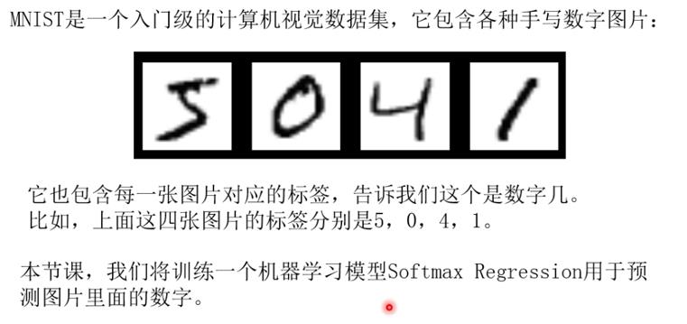
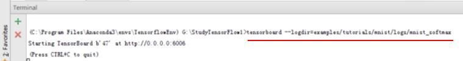
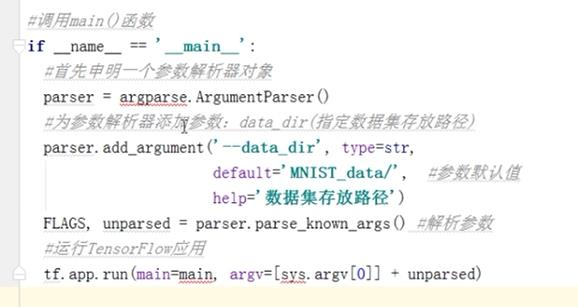

# SoftMax Regression分类器 #

- [视频1](http://v.youku.com/v_show/id_XMjczMDMyOTg0OA==.html?spm=a2h0j.8191423.playlist_content.5!14~5~5~A&&f=49399706&from=y1.2-3.4.14)

   
   
   
   
	
	注意：以下图中，行\列是反的

   
   
   
   

	evidence_i是输入样本图片x是数字i的证据（或者说是概率），而evidence就是输入样本图片为各个数字的概率
	W_ij是图片x的第j个像素值x_j的权重（比如像素i对于判断图片x是数字i更有利，则该点处的权重更大）
	b_i代表图片x是数字i的偏置，目的是去掉输入本身的干扰

   
   
   
   
   
   
   

- **mnist实例**

[视频2](http://v.youku.com/v_show/id_XMjczMDM1ODMyNA==.html?spm=a2h0j.8191423.playlist_content.5!15~5~5~A&&f=49399706&from=y1.2-3.4.15)

   
   
   
	
**在tensorboard 1.2.1中，启动tensorbloard的查看log的命令如下**：

	1) 在pycharm的terminal中运行： tensorboard --logdir=logs/mnist_softmax
	2）在chrome浏览器中运行1中生成地址：http://NWD00P5OFU02K0G:6006  即可查看计算图
	
   
   
   
   
   
   
   
   
   