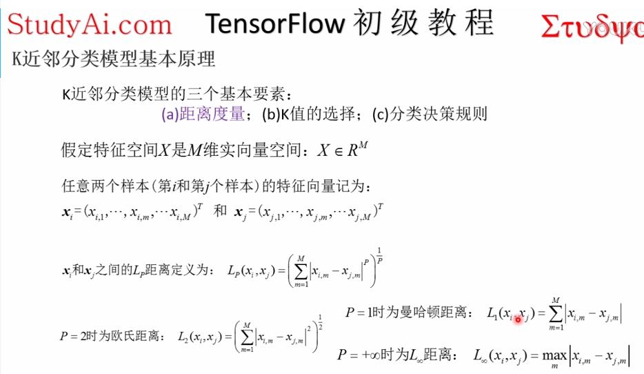
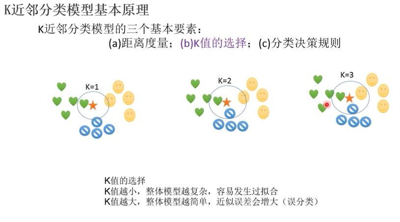
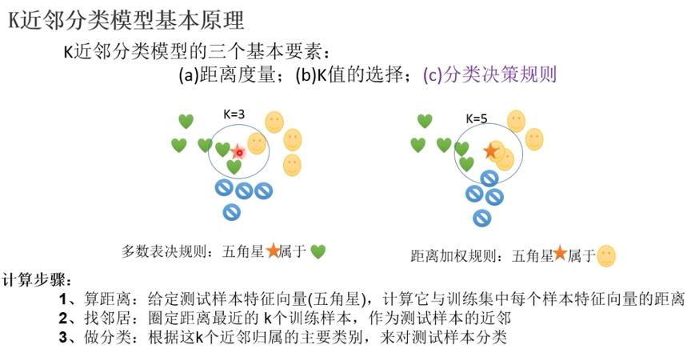
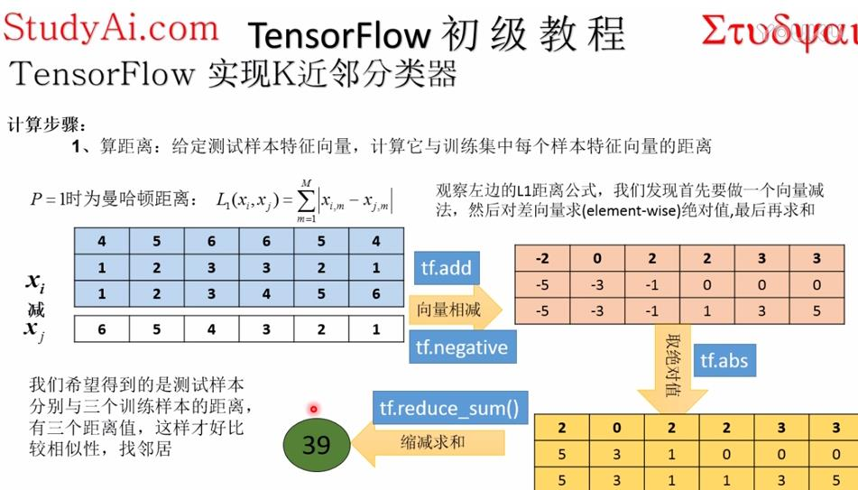
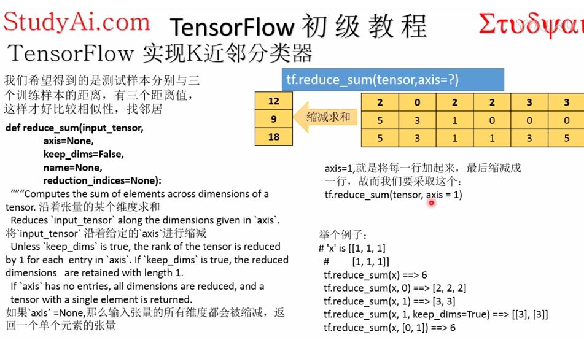
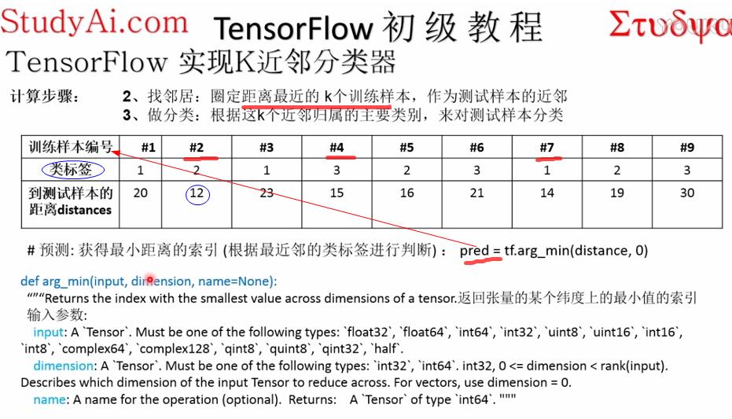
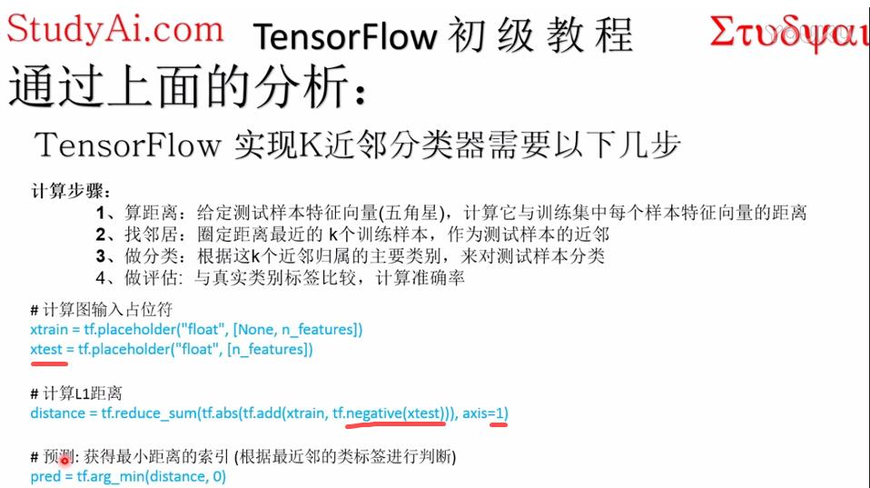
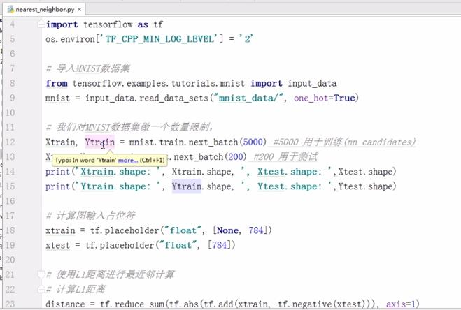
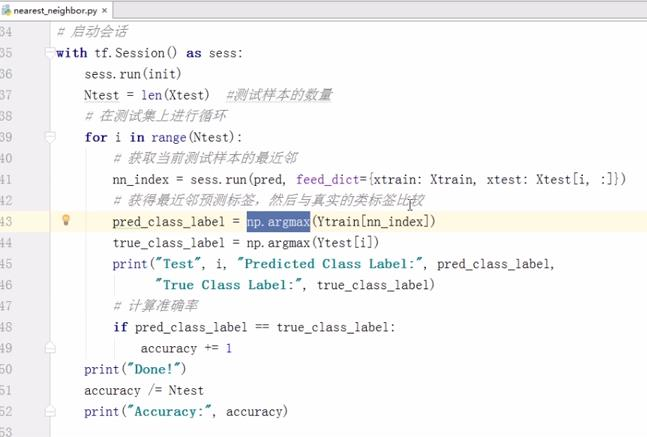

# k近邻分类器 #
[视频](http://v.youku.com/v_show/id_XMjcyNjgyNzUzNg==.html?spm=a2h0j.8191423.playlist_content.5!8~5~5~A&f=49399706&from=y1.2-3.4.8 "地方")

   
   
   

	注意: xi是第i个训练样本，xj是第j个测试样本
	每行蓝色是一个训练样本的6个特征向量，也称作张量

   
   
   
   
   
   

